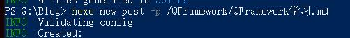
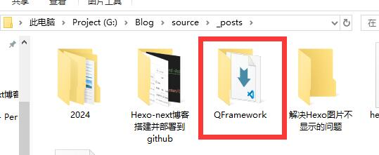
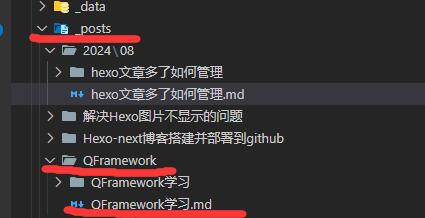

每次通过hexo new ‘xxx’创建新的博文时，都会将生成的.md文件放置在_post文件夹下，随着文章数的增多，_post文件夹也会越来越混乱。

<!--more-->

可以通过配置全局配置文件_config.yml来依据年月进行分配，在文件中查找new_post_name:并修改为

```yml
new_post_name: :year/:month/:title.md
```
修改后，每次创建的文章将会以生成的年月进行管理。

- 如果想直接进行分类创建，可以选择采用如下命令进行创建。

```shell
hexo new post -p /文件夹名/文件名.md
```
如执行如下命令后

文章将会被创建在QFramework中

