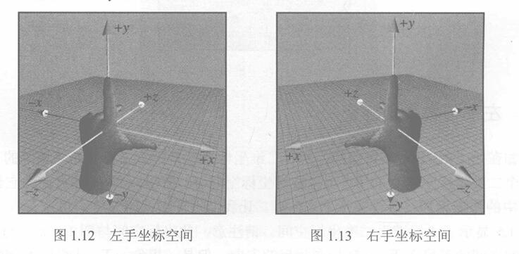
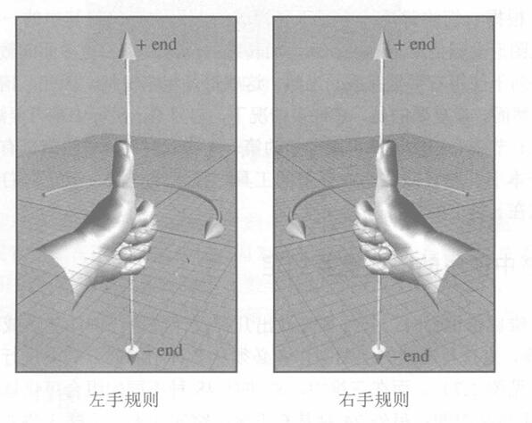
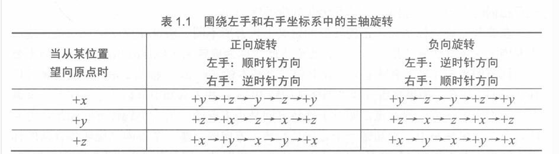
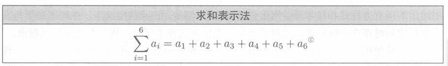
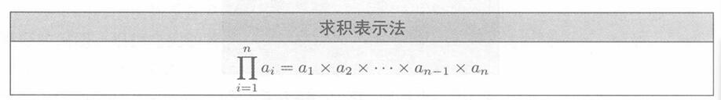
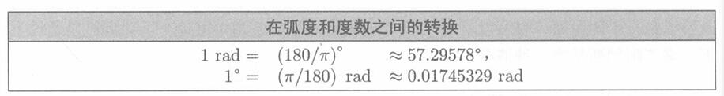

选择性的记录内容，学习笔记

<!--more-->
# 目录
- [目录](#目录)
- [1.1 一维数学](#11-一维数学)
- [1.2 二维笛卡尔空间](#12-二维笛卡尔空间)
  - [1.2.2 任意二维坐标空间](#122-任意二维坐标空间)
  - [1.2.3 使用笛卡尔坐标指定二维中的位置](#123-使用笛卡尔坐标指定二维中的位置)
- [1.3 三维笛卡尔空间](#13-三维笛卡尔空间)
  - [1.3.1 新增维度和轴](#131-新增维度和轴)
  - [1.3.2 在三维中制动位置](#132-在三维中制动位置)
  - [1.3.3 左手与右手坐标空间](#133-左手与右手坐标空间)
  - [1.3.4 一些使用的重要约定](#134-一些使用的重要约定)
- [1.4 一些零散的知识](#14-一些零散的知识)
    - [1.4.1 求和与求积的表示法](#141-求和与求积的表示法)
  - [1.4.2 区间符号](#142-区间符号)
  - [1.4.3 角度、度数和弧度](#143-角度度数和弧度)
  - [1.4.4 三角函数](#144-三角函数)
  - [1.4.5 三角函数恒等式 ⭐](#145-三角函数恒等式-)

# 1.1 一维数学

# 1.2 二维笛卡尔空间
## 1.2.2 任意二维坐标空间

原点、x轴、y轴

## 1.2.3 使用笛卡尔坐标指定二维中的位置

坐标点表示为(x,y)

# 1.3 三维笛卡尔空间

## 1.3.1 新增维度和轴

新增z轴

## 1.3.2 在三维中制动位置

坐标点表示为(x,y,z)

## 1.3.3 左手与右手坐标空间

**1. 左手坐标系**
- 伸出左手，用拇指和食指做出一个L形
- 拇指指向你的右边，食指朝上
- 现在伸展你的第三根手指（中指），使它直接指向前方

这样你就形成了一个**左手坐标系**。你的拇指、食指和第三根（中指）手指分别指向+x、+y和+z方向。

**2. 右手坐标系**
- 伸出有手，用拇指和食指做出一个L形
- 拇指指向你的左边，食指朝上
- 现在伸展你的第三根手指（中指），使它直接指向前方
这样你就形成了一个**右手坐标系**。你的拇指、食指和第三根（中指）手指分别指向+x、+y和+z方向。

**3. 左旋、右旋坐标系**

左旋和右旋坐标系在“正旋转”的定义上也有所不同。假设在空间中有一条直线，需要围绕这条直线旋转指定的角度。我们将此线称为旋转轴(Axis of Rotation)。
（1） 左（右）手规则。在左（右）手坐标系中，告知哪一个方向是旋转正方向的，哪一个方向是旋转负方向的标准方法称为**左（右）手规则**。
- 将左（右）手摆出一个“竖起大拇指”的位置，拇指指向旋转轴的正值端
- 此时，围绕旋转轴的正向旋转方向就是手指卷曲的方向。

（2）从图中可以看出，在**左手坐标系**中，**正向旋转**从轴的正端看时是**顺时针**旋转的;而在**右手坐标系中，正向旋转是逆时针旋转**的。

**4. 左右手坐标系转换**

交换一个轴的正负端

**5. 左右手坐标系的应用**
一些较新的计算机图形文献使用左手坐标系，而传统的图形文献和更多面向数学的线性代数的研究人员则倾向于使用右手坐标系

## 1.3.4 一些使用的重要约定
1. 在设计三维虚拟世界时，必须事先做出几种设计决策，例如左手或右手坐标系、哪个方向是+y等。
2. **这本书后续将使用左手坐标系(+x、+y和+z方向分别指向右、上和前)作为例子讲解，当出现差异时会特别加以指出**

# 1.4 一些零散的知识
### 1.4.1 求和与求积的表示法

## 1.4.2 区间符号
- $[a,b]$ 表示 “所有满足$a≤x≤b$的数字$x$” ,是一个闭区间，包含a,b
- $(a,b)$ 表示 “所有满足$a<x<b$的数字$x$” ,是一个开区间，不包含a,b
- $(a,b]$ 与$[a,b)$ 表示半开区间

## 1.4.3 角度、度数和弧度

（1）角度可以测量平面中的旋转量。表示角度的变量通常被赋予希腊字母$\theta$。用于指定角度的最重要的度量单位是**度( °）和弧度（rad）**。

（2）人类通常使用度（Degree）数来测量角度。**一度表示旋转1/360，因此360°代表旋转完整的一圈**。然而，数学家更喜欢以弧度为单位测量角度，**弧度是基于圆的属性的度量单位**。当以弧度指定两条线之间的角度时，**实际上是测量单位圆(以半径为1的原点为中心的圆）的截取弧的长度**

（3）弧度和度数的转换

## 1.4.4 三角函数
（1） 正弦$cos\theta$、余弦$sin\theta$
- 在坐标中也有特殊的意义， $cos\theta = x$ ,$sin\theta = y$

（2）割线(secant)、余割（cosecant）、切线（tangent）和余切（cotangent）也是有用的三角函数。

（3） 勾股与三角函数的对应关系
在术语中，勾被称为邻边(Adjacent)，长度为x;股被称为对边(Opposite),长度为y。它们都是相对于角度0进行解释的。同样，在这里字母顺序也是一个有用的记忆辅助手段——Adjacent和 Opposite 的顺序与相应的cosine和 sine 的顺序是相同的。弦则被称为斜边（Hypotenuse)，而缩写词 **hyp、adj和 opp则分别指的是斜边、邻边和对边的长度**，如图所示。

- 当$\theta$为钝角时，上述等式不太适用，因为不能形成具有钝角内角的直角三角形。但是，通过在标准位置显示角度并允许旋转的线条为任何长度r，可以使用x、y和r表示以下对比关系。

**（4）常见角度的度数和弧度值，以及相应的三角函数的值**⭐

## 1.4.5 三角函数恒等式 ⭐
（1）基本恒等式（可基于单位圆的对称性推导出）

（2）毕达哥拉斯恒等式

（3）和差公式

（4）等腰三角形恒等式（和差公式的特殊情况）

（5）正弦定理与余弦定理
