# 一、安装下载Node.js、Vscode、Git
1.1 安装可以看这篇博文的第2点 《在Windows系统下安装Node.js》的1-6点（补充除外）：https://blog.csdn.net/loze/article/details/94208742
<!--more-->
1.2 补充：上面博文的补充地方镜像有问题。 应执行下面语句：
```
（如果不小心跟着1. 执行了补充，先运行这个，否则没必要）
npm cache clean --force

npm config set registry https://registry.npmmirror.com
```
1.3 （可选）将npm的安装路径修改到其他盘避免占用C盘：https://blog.csdn.net/Deng872347348/article/details/121646375 只做到 **“接下来设置环境变量，关闭cmd窗口，“我的电脑”-右键-“属性”-“高级系统设置”-“高级”-“环境变量””** 之前的步骤
# 二、安装Hexo
2.1 新建 Blog 文件夹，进入此目录下
2.2 安装Hexo脚手架.下面的命令会把hexo.cmd安装到**全局包仓库中**，由于该仓库文件夹在Windows系统的path中。所以你就**可以在任意位置执行hexo命令**了。
```
npm install -g hexo-cli
```
我这里是安装过了所以是显示这样的
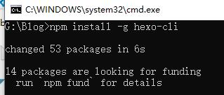
2.3 执行一下命令确认hexo安装完好。这里执行如果报错（hexo‘ 不是内部或外部命令，也不是可运行的程序），请参考该内容以配置Hexo的环境变量：https://blog.csdn.net/Deng872347348/article/details/121646375 的 **“接下来设置环境变量，关闭cmd窗口，“我的电脑”-右键-“属性”-“高级系统设置”-“高级”-“环境变量””** 及其之后的步骤 ，如果在2.2步之后不小心重新设置了npm的全局文件夹，则重新执行2.2的npm install -g hexo-cli命令，但**可能会出现权限问题，请以管理员身份运行cmd或者修改nodejs文件夹权限,[可以看该网址中的方法二](https://blog.csdn.net/m0_56253302/article/details/130111914)**。解决以上问题后执行下面命令。
```
hexo -v
```
2.4 新建一个**空文件夹**用于初始化Hexo，启动cmd并进入到文件夹中。
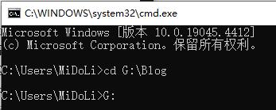
执行Hexo初始化命令
```
hexo init
```
2.5 cmd命令中进入到themes文件夹
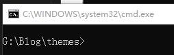
2.6 cmd命令中执行如下命令，下载 Next主题
```
git clone https://github.com/theme-next/hexo-theme-next
```
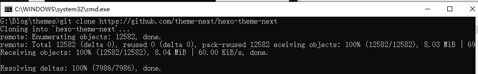
文件夹多出文件
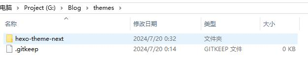

2.7 cmd中启动本地服务查看
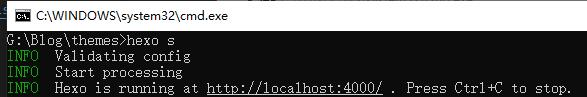
```
hexo s
```
在浏览器中输入http://localhost:4000/ 即可看到目前的界面
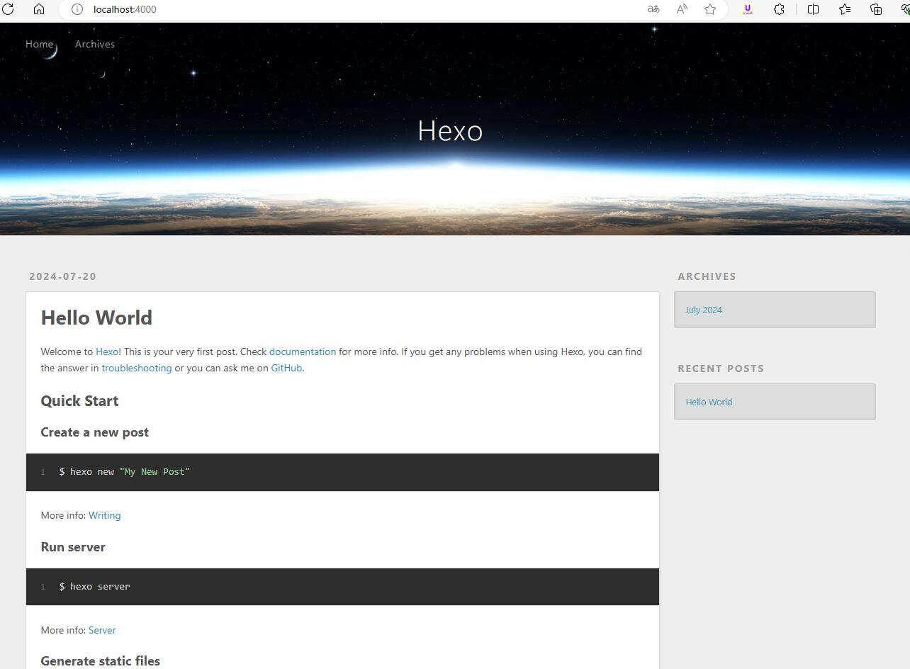

2.8 一些相关命令
- hexo clean：清除 public 静态目录
- hexo s：本地启动默认指定 4000 端口预览 (s 是 server 是缩写 也就是启动 hexo 服务)
- hexo g：生成 public 静态目录
- hexo d： 部署
- hexo n: 新建文章。示例hexo n "我的博客" == hexo new "我的博客" #新建文章
- hexo p == hexo publish
- hexo server -p 5000 #更改端口
- hexo server -i 192.168.1.1 #自定义 IP
- hexo new draft 草稿文件名。新建草稿命令如下，草稿不会在博客上显示。

# 三、配置文件设置

### 3.1 配置文件说明
在 Hexo 中有两份主要的配置文件，其名称都是 _config.yml。

1. 站点配置文件：位于站点根目录下（/_config.yml），主要包含 Hexo 本身的站点配置，内容如下：

```yml
# Hexo Configuration
## Docs: https://hexo.io/docs/configuration.html
## Source: https://github.com/hexojs/hexo/

# Site
title: Hexo          # 网站的标题，可能用在各种布局的页面中
subtitle:            # 网站子标题
description:         # 网站的描述性
keywords:            # 网站的关键字
author: John Doe     # 网站的作者
language:            # 网站采用语言，要跟/theme/***/languages/**.yml下的文件名对应。
timezone:            # 网站的时区

# URL
## If your site is put in a subdirectory, set url as 'http://yoursite.com/child' and root as '/child/'
url: http://yoursite.com              # 网站的url，如果不在域名根目录，应包含子目录，且root要设置为`/子目录/`
root: /                               # 网站的根目录
permalink: :year/:month/:day/:title/  #文章永久链接的形成模版。每一篇文章都有唯一的url。
permalink_defaults:                   #文章永久链接中，各部分的默认值。

# Directory
source_dir: source          # 网站中源文件（比如Markdown啊什么的所在的文件夹）
public_dir: public          # 生成的静态网站的目录
tag_dir: tags               # 标签页所在的文件夹。
archive_dir: archives       # 文档页所在的文件夹
category_dir: categories    # 类别也所在的文件夹
code_dir: downloads/code    # 代码也所在的文件夹
i18n_dir: :lang             # 国际语言所在的文件夹
skip_render:                # 忽略文档清单

# Writing 写作
new_post_name: :title.md    # 默认新建文档名，`:title`为变量，指文档标题，也可用其他变量
default_layout: post        # 新建文档的默认布局
titlecase: false            # 是否要把标题中的首字符大写
external_link: true         # 是否要在新开tab中打开外链
filename_case: 0            # 文件名是否小写敏感
render_drafts: false        # 是否渲染草稿
post_asset_folder: false    # 是否启用资源文件夹。如启用，新建文档同时建立同名的资源文件夹
relative_link: false        # 是否把站内资源的链接改为站内相对链接。建议关闭。
future: true                # 文档中指定为未来时间创建
highlight:
  enable: true              # 是否开启代码高亮功能
  line_number: true         # 代码块中是否在前面加上行号
  auto_detect: false        # 是否自动检测代码块的语言（比如xml、JavaScript、mermaid等）
  tab_replace:              # 用什么字符来代替tab(`\t`)字符。
  
# Home page setting
# path: Root path for your blogs index page. (default = '')
# per_page: Posts displayed per page. (0 = disable pagination)
# order_by: Posts order. (Order by date descending by default)
index_generator:       
  path: ''              # 主页所在路径，默认为''
  per_page: 10          # 主页的索引页包含文章数量，如未定义，则采用根目录下的`per_page`值
  order_by: -date       # 文章（Post类型）排序属性，`-`为降序
  
# Category & Tag
default_category: uncategorized      # 对文档的默认分类
category_map:                        # 对文档中的分类字段进行映射。建立分类文件夹时采用映射后的字符串
tag_map:                             # 对文档中的标签字段进行映射。建立标签文件夹时采用映射后的字符串

# Date / Time format
## Hexo uses Moment.js to parse and display date
## You can customize the date format as defined in
## http://momentjs.com/docs/#/displaying/format/
date_format: YYYY-MM-DD   # 日期格式
time_format: HH:mm:ss     # 时间格式

# Pagination
## Set per_page to 0 to disable pagination
per_page: 10                      # 主页/分类/标签/存档等类型索引页包含文章数量
pagination_dir: page              # 分页所在文件夹

# Extensions                      # 扩展。放置插件和主题
## Plugins: https://hexo.io/plugins/
## Themes: https://hexo.io/themes/
theme: landscape                                # 默认主题landscape

# Deployment
## Docs: https://hexo.io/docs/deployment.html    
deploy:                                         # 定义部署
  type:
```
2. 主题配置文件：位于主题目录下（themes/hexo-theme-next/_config.yml），这份配置由主题作者提供，主要用于配置主题相关的选项。

3. 设置站点配置文件主题为 next。（用于我clone下来的next的文件夹名为hexo-theme-next），所以要将主题设置为 hexo-theme-next 而不是next

```yml
# Extensions
## Plugins: https://hexo.io/plugins/
## Themes: https://hexo.io/themes/
theme: hexo-theme-next
```

### 3.2 主题方案设置
在主题配置文件中

```yml
# Schemes
# scheme: Muse
# scheme: Mist
# scheme: Pisces
scheme: Gemini
```

### 3.3 配置menu
1. 在站点配置文件中

```yml
# Site
title: MiDoLi's Blog
subtitle: "Code builds world !"
description: "欢迎来到我的世界💜"
keywords:
author: MiDoLi
language: zh-CN
timezone: "Asia/Shanghai"
```
2. 在主题配置文件中

```yml
# Usage: `Key: /link/ || icon`
# Key is the name of menu item. If the translation for this item is available, the translated text will be loaded, otherwise the Key name will be used. Key is case-sensitive.
# Value before `||` delimiter is the target link, value after `||` delimiter is the name of Font Awesome icon.
# External url should start with http:// or https://
menu:
  home: / || fa fa-home
  about: /about/ || fa fa-user
  tags: /tags/ || fa fa-tags
  categories: /categories/ || fa fa-th
  archives: /archives/ || fa fa-archive
  # schedule: /schedule/ || fa fa-calendar
  # sitemap: /sitemap.xml || fa fa-sitemap
  #commonweal: /404/ || fa fa-heartbeat

# Enable / Disable menu icons / item badges.
menu_settings:
  icons: true # 是否显示各个页面的图标
  badges: false # 是否显示分类/标签/归档页的内容量
```

### 3.4 隐藏网页底部 powered By Hexo / 强力驱动(TODO)
全局搜索并注释掉相应代码即可(我就没注释了)

```yml
<!-- 删除 “由 Hexo & NexT.Gemini 强力驱动” -->
<!-- 
  <div class="powered-by">
    
    {{- __('footer.powered', next_url('https://hexo.io', 'Hexo') + ' & ' + next_url(next_site, 'NexT.' + theme.scheme)) }}
  </div>
 -->
```

### 3.5 配置代码块高亮风格
highlight 和 prismjs 是两种代码块风格，现在 highlight 是主流，且二者只能开启其一。
- 站点配置文件

```yml
highlight:
  enable: true #是否开启代码高亮
  line_number: true #是否增加代码行号
  auto_detect: true #自动判断代码语言
  tab_replace: ""
  wrap: true
  hljs: false
prismjs:
  enable: false
  preprocess: true
  line_number: true
  tab_replace: ""
```
- 主题配置文件

```yml
codeblock:
  # Code Highlight theme
  # Available values: normal | night | night eighties | night blue | night bright | solarized | solarized dark | galactic
  # See: https://github.com/chriskempson/tomorrow-theme
  highlight_theme: night eighties
  # Add copy button on codeblock
  copy_button: # 一键复制
    enable: true
    # Show text copy result.
    show_result: true
    # Available values: default | flat | mac
    style: mac
```
代码风格我就直接用的默认的 normal
复制按钮可以选择default | flat | mac三种风格

可在 https://theme-next.js.org/highlight/ 中查看各个代码风格主题，选择自己喜欢的代码风格

### 3.6  文章添加阴影(TODO)
找到文件blog\themes\hexo-theme-next\source\css\\_common\components\post\post.styl （旧版可能是index.styl文件），并在修改其中use-motion的内容

```css
.use-motion {
if (hexo-config('motion.transition.post_block')) {
    .post-block {
      visibility: hidden;
      margin-top: 60px;
      margin-bottom: 60px;
      padding: 25px;
      border-radius: 20px 20px 20px 20px;
      -webkit-box-shadow: 0 0 5px rgba(202, 203, 203, .5);
      -moz-box-shadow: 0 0 5px rgba(202, 203, 204, .5);
    }
    .pagination, .comments {
      visibility: hidden;
    }
  }

```

### 3.7 显示当前浏览进度

```yml
back2top:
enable: true
# Back to top in sidebar.
sidebar: true
# Scroll percent label in b2t button.
scrollpercent: true
```

### 3.8 文章分享功能
等有了域名以后才能在addthis中配置

### 3.9 Local Search本地搜索
- 安装插件 hexo-generator-searchdb，执行以下命令:

```shell
npm install hexo-generator-searchdb --save
```

- 修改 hexo/_config.yml 站点配置文件，新增以下内容到末尾位置：

```yml
search:
path: search.xml
field: post
format: html
limit: 10000
```

- 修改 主题配置文件，启用本地搜索功能：

```yml
# Local search
local_search:
enable: true
# 页面打开时预加载搜索数据
preload: true 
```
我还将 页面打开时预加载搜索数据设置为了true 这个看个人需要。

### 3.10 设置favicon.ico图标(TODO)

在 EasyIcon 中找一张（32 * 32）的 ico 图标，或者去别的网站下载或者制作，并将图标名称改为 favicon.ico，然后把图标放在 /themes/next/source/images 里，并且修改主题配置文件：

```yml
favicon:
  small: /images/favicon-16x16-next.png
  medium: /images/favicon-32x32-next.png
  apple_touch_icon: /images/apple-touch-icon-next.png
  safari_pinned_tab: /images/logo.svg
  #android_manifest: /manifest.json
```

### 3.11 修改文章底部的#号的标签

新版本的next无需修改

### 3.12 增加文章字数统计和阅读时长
- 安装 hexo-word-counter 插件

```shell
npm install hexo-word-counter
npm install hexo-symbols-count-time --save
npm install eslint --save
```
- 站点配置文件，将以下内容粘贴在末尾位置

```yml
# 增加文章字数统计及阅读时长功能
symbols_count_time:
  symbols: true                # 文章字数统计
  time: true                   # 文章阅读时长
  total_symbols: true          # 站点总字数统计
  total_time: true             # 站点总阅读时长
  exclude_codeblock: false     # 排除代码字数统计
```

- 在NexT主题配置文件添加如下配置（NexT主题已支持该插件，有的话无需再添加）

```yml
# Post wordcount display settings
# Dependencies: https://github.com/theme-next/hexo-symbols-count-time
symbols_count_time:
  separated_meta: true     # 是否另起一行（true的话不和发表时间等同一行）
  item_text_post: true     # 首页文章统计数量前是否显示文字描述（本文字数、阅读时长）
  item_text_total: false   # 页面底部统计数量前是否显示文字描述（站点总字数、站点阅读时长）
  awl: 4                   # Average Word Length
  wpm: 275                 # Words Per Minute（每分钟阅读词数）
  suffix: mins.
```

### 3.13 阅读全文

直接在文章中添加 <!-- more --> 来精确控制摘要内容，即控制 Read More（阅读全文） 的位置

我们可以添加前言引用来对文章进行总结提炼 详情可点击阅读全文~
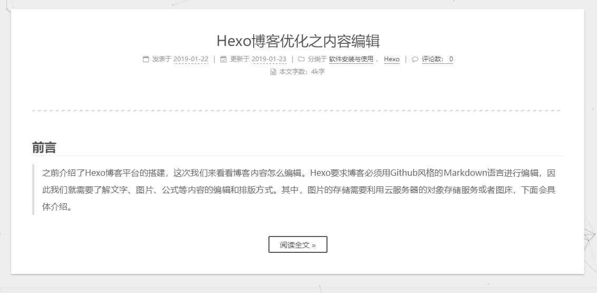

### 3.14 添加作者头像
进入主题配置文件，找到下面这行

```yml
avatar: 
  # Replace the default image and set the url here.
  url: /images/avatar.gif
```

上传自定义的图片到下列目录：/themes/hexo-theme-next/source/images/，更改 avatar 路径完成！ （我clone下来的next项目名是hexo-theme-next，有的是next，所以看清自己的路径）
```yml
# Sidebar Avatar
avatar:
  # Replace the default image and set the url here.
  url: /images/Ben.jpg
  rounded: true # 设置头像为圆形显示
  rotated: true # 当鼠标选中头像后 头像会旋转一周
```

### 3.15 添加页面顶部加载条(TODO)

全局搜索 pace 然后设置 pace: true 开启

```yml
pace:
  enable: true
  # All available colors:
  # black | blue | green | orange | pink | purple | red | silver | white | yellow
  color: blue
  # All available themes:
  # big-counter | bounce | barber-shop | center-atom | center-circle | center-radar | center-simple
  # corner-indicator | fill-left | flat-top | flash | loading-bar | mac-osx | material | minimal
  theme: bounce
```

我看**最新版本next没有这个color的参数**，可以自行设置看看

### 3.16 添加本站运行时间

修改 /blog/themes/hexo-theme-next/layout/_partials/footer.swig 文件，在末尾加入如下代码：（我clone下来的next项目名是hexo-theme-next，有的是next，所以看清自己的路径）

```swig
<!-- 网站运行时间的设置 -->
<span id="timeDate">载入天数...</span>
<span id="times">载入时分秒...</span>
<script>
    var now = new Date();
    function createtime() {
        var grt= new Date("03/01/2023 10:00:00"); //此处修改你的建站时间或者网站上线时间
        now.setTime(now.getTime()+250);
        days = (now - grt ) / 1000 / 60 / 60 / 24; dnum = Math.floor(days);
        hours = (now - grt ) / 1000 / 60 / 60 - (24 * dnum); hnum = Math.floor(hours);
        if(String(hnum).length ==1 ){hnum = "0" + hnum;} minutes = (now - grt ) / 1000 /60 - (24 * 60 * dnum) - (60 * hnum);
        mnum = Math.floor(minutes); if(String(mnum).length ==1 ){mnum = "0" + mnum;}
        seconds = (now - grt ) / 1000 - (24 * 60 * 60 * dnum) - (60 * 60 * hnum) - (60 * mnum);
        snum = Math.round(seconds); if(String(snum).length ==1 ){snum = "0" + snum;}
        document.getElementById("timeDate").innerHTML = "本站已安全运行 "+dnum+" 天 ";
        document.getElementById("times").innerHTML = hnum + " 小时 " + mnum + " 分 " + snum + " 秒.";
    }
setInterval("createtime()",250);
</script>
```

### 3.17 鼠标点击动画
1. 爱心特效
- 在 /themes/hexo-theme-next/source/js/ 下新建文件 clicklove.js 并添加代码：（我clone下来的next项目名是hexo-theme-next，有的是next，所以看清自己的路径）

```js
!function(e,t,a){function n(){c(".heart{width: 10px;height: 10px;position: fixed;background: #f00;transform: rotate(45deg);-webkit-transform: rotate(45deg);-moz-transform: rotate(45deg);}.heart:after,.heart:before{content: '';width: inherit;height: inherit;background: inherit;border-radius: 50%;-webkit-border-radius: 50%;-moz-border-radius: 50%;position: fixed;}.heart:after{top: -5px;}.heart:before{left: -5px;}"),o(),r()}function r(){for(var e=0;e<d.length;e++)d[e].alpha<=0?(t.body.removeChild(d[e].el),d.splice(e,1)):(d[e].y--,d[e].scale+=.004,d[e].alpha-=.013,d[e].el.style.cssText="left:"+d[e].x+"px;top:"+d[e].y+"px;opacity:"+d[e].alpha+";transform:scale("+d[e].scale+","+d[e].scale+") rotate(45deg);background:"+d[e].color+";z-index:99999");requestAnimationFrame(r)}function o(){var t="function"==typeof e.onclick&&e.onclick;e.onclick=function(e){t&&t(),i(e)}}function i(e){var a=t.createElement("div");a.className="heart",d.push({el:a,x:e.clientX-5,y:e.clientY-5,scale:1,alpha:1,color:s()}),t.body.appendChild(a)}function c(e){var a=t.createElement("style");a.type="text/css";try{a.appendChild(t.createTextNode(e))}catch(t){a.styleSheet.cssText=e}t.getElementsByTagName("head")[0].appendChild(a)}function s(){return"rgb("+~~(255*Math.random())+","+~~(255*Math.random())+","+~~(255*Math.random())+")"}var d=[];e.requestAnimationFrame=function(){return e.requestAnimationFrame||e.webkitRequestAnimationFrame||e.mozRequestAnimationFrame||e.oRequestAnimationFrame||e.msRequestAnimationFrame||function(e){setTimeout(e,1e3/60)}}(),n()}(window,document);
```

- 在 \themes\hexo-theme-next\layout_layout.swig 文件末尾添加：（我clone下来的next项目名是hexo-theme-next，有的是next，所以看清自己的路径）

```swig
<!-- 页面点击小红心 -->
<script type="text/javascript" src="/js/clicklove.js"></script>
```


2. 在 themes/hexo-theme-next/source/js/ 里面新建文件 fireworks.js 并添加代码：

```js
"use strict"; function updateCoords(e) { pointerX = (e.clientX || e.touches[0].clientX) - canvasEl.getBoundingClientRect().left, pointerY = e.clientY || e.touches[0].clientY - canvasEl.getBoundingClientRect().top } function setParticuleDirection(e) { var t = anime.random(0, 360) * Math.PI / 180, a = anime.random(50, 180), n = [-1, 1][anime.random(0, 1)] * a; return { x: e.x + n * Math.cos(t), y: e.y + n * Math.sin(t) } } function createParticule(e, t) { var a = {}; return a.x = e, a.y = t, a.color = colors[anime.random(0, colors.length - 1)], a.radius = anime.random(16, 32), a.endPos = setParticuleDirection(a), a.draw = function () { ctx.beginPath(), ctx.arc(a.x, a.y, a.radius, 0, 2 * Math.PI, !0), ctx.fillStyle = a.color, ctx.fill() }, a } function createCircle(e, t) { var a = {}; return a.x = e, a.y = t, a.color = "#F00", a.radius = 0.1, a.alpha = 0.5, a.lineWidth = 6, a.draw = function () { ctx.globalAlpha = a.alpha, ctx.beginPath(), ctx.arc(a.x, a.y, a.radius, 0, 2 * Math.PI, !0), ctx.lineWidth = a.lineWidth, ctx.strokeStyle = a.color, ctx.stroke(), ctx.globalAlpha = 1 }, a } function renderParticule(e) { for (var t = 0; t < e.animatables.length; t++) { e.animatables[t].target.draw() } } function animateParticules(e, t) { for (var a = createCircle(e, t), n = [], i = 0; i < numberOfParticules; i++) { n.push(createParticule(e, t)) } anime.timeline().add({ targets: n, x: function (e) { return e.endPos.x }, y: function (e) { return e.endPos.y }, radius: 0.1, duration: anime.random(1200, 1800), easing: "easeOutExpo", update: renderParticule }).add({ targets: a, radius: anime.random(80, 160), lineWidth: 0, alpha: { value: 0, easing: "linear", duration: anime.random(600, 800) }, duration: anime.random(1200, 1800), easing: "easeOutExpo", update: renderParticule, offset: 0 }) } function debounce(e, t) { var a; return function () { var n = this, i = arguments; clearTimeout(a), a = setTimeout(function () { e.apply(n, i) }, t) } } var canvasEl = document.querySelector(".fireworks"); if (canvasEl) { var ctx = canvasEl.getContext("2d"), numberOfParticules = 30, pointerX = 0, pointerY = 0, tap = "mousedown", colors = ["#FF1461", "#18FF92", "#5A87FF", "#FBF38C"], setCanvasSize = debounce(function () { canvasEl.width = 2 * window.innerWidth, canvasEl.height = 2 * window.innerHeight, canvasEl.style.width = window.innerWidth + "px", canvasEl.style.height = window.innerHeight + "px", canvasEl.getContext("2d").scale(2, 2) }, 500), render = anime({ duration: 1 / 0, update: function () { ctx.clearRect(0, 0, canvasEl.width, canvasEl.height) } }); document.addEventListener(tap, function (e) { "sidebar" !== e.target.id && "toggle-sidebar" !== e.target.id && "A" !== e.target.nodeName && "IMG" !== e.target.nodeName && (render.play(), updateCoords(e), animateParticules(pointerX, pointerY)) }, !1), setCanvasSize(), window.addEventListener("resize", setCanvasSize, !1) } "use strict"; function updateCoords(e) { pointerX = (e.clientX || e.touches[0].clientX) - canvasEl.getBoundingClientRect().left, pointerY = e.clientY || e.touches[0].clientY - canvasEl.getBoundingClientRect().top } function setParticuleDirection(e) { var t = anime.random(0, 360) * Math.PI / 180, a = anime.random(50, 180), n = [-1, 1][anime.random(0, 1)] * a; return { x: e.x + n * Math.cos(t), y: e.y + n * Math.sin(t) } } function createParticule(e, t) { var a = {}; return a.x = e, a.y = t, a.color = colors[anime.random(0, colors.length - 1)], a.radius = anime.random(16, 32), a.endPos = setParticuleDirection(a), a.draw = function () { ctx.beginPath(), ctx.arc(a.x, a.y, a.radius, 0, 2 * Math.PI, !0), ctx.fillStyle = a.color, ctx.fill() }, a } function createCircle(e, t) { var a = {}; return a.x = e, a.y = t, a.color = "#F00", a.radius = 0.1, a.alpha = 0.5, a.lineWidth = 6, a.draw = function () { ctx.globalAlpha = a.alpha, ctx.beginPath(), ctx.arc(a.x, a.y, a.radius, 0, 2 * Math.PI, !0), ctx.lineWidth = a.lineWidth, ctx.strokeStyle = a.color, ctx.stroke(), ctx.globalAlpha = 1 }, a } function renderParticule(e) { for (var t = 0; t < e.animatables.length; t++) { e.animatables[t].target.draw() } } function animateParticules(e, t) { for (var a = createCircle(e, t), n = [], i = 0; i < numberOfParticules; i++) { n.push(createParticule(e, t)) } anime.timeline().add({ targets: n, x: function (e) { return e.endPos.x }, y: function (e) { return e.endPos.y }, radius: 0.1, duration: anime.random(1200, 1800), easing: "easeOutExpo", update: renderParticule }).add({ targets: a, radius: anime.random(80, 160), lineWidth: 0, alpha: { value: 0, easing: "linear", duration: anime.random(600, 800) }, duration: anime.random(1200, 1800), easing: "easeOutExpo", update: renderParticule, offset: 0 }) } function debounce(e, t) { var a; return function () { var n = this, i = arguments; clearTimeout(a), a = setTimeout(function () { e.apply(n, i) }, t) } } var canvasEl = document.querySelector(".fireworks"); if (canvasEl) { var ctx = canvasEl.getContext("2d"), numberOfParticules = 30, pointerX = 0, pointerY = 0, tap = "mousedown", colors = ["#FF1461", "#18FF92", "#5A87FF", "#FBF38C"], setCanvasSize = debounce(function () { canvasEl.width = 2 * window.innerWidth, canvasEl.height = 2 * window.innerHeight, canvasEl.style.width = window.innerWidth + "px", canvasEl.style.height = window.innerHeight + "px", canvasEl.getContext("2d").scale(2, 2) }, 500), render = anime({ duration: 1 / 0, update: function () { ctx.clearRect(0, 0, canvasEl.width, canvasEl.height) } }); document.addEventListener(tap, function (e) { "sidebar" !== e.target.id && "toggle-sidebar" !== e.target.id && "A" !== e.target.nodeName && "IMG" !== e.target.nodeName && (render.play(), updateCoords(e), animateParticules(pointerX, pointerY)) }, !1), setCanvasSize(), window.addEventListener("resize", setCanvasSize, !1) };
```

2. 打开 themes/hexo-theme-next/layout/_layout.swig，在</body>里添加如下代码：

```

   <canvas class="fireworks" style="position: fixed;left: 0;top: 0;z-index: 1; pointer-events: none;" ></canvas> 
   <script type="text/javascript" src="//cdn.bootcss.com/animejs/2.2.0/anime.min.js"></script> 
   <script type="text/javascript" src="/js/fireworks.js"></script>

```

3. 打开主题配置文件，末尾添加：

```yml
# 鼠标点击动画 Fireworks
fireworks: true
```


### 3.18 背景动画
1. 丝带背景动画(TODO) 还未启用

```yml
# 丝带背景动画
# Generate a ribbon in your website with HTML5 canvas.
# For more information: https://github.com/hustcc/ribbon.js
canvas_ribbon: # 丝带背景动画
  enable: false
  size: 300 # The width of the ribbon
  alpha: 0.6 # The transparency of the ribbon
  zIndex: -1 # The display level of the ribbon
```
2. 网格背景动画
- 打开 hexo-theme-next/layout/_layout.swig，在<body></body>标签内添加代码

```yml

<script type="text/javascript"
    count="150"
    opacity: 1
    src="//cdn.bootcss.com/canvas-nest.js/1.0.0/canvas-nest.min.js">
</script>

```
原文怀疑src里的链接配置的 count=99，所以设置了内联式 count=150（默认也是150）, 设置后count的数量明显增加

- 配置项
  - color：线条颜色, 默认: ‘0,0,0’ ；三个数字分别为(R,G,B)，注意用, 分割
  - opacity：线条透明度（0～1），默认 0.5
  - count：线条的总数量，默认 150
  - zIndex：背景的z-index属性，css属性用于控制所在层的位置，默认：-1

3. 打开主题配置文件，添加以下代码：

```yml
# Canvas-nest
# Dependencies: https://github.com/theme-next/theme-next-canvas-nest
# For more information: https://github.com/hustcc/canvas-nest.js
# canvas_nest
canvas_nest: true # 开启动画 老版的不能用enable: true
# canvas_nest: false # 关闭动画
```

### 3.19 文章结束标志

- 在路径 \themes\hexo-theme-next\layout\\_macro 中新建 passage-end-tag.swig 文件,并添加以下内容

```swig
<div>
    
        <div style="text-align:center;color: #ccc;font-size:14px;">-------------已经到底啦！<i class="fa fa-paw"></i>-------------</div>
    
</div>
```

- 打开 \themes\hexo-theme-next\layout\\_macro\post.swig 文件，在post-body 之后(END POST BODY)，post-footer 之前添加以下代码：

```swig
<div>
  
    
  
</div>
```

### 3.20 配置live-2d模型

- 安装 hexo-helper-live2d 插件

```shell
npm install -save hexo-helper-live2d
```

- 这个默认是 shizuku 不用配置，安装后直接在站点显示，但如果想要性能优化，配置模型相关信息的话，需要再安装 shizuku。

- 在站点配置文件中添加参数：（想要配置参数的话，需要重新下载专门的模型包）

```yml
live2d:
  enable: true
  scriptFrom: local
  pluginRootPath: live2dw/
  pluginJsPath: lib/
  pluginModelPath: assets/
  tagMode: false
  log: false
  model:
    use: live2d-widget-model-<你喜欢的模型名字>
  display:
    position: right
    # width: 150 # 大小根据模型结构自己调整合适的
    # height: 300
  mobile:
    show: true # 是否在手机端显示
```
- 可供选择模型：

```
live2d-widget-model-chitose

live2d-widget-model-epsilon2_1

live2d-widget-model-gf

live2d-widget-model-haru/01 (use npm install --save live2d-widget-model-haru)

live2d-widget-model-haru/02 (use npm install --save live2d-widget-model-haru)

live2d-widget-model-haruto

live2d-widget-model-hibiki

live2d-widget-model-hijiki

live2d-widget-model-izumi

live2d-widget-model-koharu

live2d-widget-model-miku

live2d-widget-model-ni-j

live2d-widget-model-nico

live2d-widget-model-nietzsche

live2d-widget-model-nipsilon

live2d-widget-model-nito

live2d-widget-model-shizuku

live2d-widget-model-tororo

live2d-widget-model-tsumiki

live2d-widget-model-unitychan

live2d-widget-model-wanko

live2d-widget-model-z16
```

- 上面模型的选择可在lived2d中选择，并下载相应的模型：（这里先选择了 wanko作为示例）

```shell
npm install live2d-widget-model-wanko --save
```

- 安装 shizuku 模型时建议 cnpm，速度很快且用npm安装这个模型容易出现 network error

- 下载cnpm淘宝源(TODO)（我这里就没下载了,直接安装的）

```shell
npm install -g cnpm --registry=https://registry.npm.taobao.org
```

- 安装 shizuku 模型

```shell
npm install live2d-widget-model-shizuku --save
```

- hexo-helper-live2d 相当于 live2d 的脚手架，不能只下载 model，删除了 hexo-helper-live2d，live2d 模型无法生成

### 3.21 侧边栏社交链接

在主题配置文件中，开启 social 并选择想要的社交链接，取消注释

```yml
social:
  # GitHub: https://github.com/Benn314 || fab fa-github
  E-Mail: 936184713@qq.com || fa fa-envelope
  Bilibili: https://space.bilibili.com/8032462?spm_id_from=333.1007.0.0 || fa fa-envelope
  CSDN: https://blog.csdn.net/qq_41234218?type=blog || fa fa-envelope
  #Weibo: https://weibo.com/yourname || fab fa-weibo
  #Twitter: https://twitter.com/yourname || fab fa-twitter
  #FB Page: https://www.facebook.com/yourname || fab fa-facebook
  #StackOverflow: https://stackoverflow.com/yourname || fab fa-stack-overflow
  #YouTube: https://youtube.com/yourname || fab fa-youtube
  #Instagram: https://instagram.com/yourname || fab fa-instagram
  #Skype: skype:yourname?call|chat || fab fa-skype
```

#### 3.21.1 自定义icon图标

- 首先去 [iconfont-阿里巴巴矢量图库](https://www.iconfont.cn/) 下载 svg 格式的图标，需要什么图标则搜索相应图标并下载，然后把图标放在 \themes\hexo-theme-next\source\images 目录下

- 在 \themes\hexo-theme-next\source\css 目录下的 main.styl 添加代码
这里以 bilibili 和 CSDN 为例： (记得把下载下来的图片名改为bilibili.svg和csdn.svg)
```css
/* 侧边栏图标格式设置 */
.bilibili {
  background-image: url('/images/bilibili.svg');
  background-size: 1em 1em;
  opacity: 0.55;
  background-position: 0.05rem 0.2rem;
  background-repeat: no-repeat;
  height: 1rem;
  width: 1rem; 
  border-radius: 0rem;
  /*鼠标停留在图标上时，图标呈现发光效果*/
  &:hover {
      opacity: 1;
    }
} 

.csdn {
  background-image: url('/images/csdn.svg');
  background-size: 1em 1em; /*第一个参数是宽 第二个是高*/
  opacity: 0.55;
  background-position: 0.05rem 0.2rem;
  background-repeat: no-repeat;
  height: 1rem;
  width: 1rem; 
  border-radius: 0rem;
  /*鼠标停留在图标上时，图标呈现发光效果*/
  &:hover {
      opacity: 1;
    }
}
```

- 在主题配置文件中，开启 social 并在 social 项下图片来源设置为 fa bilibili 和 fa csdn

```yml
social:
  GitHub: https://github.com/ConanGentleman || fab fa-github
  E-Mail: 936184713@qq.com || fa fa-envelope
  Bilibili: https://space.bilibili.com/8032462?spm_id_from=333.1007.0.0 || fa bilibili
  CSDN: https://blog.csdn.net/qq_41234218?type=blog || fa csdn
  #Weibo: https://weibo.com/yourname || fab fa-weibo
  #Twitter: https://twitter.com/yourname || fab fa-twitter
  #FB Page: https://www.facebook.com/yourname || fab fa-facebook
  #StackOverflow: https://stackoverflow.com/yourname || fab fa-stack-overflow
  #YouTube: https://youtube.com/yourname || fab fa-youtube
  #Instagram: https://instagram.com/yourname || fab fa-instagram
  #Skype: skype:yourname?call|chat || fab fa-skype
```

### 3.22 添加fork me on github入口

- 首先到 GitHub Corners 或者 GitHub Ribbons 选择自己喜欢的图标，然后copy相应的代码粘贴到 themes/hexo-theme-next/layout/_layout.swig 文件中，把代码中的href后面的值替换成你要跳转的地址，比如你的GitHub主页


```html
  <a href="https://github.com/ConanGentleman" class="github-corner" aria-label="View source on GitHub"><svg width="80" height="80" viewBox="0 0 250 250" style="fill:#151513; color:#fff; position: absolute; top: 0; border: 0; right: 0;" aria-hidden="true"><path d="M0,0 L115,115 L130,115 L142,142 L250,250 L250,0 Z"></path><path d="M128.3,109.0 C113.8,99.7 119.0,89.6 119.0,89.6 C122.0,82.7 120.5,78.6 120.5,78.6 C119.2,72.0 123.4,76.3 123.4,76.3 C127.3,80.9 125.5,87.3 125.5,87.3 C122.9,97.6 130.6,101.9 134.4,103.2" fill="currentColor" style="transform-origin: 130px 106px;" class="octo-arm"></path><path d="M115.0,115.0 C114.9,115.1 118.7,116.5 119.8,115.4 L133.7,101.6 C136.9,99.2 139.9,98.4 142.2,98.6 C133.8,88.0 127.5,74.4 143.8,58.0 C148.5,53.4 154.0,51.2 159.7,51.0 C160.3,49.4 163.2,43.6 171.4,40.1 C171.4,40.1 176.1,42.5 178.8,56.2 C183.1,58.6 187.2,61.8 190.9,65.4 C194.5,69.0 197.7,73.2 200.1,77.6 C213.8,80.2 216.3,84.9 216.3,84.9 C212.7,93.1 206.9,96.0 205.4,96.6 C205.1,102.4 203.0,107.8 198.3,112.5 C181.9,128.9 168.3,122.5 157.7,114.1 C157.9,116.9 156.7,120.9 152.7,124.9 L141.0,136.5 C139.8,137.7 141.6,141.9 141.8,141.8 Z" fill="currentColor" class="octo-body"></path></svg></a><style>.github-corner:hover .octo-arm{animation:octocat-wave 560ms ease-in-out}@keyframes octocat-wave{0%,100%{transform:rotate(0)}20%,60%{transform:rotate(-25deg)}40%,80%{transform:rotate(10deg)}}@media (max-width:500px){.github-corner:hover .octo-arm{animation:none}.github-corner .octo-arm{animation:octocat-wave 560ms ease-in-out}}</style>
```


### 3.23 更换博客背景

1. 更换主背景
- 把准备好的背景图放入 themes\hexo-theme-next\source\images 中

- 新版本需要新建 hexo/source/_data/styles.styl，即在 hexo目录的 source文件夹下新建 _data 文件夹，文件夹中新建 styles.styl。**注意：是新建在 hexo目录下 source文件夹里，而不是主题文件 next目录下的 source文件夹**，如图：


- 打开 styles.styl，添加如下：

```css
//背景图片设置
body {
    background-image: url(/images/background.jpg);
    background-repeat: no-repeat;
    background-attachment: fixed;
    background-size: 100% 100%;
    // background-size: cover // 填充
}
```
- 配置项
  - background-image:url 为图片路径，可以直接使用链接，也可以是图片路径（将自定义图片放入hexo-theme-next\public\images路径下或者之前提到的themes\hexo-theme-next\source\images中）
  - background-repeat：若果背景图片不能全屏，那么是否平铺显示，充满屏幕
  - background-attachment：背景是否随着网页上下滚动而滚动，fixed 为固定
  - background-size：图片展示大小，这里设置 100%，100% 的意义为：如果背景图片不能全屏，那么是否通过拉伸的方式将背景强制拉伸至全屏显示
  - background-size: cover // 填充

- 打开主题配置文件，将 custom_file_path 的 sytle 注释打开。(**variable**: source/_data/variables.styl是**后面[3.25-边框圆角](#325-边框圆角)才设置的**这里可以先不用，但也可以先设置了)

```yml
custom_file_path:
  #head: source/_data/head.njk
  #header: source/_data/header.njk
  #sidebar: source/_data/sidebar.njk
  #postMeta: source/_data/post-meta.njk
  #postBodyEnd: source/_data/post-body-end.njk
  #footer: source/_data/footer.njk
  #bodyEnd: source/_data/body-end.njk
  variable: source/_data/variables.styl
  #mixin: source/_data/mixins.styl
  style: source/_data/styles.styl
```

2. 添加侧边栏背景

- 对 themes\hexo-theme-next\source\css\\_schemes\Pisces\\_header.styl 中 site-brand-container的background进行修改

```css
.site-brand-container {
  // background: var(--theme-color); // 默认背景
  background: url('https://images.unsplash.com/photo-1668871333606-ef8461d43922?ixlib=rb-4.0.3&ixid=MnwxMjA3fDB8MHxlZGl0b3JpYWwtZmVlZHw0fHx8ZW58MHx8fHw%3D&auto=format&fit=crop&w=600&q=60');
  // background: url('https://images.unsplash.com/photo-1661961110144-12ac85918e40?ixlib=rb-4.0.3&ixid=MnwxMjA3fDF8MHxlZGl0b3JpYWwtZmVlZHw4NHx8fGVufDB8fHx8&auto=format&fit=crop&w=600&q=60');
  // background: url('https://images.unsplash.com/photo-1668735648397-9defaa967b15?ixlib=rb-4.0.3&ixid=MnwxMjA3fDB8MHxlZGl0b3JpYWwtZmVlZHwxMDV8fHxlbnwwfHx8fA%3D%3D&auto=format&fit=crop&w=600&q=60');
  // background: url('https://images.unsplash.com/photo-1668765005700-021ea0bb9250?ixlib=rb-4.0.3&ixid=MnwxMjA3fDB8MHxlZGl0b3JpYWwtZmVlZHwxMDN8fHxlbnwwfHx8fA%3D%3D&auto=format&fit=crop&w=600&q=60');
  //background: url('https://images.unsplash.com/photo-1668681919287-7367677cdc4c?ixlib=rb-4.0.3&ixid=MnwxMjA3fDB8MHxlZGl0b3JpYWwtZmVlZHwxNTV8fHxlbnwwfHx8fA%3D%3D&auto=format&fit=crop&w=600&q=60');
  background-size: cover; // 填充
  //background-size: 100% 100%;

  .site-nav-on & {
    +tablet-mobile() {
      box-shadow: 0 0 16px rgba(0, 0, 0, .5);
    }
  }
}
```

- 扩展
[unsplash](https://source.unsplash.com/)是一个高清大图免费下载的好网站，提供了大量的图片和外链API，可以用来当作自己的博客背景

### 3.24 设置透明度
- 单独给每个区域设置opacity会出现很多问题，例如搜索框弹出会被覆盖图层导致无法进行本地搜索

- 最理想是进行全局设置，在 blog\source\\_data\styles.styl 中 直接设置body的透明度为0.85 全体透明化，opacity的值可以自行调整

```css
//背景图片设置
body {
    background-image: url(/images/background.jpg);
    background-repeat: no-repeat;
    background-attachment: fixed;
    background-size: 100% 100%;
    // background-size: cover // 填充
    opacity: 0.85;
    //可选(用于移动端显示)
    +mobile(){
      background-image: url(https://unsplash.com/photos/shooting-star-in-night-sky-5LOhydOtTKU); //这里选用的是https://source.unsplash.com/上的在线图片，用于移动端显示（可选）
      background-size: cover;
    }
}
```

#### 3.24.1 文章区域位置调整(TODO,调整了会有问题，建议别调整了，或者查一下错误) 
- 在\themes\hexo-theme-next\source\css_common\components\post\post.styl （旧版可能是index.styl文件）设置了布局（调整位置信息） ,不需要的话可以删掉下面的margin和padding（默认值没有设置margin和padding）或者修改其值

```css
.use-motion {
  if (hexo-config('motion.transition.post_block')) {
    .post-block {
      visibility: hidden;
      margin-top: 60px;
      margin-bottom: 60px;
      margin-left: 2px;
      padding-top: 45px;
      // border-radius: 20px 20px 20px 20px;
      -webkit-box-shadow: 0 0 5px rgba(202, 203, 203, .5);
      -moz-box-shadow: 0 0 5px rgba(202, 203, 204, .5);
      opacity: 0.95; // 添加透明度
    }
    .pagination, .comments {
      visibility: hidden;
    }
  }//文章位置调整
```

### 3.25 边框圆角
- 在之前新建的 _data 目录下新建 variables.styl，类似新建 styles.styl。打开 variables.styl，添加如下：

```css
// 圆角设置
$border-radius-inner     = 20px 20px 20px 20px;
$border-radius           = 20px;
```

- 打开主题配置文件, custom_file_path 中 variable 的注释 这个已经在[3.23 更换博客背景](#323-更换博客背景)中设置过了

```yml
custom_file_path:

variable: source/_data/variables.styl
```

- 此时有一个问题就是 侧边栏-分类左下/右下 的圆角明显有一层阴影，下图是修正过的（图片只是为了指明位置）
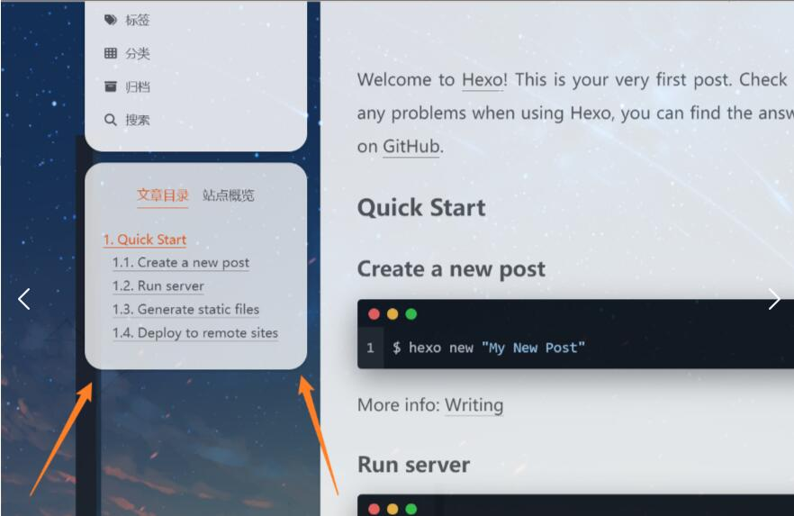
- 原因是开启 主题配置文件中back2top 的 sidebar 和 scrollpercent，back2top的阴影背景覆盖了圆角，把阴影背景改为透明便可解决，因为我们需要的只是scrollpercent。打开/themes/hexo-theme-next/source/css/_variables/Gemini.styl 内代码,将 $body-bg-color 赋值为透明 transparent

```css
// Variables of Gemini scheme
// ==================================================

@import "Pisces.styl";

// Settings for some of the most global styles.
// --------------------------------------------------
// $body-bg-color           = #eee;
//将 $body-bg-color 赋值为透明 transparent 解决back2top的阴影背景覆盖边框圆角的问题
$body-bg-color           = transparent; 

// Borders.
// --------------------------------------------------
$box-shadow-inner        = 0 2px 2px 0 rgba(0, 0, 0, .12), 0 3px 1px -2px rgba(0, 0, 0, .06), 0 1px 5px 0 rgba(0, 0, 0, .12);
$box-shadow              = 0 2px 2px 0 rgba(0, 0, 0, .12), 0 3px 1px -2px rgba(0, 0, 0, .06), 0 1px 5px 0 rgba(0, 0, 0, .12), 0 -1px .5px 0 rgba(0, 0, 0, .09);

$border-radius-inner     = initial;
$border-radius           = initial;
// $border-radius-inner     = 0 0 3px 3px;
// $border-radius           = 3px;
```

#### 3.25.1 修改侧边栏顶部圆角
在 blog\themes\hexo-theme-next\source\css\\_common\outline\header\header.styl (旧版可能是index.styl) 中对 site-brand-container（审查元素得知） 进行修改

```css
.site-brand-container {
  display: flex;
  flex-shrink: 0;
  padding: 0 10px;
  border-radius: 18.8px 18.8px 0 0; // 上边圆角 下边尖角 不设置20px 20px 0 0的原因是因为下面的sidebar的class="header"有一点白色溢出 所以把圆角设置小点对其进行覆盖
}

```
左下/右下角不需要设置圆角，不然反而不美观

### 3.26 调整back2top透明度和位置

1. 调整透明度
进入 blog\themes\hexo-theme-next\source\css\\_variables\Pisces.styl，根据自身博客修改透明度至满意值。（$b2t-opacity-hover 新版没有这个属性 ，看有没有必要设置）

```css
// Back to top
$b2t-opacity  = .94; // 默认 .6 // 调整透明度
$b2t-opacity-hover  = .99; // 默认 .8   这个新版没有 ，看有没有必要设置
$b2t-position-bottom          = -100px;
$b2t-position-bottom-on       = 30px;
```

2. 调整位置靠左

调整位置靠左的原因是设计把live-2d放到右边，而此时back2top按钮不管是在live-2d图层上方(不美观)还是下方(按钮无法被点击且看不到百分比)效果都不理想，故把按钮调整至靠左位置

- 在 blog\themes\hexo-theme-next\source\css\\_variables\base.styl 中有Back to top的基本参数信息，我们把 \$b2t-position-right 和 \$b2t-position-right-mobile 注释掉，使其默认靠左

```
// Components
// --------------------------------------------------
// Back to top
$b2t-opacity                  = .8;
$b2t-opacity-hover            = 1;
$b2t-position-bottom          = -100px;
$b2t-position-bottom-on       = 30px;
// $b2t-position-right           = 30px; //注释掉 themes\hexo-theme-next\source\css\_mixins.styl的逻辑也可以注释掉 不然可能有warnning
// $b2t-position-right-mobile    = 20px;//注释掉 themes\hexo-theme-next\source\css\_mixins.styl的逻辑也可以注释掉 不然可能有warnning
$b2t-font-size                = 12px;
$b2t-color                    = white;
$b2t-bg-color                 = $black-deep;

$sidebar-toggle-inner-size    = 16px;
$sidebar-toggle-padding       = 5px;
$sidebar-toggle-size          = $sidebar-toggle-inner-size + $sidebar-toggle-padding * 2;
```

这里从right修改成left无效的原因是值没有变 只是换了个变量名
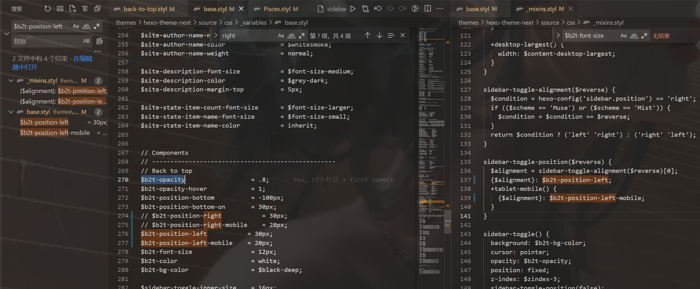

- 然后在 themes\hexo-theme-next\source\css\\_common\components\back-to-top.styl 末尾(保证在body里)添加如下两行代码并注释 margin-right: 8px;

```
if (hexo-config('back2top.enable')) {
  .back-to-top {
    font-size: $b2t-font-size;

    span {
      //margin-right: 8px; // 注释掉（默认设置是这个 给改成末尾两行）
    }
    ...
    ...
    padding-right: 5px; // 新添加的代码
    left: 30px; // // 新添加的代码
  }
}

```

### 3.27 添加README.md文件(TODO)
每个项目下一般都有一个 README.md 文件，但是使用 hexo 部署到仓库后，项目下是没有 README.md 文件的 **（最新的项目好像有了）**

1. 在 Hexo 目录下的 source 根目录下添加一个 README.md文件，修改站点配置文件 _config.yml，将 skip_render 参数的值设置为（这个需要设置）

```yml
skip_render: README.md
```
保存退出即可 再次使用 hexo d 命令部署博客的时候就不会在渲染 README.md 文件了

### 3.28 侧栏Celeste(旋转的小人)
1. 这里罗列两种位置摆放效果
- 放在 blog\themes\hexo-theme-next\layout\\_macro\sidebar.swig  （我选的这种，我觉得这种更好看，而且第二种没有找到合适的位置放，老有问题）

文件中找到以下内容
```html
      
        <div class="back-to-top motion-element">
          <i class="fa fa-arrow-up"></i>
          <span>0%</span>
        </div>
      
```
然后替换成以下内容
```html
<div class="twopeople">
        <div class="container" style="height:200px;">
            <canvas class="illo" width="800" height="800" style="max-width: 200px; max-height: 200px; touch-action: none; width: 640px; height: 640px;"></canvas>
        </div>
        <script src="https://cdn.jsdelivr.net/gh/Justlovesmile/CDN/js/twopeople1.js"></script>
        <script src="https://cdn.jsdelivr.net/gh/Justlovesmile/CDN/js/zdog.dist.js"></script>
        <script id="rendered-js" src="https://cdn.jsdelivr.net/gh/Justlovesmile/CDN/js/twopeople.js"></script>
        <style>
            .twopeople{
                margin: 0;
                align-items: center;
                justify-content: center;
                text-align: center;
            }
            canvas {
                display: block;
                margin: 0 auto;
                cursor: move;
            }
        </style>
      </div>

      
        <div class="back-to-top animated" role="button" aria-label="{{ __('accessibility.back_to_top') }}">
          <i class="fa fa-arrow-up"></i>
          <span>0%</span>
        </div>
      
    </div>
  </aside>

```

- 放在 blog\themes\hexo-theme-next\layout\_layout.njk

```html
<div class="column">
      <header class="header" itemscope itemtype="http://schema.org/WPHeader">
        
      </header>
      
        
      

      <-- 旋转的小人 -->
      <div class="twopeople">
        <div class="container" style="height:200px;">
            <canvas class="illo" width="800" height="800" style="max-width: 200px; max-height: 200px; touch-action: none; width: 640px; height: 640px;"></canvas>
        </div>
        <script src="https://cdn.jsdelivr.net/gh/Justlovesmile/CDN/js/twopeople1.js"></script>
        <script src="https://cdn.jsdelivr.net/gh/Justlovesmile/CDN/js/zdog.dist.js"></script>
        <script id="rendered-js" src="https://cdn.jsdelivr.net/gh/Justlovesmile/CDN/js/twopeople.js"></script>
        <style>
            .twopeople{
                margin: 0;
                align-items: center;
                justify-content: center;
                text-align: center;
            }
            canvas {
                display: block;
                margin: 0 auto;
                cursor: move;
            }
        </style>
      </div>
    </div>
```

这种方式的动画位置不会固定在浏览器窗口位置，而是会随着滚动而消失

### 3.29 懒加载开启(性能优化)(TODO)
进入 主题配置文件找到lazyload，修改为true：**(我开启后加载不出来界面了不知道为什么，所以就没开了)**

```yml
# Vanilla JavaScript plugin for lazyloading images.
# For more information: https://apoorv.pro/lozad.js/demo/
lazyload: true # 懒加载开启
```

### 3.30 加入网易云音乐播放器

在网页搜索网易云音乐，选择音乐，并生成外链播放器，获取 iframe 标签

```
<!-- 外链播放器 溯（钢琴版）-->
<iframe frameborder="no" border="0" marginwidth="0" marginheight="0" width=330 height=86 src="//music.163.com/outchain/player?type=2&id=1433584979&auto=1&height=66"></iframe>
```

- 建议把标签放到侧边栏，在 Blog/themes/next/layout/_macro/sidebar.njk 或 themes\hexo-theme-next\layout\_layout.njk 文件下，同理 [3.28 celeste旋转的小人](#328-侧栏celeste旋转的小人)的方式选择位置粘贴进去，不同位置效果不同。
我依旧是在blog\themes\hexo-theme-next\layout\\_macro\sidebar.swig里面设置的，放在了小人和back2top的按钮中间

```html
<div class="twopeople">
        <div class="container" style="height:200px;">
            <canvas class="illo" width="800" height="800" style="max-width: 200px; max-height: 200px; touch-action: none; width: 640px; height: 640px;"></canvas>
        </div>
        <script src="https://cdn.jsdelivr.net/gh/Justlovesmile/CDN/js/twopeople1.js"></script>
        <script src="https://cdn.jsdelivr.net/gh/Justlovesmile/CDN/js/zdog.dist.js"></script>
        <script id="rendered-js" src="https://cdn.jsdelivr.net/gh/Justlovesmile/CDN/js/twopeople.js"></script>
        <style>
            .twopeople{
                margin: 0;
                align-items: center;
                justify-content: center;
                text-align: center;
            }
            canvas {
                display: block;
                margin: 0 auto;
                cursor: move;
            }
        </style>
      </div>

<!-- 放在了这里start！！！-->
<!-- 外链播放器 溯（钢琴版）-->
<iframe frameborder="no" border="0" marginwidth="0" marginheight="0" width=330 height=86 src="//music.163.com/outchain/player?type=2&id=1433584979&auto=1&height=66"></iframe>
<!-- 放在了这里end！！！-->


      
        <div class="back-to-top animated" role="button" aria-label="{{ __('accessibility.back_to_top') }}">
          <i class="fa fa-arrow-up"></i>
          <span>0%</span>
        </div>
      
```
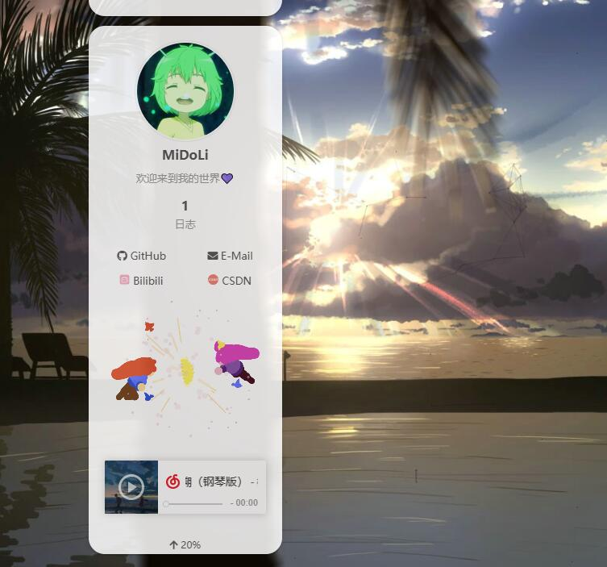


### 3.31 添加Aplayer音乐播放器(进阶)
由于网易云外链播放器每次只能选择一首歌，如果想要让播放器的功能更加全面丰富，我们可以通过安装插件 Aplayer来满足我们的需求

- 首先，先下载Aplayer源码：APlayer 或者执行以下命令

```shell
npm install aplayer --save
```
如果通过命令执行则在 blog/node_modules/aplayer中找到dist文件夹

- ​将文件中的dist文件夹复制到路径：blog/themes/next/source

1. 在目录 blog/themes/next/source/dist 下新建 music.js 文件，内容是：

```js
const ap = new APlayer({
  container: document.getElementById('aplayer'),
  fixed: true,
  // autoplay: true,
  audio: [
    {
      name: '溯（钢琴版）',
      artist: '柳轻颂',
      url: 'http://music.163.com/song/media/outer/url?id=1433584979.mp3',
      cover: 'http://p1.music.126.net/qX7knUIlpmbJ34UBzCCS6w==/109951164802366812.jpg?param=130y130',
    },
    {
      name: "夢灯籠",
      artist: 'RADWIMPS',
      url: '/images/夢灯籠.mp3',
      cover: 'http://p2.music.126.net/sSxbRt9RpC6s_MaewyDJfA==/18597139672292692.jpg?param=130y130',
    }
  ]
});
```
歌曲信息可自行添加自己喜欢的

2. 配置项（记得都要加引号）
- name：歌曲名称
- artist：作者
- url：连接（具体怎样操作看下面步骤），
- cover：是图片连接，可以是本地图片，也可以是在线图片，本地放在 source/images然后修改路径即可

更多参数(⭐)：
```js
const ap = new APlayer({
    container: document.getElementById('aplayer'), //播放器容器元素
    mini: false, //迷你模式
    autoplay: false, //自动播放
    theme: '#FADFA3', //主题色
    loop: 'all', //音频循环播放, 可选值: 'all'全部循环, 'one'单曲循环, 'none'不循环
    order: 'random', //音频循环顺序, 可选值: 'list'列表循环, 'random'随机循环
    preload: 'auto', //预加载，可选值: 'none', 'metadata', 'auto'
    volume: 0.7, //默认音量，请注意播放器会记忆用户设置，用户手动设置音量后默认音量即失效
    mutex: true, //互斥，阻止多个播放器同时播放，当前播放器播放时暂停其他播放器
    listFolded: false, //列表默认折叠
    listMaxHeight: 90, //列表最大高度
    lrcType: 3, //歌词传递方式
    audio: [ //音频信息,包含以下
        {
            name: 'name1', //音频名称
            artist: 'artist1', //音频艺术家
            url: 'url1.mp3', //音频外链
            cover: 'cover1.jpg', //音频封面
            lrc: 'lrc1.lrc', //音频歌词，配合上面的lrcType使用
            theme: '#ebd0c2' //切换到此音频时的主题色，比上面的 theme 优先级高
        },
        {
            name: 'name2', //如果只有一首歌，删掉这一块，如有更多歌曲按此格式逐渐往下添加
            artist: 'artist2',
            url: 'url2.mp3',
            cover: 'cover2.jpg',
            lrc: 'lrc2.lrc',
            theme: '#46718b'
        }
    ]
});
```

3. url添加歌曲方法
- 链接方式url
  - 网易云网页播放一首歌曲
  - 将网址中的 id 进行复制：https://music.163.com/#/song?id=1411358329，也就是1411358329
  - 将下面代码中的 id 修改为你想添加歌曲的 id：http://music.163.com/song/media/outer/url?id=xxx.mp3 （网易云音乐在线播放歌曲模板），即http://music.163.com/song/media/outer/url?id=1411358329.mp3
- 本地方式url
  - 先下载好音频问价
  - 然后放在themes\hexo-theme-next\source\images里 
  - url为 '/images/音频名字.mp3'

4. 引用头文件
我仍然把播放器放在了原来外链播放器的位置blog\themes\hexo-theme-next\layout\\_macro\sidebar.swig,内容为：


```html
<link rel="stylesheet" href="/dist/APlayer.min.css">
<div id="aplayer"></div>
<script type="text/javascript" src="/dist/APlayer.min.js"></script>
<script type="text/javascript" src="/dist/music.js"></script>
```

（也可以放在在路径：blog/themes/hexo-theme-next/layout/_layout.swig 文件，然后将下面的代码添加到：<body itemscope ...> （在body里面就可以）)


完成后需要重新部署才能看到效果

aplayer我采用的是默认的效果，详细信息请查阅 [官方文档](https://aplayer.js.org/#/home)

5. 因为了有了 aplayer 插件 所有原先的 back2top 会被遮挡 需要重新调整位置。 没有影响则可不调整(TODO)，放到sidebar没有影响，如果放在llayout中，修改如下：

```css
padding-right: 5px;
// left: 30px; // 原先修改过后的位置 加了aplayer后 重新定义位置如下
left: 15%

```

### 3.32 删除了默认的landscope主题(性能优化)(TODO)

```
压缩内存
```

### 3.33 评论系统
根据网上对国内国外的评价系统对比，可知Valine是近几年大受欢迎的博客评价系统，但由于作者已经放弃了对 Valine 的维护，bug一堆尚未解决，所以最终敲定用基于Valine开发的新版本[Waline](https://waline.js.org/)作为本博客的评价系统。**（但我的评价是如果hexo版本不高，建议还是用valine就行了，又快又方便），好像next自带的gitalk也可以评论，有时间可以试试[配置gittalk](https://blog.douchen.life/Hexo%E5%8D%9A%E5%AE%A2%E9%85%8D%E7%BD%AEGitalk%E8%AF%84%E8%AE%BA%E7%B3%BB%E7%BB%9F/)**

1. LeanCloud 设置 (数据库)
注意！：请使用中国大陆版，国外版已被禁止国内使用
   - Leancloud已经禁止了国内访问国际版 https://forum.leancloud.cn/t/2022-8/25408

- (1) 登录或注册[LeanCloud](https://console.leancloud.app/login) 并进入 [控制台](https://console.leancloud.app/apps)
- (2) 点击左上角 创建应用 并起一个你喜欢的名字 (请选择免费的开发版): 
- (3) 进入应用，选择左下角的 设置 > 应用凭证。你可以看到你的 APP ID,APP Key 和 Master Key。请记录它们，以便后续使用。 
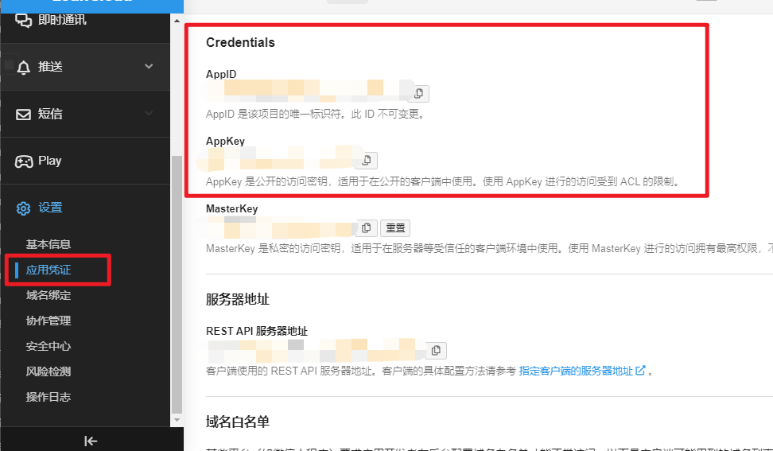

1. Vercel 部署 (服务端)
- (1) 点击进入[Vercel](https://vercel.com/new/clone?repository-url=https%3A%2F%2Fgithub.com%2Fwalinejs%2Fwaline%2Ftree%2Fmain%2Fexample),注册登录
- (2) 选择git 作用域以及输入仓库名（最终我的仓库名为midoli_blog）,并点击 Create 继续:
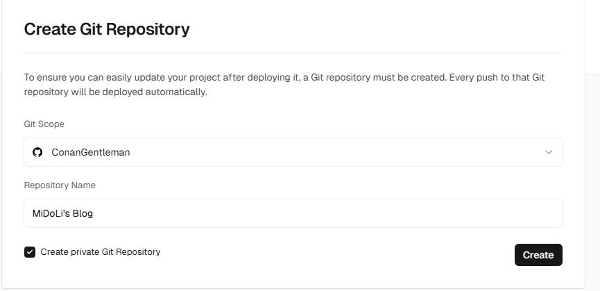
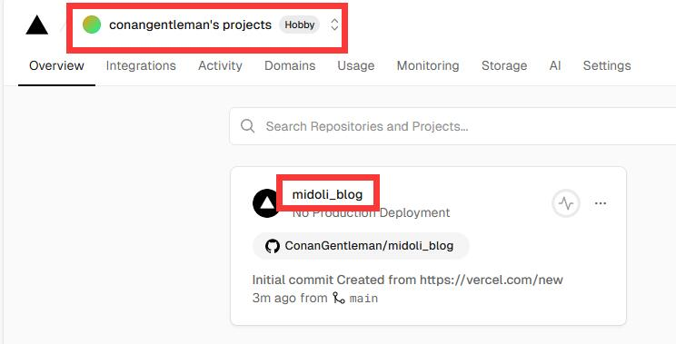
- (3) 此时 Vercel 会基于 Waline 模板帮助你新建并初始化仓库，仓库名为你之前输入的项目名，请等待一会儿
- (4) 构建结束后，点击顶部信息，并点击仓库，找到Settings - Environment Variables 进入环境变量配置页，并配置三个环境变量 **LEAN_ID, LEAN_KEY 和 LEAN_MASTER_KEY**。它们的值分别对应上一步在 LeanCloud 中获得的 **APP ID, APP KEY, Master Key**。（需要进入项目中的 Settings，而不是总设置里，总设置里没有 Environment Variables 选项配置）
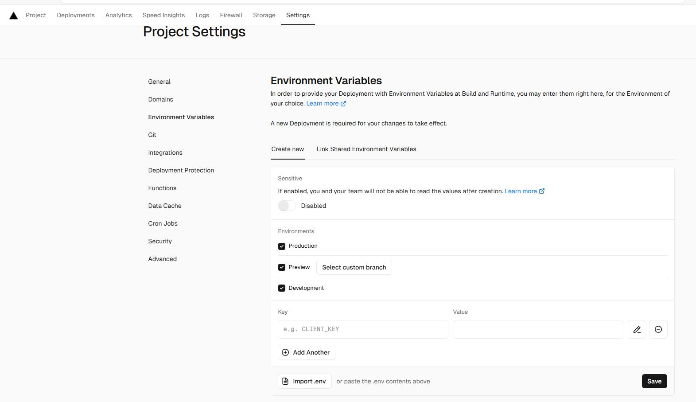
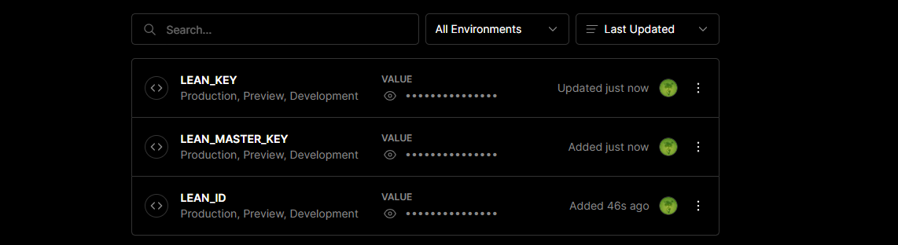


```
如果你使用 LeanCloud 国内版，请额外配置 LEAN_SERVER 环境变量，值为你绑定好的域名。
```

- (5) 环境变量配置完成之后点击顶部的 Deployments 点击顶部最新的一次部署右侧的 Redeploy 按钮进行重新部署。该步骤是为了让刚才设置的环境变量生效。
- (6) 此时会跳转到 Overview 界面开始部署，等待片刻后 STATUS 会变成 Ready。此时请点击 Visit ，即可跳转到部署好的网站地址，此地址即为你的服务端地址

1. 绑定域名 (可选)(TODO)
- (1) 点击顶部的 Settings - Domains 进入域名配置页
- (2) 输入需要绑定的域名并点击 Add

- (3) 在域名服务器商处添加新的 CNAME 解析记录

Type|	Name|	Value
---|---|---
CNAME|	example|	cname.vercel-dns.com
- (4) 等待生效，你可以通过自己的域名来访问了
  - 评论系统：example.yourdomain.com
  - 评论管理：example.yourdomain.com/ui


4. 在Next中配置
- 先到你hexo的站点目录下安装waline：

```shell
npm install @waline/hexo-next --save
```

- 找到Next主题配置文件，_config.yml进行如下配置，方便日后升级覆盖：

```yml
# Waline 评论
# For more information: https://waline.js.org, https://github.com/walinejs/waline
waline:
  enable: true #是否开启
  serverURL: blog-waline-comment.vercel.app # Waline #服务端地址，我们这里就是上面部署的 Vercel 地址
  placeholder: 欢迎评论呀~ # #评论框的默认文字
  avatar: mm # 头像风格
  meta: [nick, mail, link] # 自定义评论框上面的三个输入框的内容
  pageSize: 10 # 评论数量多少时显示分页
  lang: zh-cn # 语言, 可选值: en, zh-cn
  # Warning: 不要同时启用 `waline.visitor` 以及 `leancloud_visitors`.
  visitor: true # 文章阅读统计
  comment_count: true # 如果为 false , 评论数量只会在当前评论页面显示, 主页则不显示
  requiredFields: [nick, mail] # 设置用户评论时必填的信息，[nick,mail]: [nick] | [nick, mail]
  libUrl: # Set custom library cdn url
  
```

5. 添加评论表情包
在主题配置文件下的 waline 添加如下 emoji 代码
```yml
# Waline 评论
# For more information: https://waline.js.org, https://github.com/walinejs/waline
waline:
  enable: true #是否开启
  ......
  emoji: [
      https://unpkg.com/@waline/emojis@1.1.0/tw-emoji, # 加不加https头都可以
      //unpkg.com/@waline/emojis@1.1.0/bilibili,
      //unpkg.com/@waline/emojis@1.1.0/alus,
      https://unpkg.com/@waline/emojis@1.1.0/weibo,
    ]

```
更多表情参考 [自定义表情](https://waline.js.org/guide/client/emoji.html)

还有一个问题 就是大伙评论的东西 不翻墙刷新不出来

```
原因 jsdeliver被墙 参考链接🔗: [jsdelivr被墙,hexo-next切换为自定义CDN](https://www.xygblog.com/p/8ebdba58/)
```
6. leanClound作为数据库，同时可以用来作为图床存储文件，使其文件添加url地址
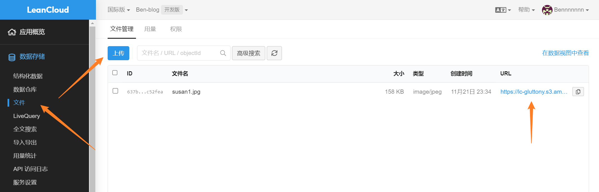


### 3.33.1 评论-邮箱通知(TODO)
[详细可查看官方文档](https://waline.js.org/guide/get-started/)
当网站有用户发布评论或者用户回复评论时，Waline 支持对博主和回复评论作者进行通知。

- 博主通知支持多种方式，包括 QQ、微信、邮件等。
- 当访客的评论收到回复时，我们会对访客进行邮件通知。

具体步骤 可看 [Hexo-Next主题搭建个人博客最新配置教程！](https://blog.csdn.net/Bennnnnnn/article/details/128000842?spm=1001.2101.3001.6650.12&utm_medium=distribute.pc_relevant.none-task-blog-2%7Edefault%7EBlogCommendFromBaidu%7ERate-12-128000842-blog-83094693.235%5Ev43%5Epc_blog_bottom_relevance_base8&depth_1-utm_source=distribute.pc_relevant.none-task-blog-2%7Edefault%7EBlogCommendFromBaidu%7ERate-12-128000842-blog-83094693.235%5Ev43%5Epc_blog_bottom_relevance_base8&utm_relevant_index=18)的**评论-邮箱通知**

### 3.34 背景图上传CDN图床(性能优化) (TODO)
由于无缓存刷新（或者第一次加载页面）的时候 背景图片加载很慢（只有900多k）所以上传到CDN图床 https://cdnjson.com/

背景图链接：https://cdnjson.com/images/2022/11/21/bg1.jpg

### 3.35 通过修改 busuanzi 的解决(TODO)

- 新建 busuanzi.js 到 themes\hexo-theme-next\source\js\ 目录下，并copy

```js
var bszCaller, bszTag; !function () { var c, d, e, a = !1, b = []; ready = function (c) { return a || "interactive" === document.readyState || "complete" === document.readyState ? c.call(document) : b.push(function () { return c.call(this) }), this }, d = function () { for (var a = 0, c = b.length; c > a; a++)b[a].apply(document); b = [] }, e = function () { a || (a = !0, d.call(window), document.removeEventListener ? document.removeEventListener("DOMContentLoaded", e, !1) : document.attachEvent && (document.detachEvent("onreadystatechange", e), window == window.top && (clearInterval(c), c = null))) }, document.addEventListener ? document.addEventListener("DOMContentLoaded", e, !1) : document.attachEvent && (document.attachEvent("onreadystatechange", function () { /loaded|complete/.test(document.readyState) && e() }), window == window.top && (c = setInterval(function () { try { a || document.documentElement.doScroll("left") } catch (b) { return } e() }, 5))) }(), bszCaller = { fetch: function (a, b) { var c = "BusuanziCallback_" + Math.floor(1099511627776 * Math.random()); window[c] = this.evalCall(b), a = a.replace("=BusuanziCallback", "=" + c), scriptTag = document.createElement("SCRIPT"), scriptTag.type = "text/javascript", scriptTag.defer = !0, scriptTag.src = a, scriptTag.referrerPolicy = "no-referrer-when-downgrade", document.getElementsByTagName("HEAD")[0].appendChild(scriptTag) }, evalCall: function (a) { return function (b) { ready(function () { try { a(b), s = document.querySelector('[src*=BusuanziCallback]'), s.parentElement.removeChild(s) } catch (c) { bszTag.hides() } }) } } }, bszCaller.fetch("//busuanzi.ibruce.info/busuanzi?jsonpCallback=BusuanziCallback", function (a) { bszTag.texts(a), bszTag.shows() }), bszTag = { bszs: ["site_pv", "page_pv", "site_uv"], texts: function (a) { this.bszs.map(function (b) { var c = document.getElementById("busuanzi_value_" + b); c && (c.innerHTML = a[b]) }) }, hides: function () { this.bszs.map(function (a) { var b = document.getElementById("busuanzi_container_" + a); b && (b.style.display = "none") }) }, shows: function () { this.bszs.map(function (a) { var b = document.getElementById("busuanzi_container_" + a); b && (b.style.display = "inline") }) } };

```

- 可以把修改后的静态文件放在博客里，然后修改 themes\hexo-theme-next\layout_third-party\statistics\busuanzi-counter.njk \<script> 中的 src

```html

  <script{{ pjax }} async src="/js/busuanzi.js"></script>


```

冲突解决原理参考链接🔗：https://ouuan.moe/post/2022/08/busuanzi-and-live2d

### 3.36 不蒜子的访客人数和文章阅读统计功能
NexT主题已集成了不蒜子的访客人数和文章阅读统计功能
- 在主题配置文件中

```yml
# Show Views / Visitors of the website / page with busuanzi.
# For more information: http://ibruce.info/2015/04/04/busuanzi/
busuanzi_count:
  enable: true
  total_visitors: true # 总访问人数
  total_visitors_icon: fa fa-user
  total_views: true # 总访问次数
  total_views_icon: fa fa-eye
  post_views: true # 文章访问次数 注意：不在首页显示每篇文章的阅读次数，点击全文阅读即显示阅读次数（起初以为是与live-2d代码冲突的问题）
  post_views_icon: far fa-eye

```
只开启了文章访问次数 总访问人数和总访问次数有bug尚未修复 如需开启请先修复

修复参考链接🔗: https://muyuuuu.github.io/2019/11/22/busuanzi-notdisplay/

### 3.37 文末尾版权声明
主题配置文件中直接搜索并且修改以下内容即可：

```yml
creative_commons:
  license: by-nc-sa
  sidebar: true
  post: true
  language: zh-CN
```

### 3.37 友情链接

主题配置文件中直接搜索关键字 Blog rolls,设置即可：

- icon：设置图标
- title：标题
- links：输入你的友情链接，可以直接修改或者添加

```yml
# Blog rolls
links_settings:
  icon: fa fa-link
  title: Links
  # Available values: block | inline
  layout: block

links:
  #Title: http://yoursite.com
  
  CSDN: https://blog.csdn.net/jj6666djdbbd?type=blog
  Luogu: https://www.luogu.com.cn/user/914079
```

### 3.38 添加RSS订阅(TODO,没有设置)

- 首先执行命令

```
npm install hexo-generator-feed --save
```

- 打开 Hexo 站点下的 _config.yml ,添加如下配置：
直接在底部复制粘贴以下内容即可

```yml
# feed
# Dependencies: https://github.com/hexojs/hexo-generator-feed
feed:
  type: atom
  path: atom.xml
  limit: 20
  hub:
  content:
```

### 3.39 打赏功能(TODO)
在 主题的 config中找到如下的 raward功能

enable选择打开，comment输入文字
在缀主题的images文件夹中把你的付款码的图片放到 /blog /themes /next /source /images/ 中，它会按照这个路径寻找图片
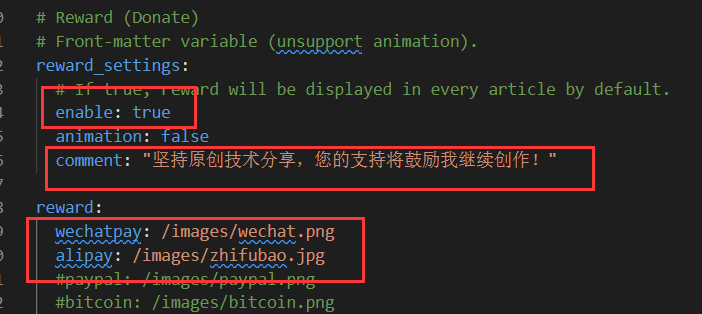


### 3.40 博客基本信息

修改 博客的标题，副标题，描述，等等基本信息。。。

- 在 blog根目录下打开 _config.yml 配置文件，直接修改以下信息即可
注意，语言要改成 zh-CN即中国，其他的自己随便改改

```
```

### 3.41 文章分享功能(TODO，找不到该属性)

打开themes/next/_config.yml 搜索关键字needmoreshare2 修改为下面设置

```yml
needmoreshare2:
  enable: true
  postbottom: #postbottom为文章末尾分享 float则是在页面侧端分享
    enable: true
    options:
      iconStyle: default
      boxForm: horizontal
      #位置
      position: bottomCenter
      #可分享网站
      networks: Weibo,Wechat,Douban,QQZone,Twitter,Facebook
  float:
    enable: true
    options:
      iconStyle: default
      boxForm: vertical
      #位置
      position: topRight
       #可分享网站
      networks: Weibo,Wechat,Douban,QQZone,Twitter,Facebook
```

### 3.42 修改文章底部的#号的标签，改为图标(TODO)
修改模板/themes/next/layout/_macro/post.swig

搜索 rel=“tag”>#，将 # 换成<i class="fa fa-tag"></i>


### 3.43 文章加密访问(encrypt)
参考：https://blog.csdn.net/weixin_58068682/article/details/116614622
1. 安装
- 使用hexo-blog-encrypt插件进行加密
- 安装如下命令

```yml
npm install --save hexo-blog-encrypt
```

- 快速使用
- 将 “password” 字段添加到您文章信息头就像这样

```md
---
title: Hello World
date: 2016/7/13 20:46:25
categories:
- Diary
tags:
  - Testing
  - Another Tag
password: 123456
---
```

再使用 hexo clean && hexo g && hexo s 在本地预览加密的文章

2. 设置优先级
文章信息头 > 按标签加密

3. 高级设置
文章信息头

```md
---
title: Hello World
tags:
- 作为日记加密
date: 2016-03-30 21:12:21
password: mikemessi
abstract: 有东西被加密了, 请输入密码查看.
message: 您好, 这里需要密码.
wrong_pass_message: 抱歉, 这个密码看着不太对, 请再试试.
wrong_hash_message: 抱歉, 这个文章不能被校验, 不过您还是能看看解密后的内容.
---

- abstract：用于设置加密文章显示的摘要。
- message：输入密码提示。
- wrong_pass_message: 输入错误提示

```

_config.yml

```yml
# Security
encrypt: # hexo-blog-encrypt
  abstract: 有东西被加密了, 请输入密码查看.
  message: 您好, 这里需要密码.
  tags:
  - {name: tagName, password: 密码A}
  - {name: tagName, password: 密码B}
  wrong_pass_message: 抱歉, 这个密码看着不太对, 请再试试.
  wrong_hash_message: 抱歉, 这个文章不能被校验, 不过您还是能看看解密后的内容.

```

4. 对博文禁用 Tag 加密

只需要将博文头部的 password 设置为 "" 即可取消 Tag 加密.

```md
---
title: Callback Test
date: 2019-12-21 11:54:07
tags:
    - A Tag should be encrypted
password: ""
---

Use a "" to diable tag encryption.

```


### 3.44 全局播放背景音乐（使用 Pajx 实现）-切换页面不打断

即实现页面跳转刷新后音乐不间断播放 （在博客文章中的网易云插件无法实现全局播放。）

- 打开themes\hexo-theme-next\layout文件夹找到_layout.swig

- 在<\head>标签前添加下面代码，并保存。

```html
<head>   //粘贴到这里 
  <!--pjax：防止跳转页面音乐暂停-->
  <script src="https://cdn.jsdelivr.net/npm/pjax@0.2.8/pjax.js"></script> 
</head> 

```
- 在主题的配置文件中找到pajx，将它设置为true，并保存。

```yml
# Easily enable fast Ajax navigation on your website.
# Dependencies: https://github.com/theme-next/theme-next-pjax
pjax: true
```

# 四、部署到github

### 4.1 新建Repository
在github上新建一个 Repository，Repository name一定要是 **你的用户名**.github.io


### 4.2 复制仓库地址

建议复制ssh，

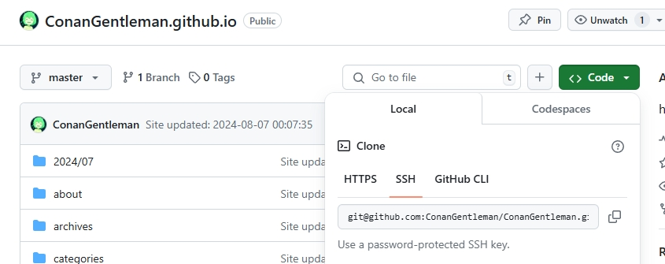

### 4.3 修改站点配置文件


### 4.4 安装插件
在Blog目录打开cmd命令输入如下命令：

```cmd
npm install hexo-deployer-git --save
```

### 4.5 部署到github

继续在cmd里面分别运行一下命令

```cmd
hexo clean
hexo g
hexo d  # hexo d 表示执行部署
```

### 4.6 访问站点

通过 **你的用户名**.github.io 访问你部署在github的博客

### 4.7 绑定个人域名

参考：https://blog.csdn.net/qq_44161695/article/details/117605288


--------

本片大部分参考的该博文，但有些地方存在问题，因此做重新梳理。https://blog.csdn.net/loze/article/details/94208742

文中带(TODO)表示我未进行设置