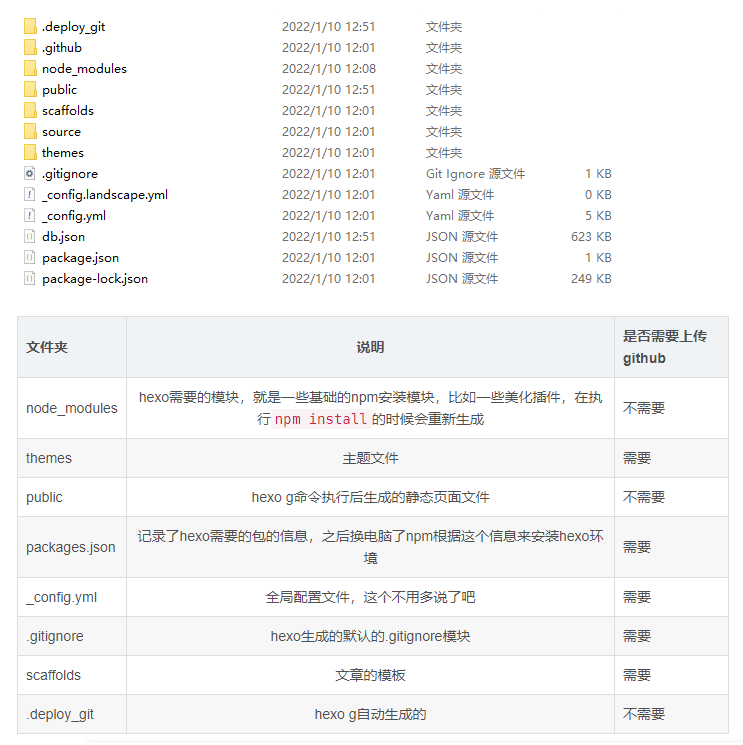
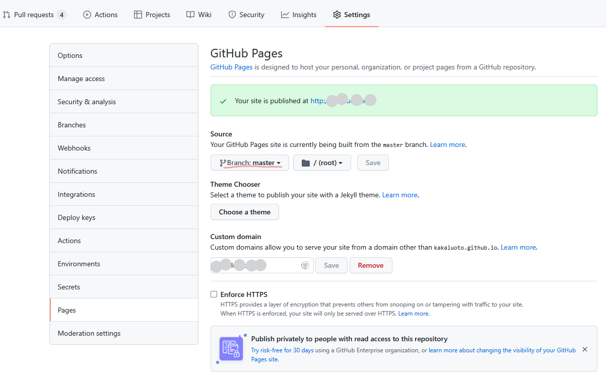
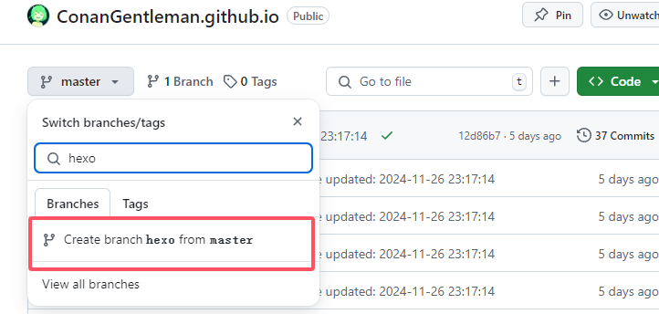
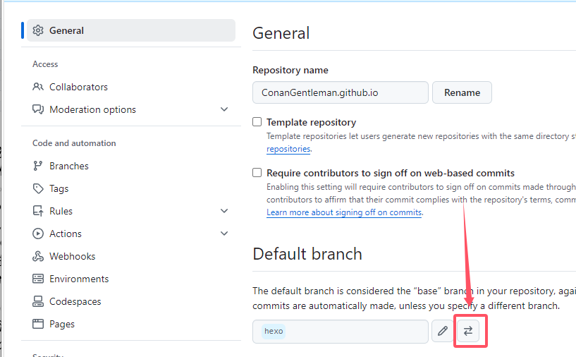

参考链接：https://blog.csdn.net/K1052176873/article/details/122879462

# 一、Hexo的文件夹说明


# 二、同步原理
1. 主要思路是利用git分支来实现hexo的同步。
**hexo生成的静态页面文件默认放在master分支上，这是由_config.yml配置文件所决定的**
你可以在全局配置文件_config.yml中找到这么一段
```yml
# Deployment
## Docs: https://hexo.io/docs/one-command-deployment
deploy:
  type: git
  repo: git@github.com:username/username.github.io.git
  branch: master
```
因此每当我们**执行hexo d**的时候，hexo都会帮我们把**生成好的静态页面文件推到master分支上**

在我们**第一次部署好博客的时候**，github给我们创建的唯一一个分支就是**master分支，同时也是默认分支**。默认分支就**意味着每次我们执行git clone 仓库地址或者git pull 仓库地址拉取的是默认分支的代码**。

**但是执行hexo d** 对应的分支和默认分支是没有关系的，因为这**是由配置文件决定的，配置文件写的哪个分支就是哪个分支**。

2. 因此，hexo生成的**静态博客文件默认放在master分支上**。**hexo的源文件（部署环境文件）可以都放在source分支上**（可以新创建一个source分支）。然后**把source分支设置成默认分支**。有小伙伴可能会担心默认分支的改变会不会影响到原来的网页的正常显示，其实如果是**用GitHub Pages对博客进行托管**的话也很简单，第一次搭建博客默认使用master分支作为页面。在下图所示的设置里可以找到。如果**不小心搞错了只要把分支设置成静态页面对应的分支就好了**。


**把source分支设置成默认分支，用来存放源文件，master分支依然存放静态文件**。在老电脑上，我们需要**把必要的源文件push到source分支。换新电脑时，直接git clone 仓库地址此时会从source分支下载源文件**，剩下的就是安装hexo环境，在新电脑上就可以重新生成静态页面了，并且**因为配置文件clone下来，deploy配置依旧是master分支，所以在新电脑上执行hexo d还是会把更新过后的静态文件推送到master分支上**。

由于master分支和source分支实际上是相互独立的两个普通的分支，所以我们**源文件和静态页面的更新也是相互独立的，故而需要手动分别执行git add . git commit git push来更新源文件,然后执行hexo d更新静态页面**。

# 二、具体操作（⭐）
1. github准备
创建一个分支hexo，在输入框输入hexo并点击下面的创建。

2. 设置默认分支

3. 打包将要推送到GitHub上的原始文件
clone该仓库到本地（clone的是hexo默认分支）
```shell
git clone git@github.com:username/username.github.io.git
```