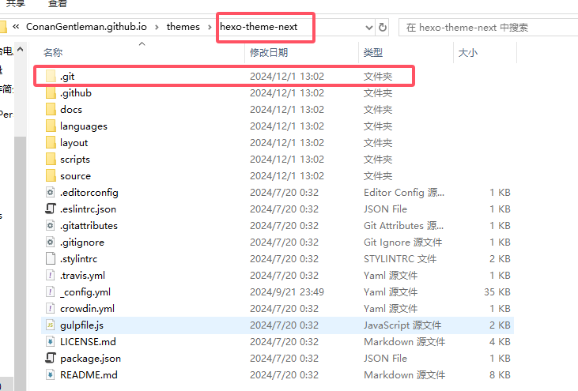

参考链接：https://blog.csdn.net/K1052176873/article/details/122879462

有时候更换电脑需要也将博客迁移，但新电脑上直接配置是效率较低的因此git来管理
<!--more-->

# 一、Hexo的文件夹说明


# 二、同步原理
1. 主要思路是利用git分支来实现hexo的同步。
**hexo生成的静态页面文件默认放在master分支上，这是由_config.yml配置文件所决定的**
你可以在全局配置文件_config.yml中找到这么一段
```yml
# Deployment
## Docs: https://hexo.io/docs/one-command-deployment
deploy:
  type: git
  repo: git@github.com:username/username.github.io.git
  branch: master
```
因此每当我们**执行hexo d**的时候，hexo都会帮我们把**生成好的静态页面文件推到master分支上**

在我们**第一次部署好博客的时候**，github给我们创建的唯一一个分支就是**master分支，同时也是默认分支**。默认分支就**意味着每次我们执行git clone 仓库地址或者git pull 仓库地址拉取的是默认分支的代码**。

**但是执行hexo d** 对应的分支和默认分支是没有关系的，因为这**是由配置文件决定的，配置文件写的哪个分支就是哪个分支**。

2. 因此，hexo生成的**静态博客文件默认放在master分支上**。**hexo的源文件（部署环境文件）可以都放在source分支上**（可以新创建一个source分支）。然后**把source分支设置成默认分支**。有小伙伴可能会担心默认分支的改变会不会影响到原来的网页的正常显示，其实如果是**用GitHub Pages对博客进行托管**的话也很简单，第一次搭建博客默认使用master分支作为页面。在下图所示的设置里可以找到。如果**不小心搞错了只要把分支设置成静态页面对应的分支就好了**。


**把source分支设置成默认分支，用来存放源文件，master分支依然存放静态文件**。在老电脑上，我们需要**把必要的源文件push到source分支。换新电脑时，直接git clone 仓库地址此时会从source分支下载源文件**，剩下的就是安装hexo环境，在新电脑上就可以重新生成静态页面了，并且**因为配置文件clone下来，deploy配置依旧是master分支，所以在新电脑上执行hexo d还是会把更新过后的静态文件推送到master分支上**。

由于master分支和source分支实际上是相互独立的两个普通的分支，所以我们**源文件和静态页面的更新也是相互独立的，故而需要手动分别执行git add . git commit git push来更新源文件,然后执行hexo d更新静态页面**。

# 二、旧电脑具体操作（⭐）
1. github准备
创建一个分支hexo，在输入框输入hexo并点击下面的创建。

2. 设置默认分支

3. 打包将要推送到GitHub上的原始文件
clone该仓库到本地（clone的是hexo默认分支）
```shell
git clone git@github.com:username/username.github.io.git
```
4. 下载的文件夹里仅留下.git 文件夹，其他的文件都删除

5. 找到原博客文件位置，将文件夹内除.deploy_git 以外都复制到clone下来的文件夹中
6. 现在clone下来的文件夹内应该有个 **.gitignore文件** ，用来忽略一些不需要的文件，表示这些类型文件不需要git。如果没有，右键新建，**内容如下**：
```
.DS_Store
Thumbs.db
db.json
*.log
node_modules/
public/
.deploy*/
```
7. 如果**已经clone过主题文件，那么需要把theme主题文件夹里的 .git 也删除**。因为git不能嵌套上传，最好是显示隐藏文件，检查一下有没有，**否则上传的时候会出错**，导致你的主题文件无法上传，这样你的配置在别的电脑上就用不了了。

8. 将clone并修改以后的文件夹推送到远程库
```shell
git add .
git commit –m add_branch
git push
```
9.  此时已经成功将整个网站推送到了远程库的默认分支hexo,
10. 至此，网站部署至master分支，整个网站备份至hexo分支。当网站的配置或文章修改后都要将远程仓库更新。首先，依次执行
```shell
git add .
git commit -m 内容
git push （或者git push origin hexo）
```
保证hexo分支版本最新。然后执行
```shell
hexo d -g
```
在此之前，有时可能需要执行**hexo clean**，完成后就会发现，最新改动已经更新到master分支了，两个分支互不干扰！

# 三、新电脑上的操作（⭐）
1. 将新电脑的生成的ssh key添加到GitHub账户上
2. 在新电脑上克隆username.github.io仓库的source分支(就是存放源码的分支)到本地，此时本地git仓库处于source分支,可以执行git branch -v查看。
3. 在新电脑的username.github.io文件夹下执行
```shell
npm install hexo (如果安装后hexo无效使用 npm install -g hexo来全局安装hexo)
npm install
npm install hexo-deployer-git （记得，不需要hexo init这条指令）
```
4. 最后执行
```shell
hexo g
hexo s
hexo d
```
等命令即可提交成功
上面步骤中，**npm install其实就是读取了packages.json里面的信息，自动安装依赖**，有的小伙伴**可能只执行npm install就行了，不过按照上面的三步是最稳妥的。**

这里提一嘴，当新电脑上的操作成功之后，其实对于新电脑还是老电脑其实都无所谓了，任何一台电脑包括老电脑只要安装了NodeJs环境，就都可以按照在新电脑上的操作完整地复刻出一个hexo环境，你甚至可以把老电脑原有的hexo工程删掉再执行上面这几步一样可以快速构建hexo环境，可以看到步骤非常简单。

此外，为了保证同步，推荐**先git pull合并**更新再进行博客的编写。