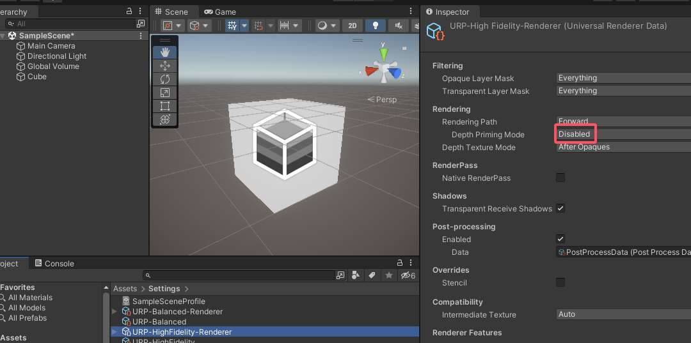
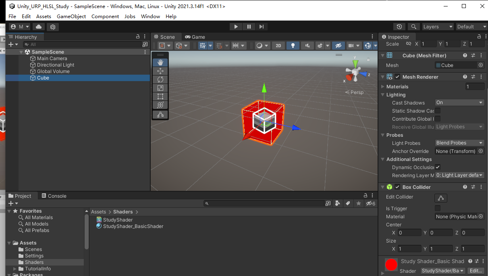

ShaderLab基本结构

<!--more-->

## 一、ShaderLab基本结构
- ShaderLab 层 (Shader、Properties、SubShader、Pass、Tags等) ，不区分大小写
- 这部分是 Unity 的“框架”代码。例如，你可以写 SubShader，也可以写 subshader，Unity 都能识别。但为了代码规范和可读性，强烈建议统一使用官方示例中的大小写风格。
```c
Shader "Custom/.../ShaderName" // Path/Name
{
    Properties {...}
    SubShader {...}
    FallBack "Path/Name"
}
```

### 1.1 Properties是什么
- 里面包含通过材质面板传入的属性 
### 1.2 Subshader是什么

Subshader表示**子着色器**
  - 不同的电脑有不同的配置，也需要有相应版本的着色器，因此不同配置就可以基于不同的子着色器

### 1.3 Fallback 是什么
Fallback "xxxx" 表示当subshader都加载失败时，默认使用的 xxx （即填写故障情况下的最保守shader的pass路径和名称

- "Hidden/Universal Render Pipeline/FallbackError" 是 unity缺材质时，紫色显示的那种
-  如果"Hidden/Universal Render Pipeline/FallbackError" 还不能加载，其还会调用"Hidden/Core/FallbackError"


### 1.4 代码示例

```c
/*
ShaderLab 层 (Shader、Properties、SubShader、Pass、Tags等)	不区分大小写	
这部分是 Unity 的“框架”代码。例如，你可以写 SubShader，也可以写 subshader，Unity 都能识别。但为了代码规范和可读性，强烈建议统一使用官方示例中的大小写风格。

CG/HLSL 层 (Cg/HLSL 程序内部)	严格区分大小写	这是真正写渲染逻辑的地方，语法规则和C语言类似。
*/
Shader "StudyShader/BasicShader" //shaders中所在路径
{
	Properties  //通过材质面板传入的属性 
	{

	}

	//Subshader 表示 子着色器 不同的电脑有不同的配置，也需要有相应版本的着色器，因此不同配置就可以基于不同的子着色器

	Subshader // 子着色器 (高配）
	{
        
	}

	Subshader // 子着色器 (低配）
	{

	}

	//Fallback "xxxx"  表示当subshader都加载失败时，默认使用的 xxx （即填写故障情况下的最保守shader的pass路径和名称
	// "Hidden/Universal Render Pipeline/FallbackError" 是 unity缺材质时，紫色显示的那种
	// 如果"Hidden/Universal Render Pipeline/FallbackError" 还不能加载，其还会调用"Hidden/Core/FallbackError"
	Fallback "Hidden/Universal Render Pipeline/FallbackError"
}
```

## 二、编写简单的Shader

### 2.0 预设置
在Edit->ProjectSetting->Graphics 中使用的是URP-HighFidelity,其渲染器URP-HighFidelity-Renderer默认勾选了Depth Priming Mode(用于优化深度剔除的)，需要设置为Disabled，不然我们写的材质可能会导致物体透明


### 2.1 简单理解部分知识
- pass 一个着色器一般是多次渲染构成的（如二次元渲染，先渲染轮廓，然后渲染本体），pass则代表每次渲染
- vertex vert 顶点着色器，将顶点从三维空间转换到投影空间
- fragment frag 片元着色器：顶点构成的三角形内部的每个显示在屏幕上的像素的着色

### 2.2 HLSL宏定义
基于URP管线的编程语言HLSL编写需要用宏定义包裹，不然会报错
```c
HLSLPROGRAM//基于URP管线的编程语言HLSL编写需要加上宏定义，不然会报错

ENDHLSL//基于URP管线的编程语言HLSL编写需要加上宏定义，不然会报错
```

### 2.3 一些字段和语义
- :POSITION 表示标记传入位置信息
- :SV_POSITION 表示该字段是 作为输出的位置信息
- :SV_TARGET 是 System Value TARGET 的缩写，属于系统值语义 (System-Value Semantics) 的一种。它告诉 GPU：“这个变量的最终值就是要输出到屏幕上的颜色”。
  - SV_ 前缀表示这是系统自动处理的值
  - TARGET 表示渲染目标（Render Target），也就是最终显示的屏幕或纹理
- 所有发给引擎的提示信息通过#pragma指令来发出通知的，因此顶点着色器和片元着色器需要加上 #pragma

### 2.4 代码
```c
Shader "StudyShader/BasicShader" //shaders中所在路径
{
	Properties  //通过材质面板传入的属性 
	{

	}

	//Subshader 表示 子着色器 不同的电脑有不同的配置，也需要有相应版本的着色器，因此不同配置就可以基于不同的子着色器

	Subshader // 子着色器 (高配）
	{
		pass //一个着色器一般是多次渲染构成的（如二次元渲染，先渲染轮廓，然后渲染本体），pass则代表每次渲染
		{
			HLSLPROGRAM//基于URP管线的编程语言HLSL编写需要加上宏定义，不然会报错

			#include "Packages/com.unity.render-pipelines.universal/ShaderLibrary/Core.hlsl" //urp管线的一些基本的函数功能都在Core.hlsl中

			//所有发给引擎的提示信息通过#pragma指令来发出通知的，因此需要加上 #pragma
			#pragma vertex vert //声明顶点着色器 (函数），将顶点从三维空间转换到投影空间
			#pragma fragment frag //声明片元着色器 (函数）：顶点构成的三角形内部的每个显示在屏幕上的像素的着色


			struct appdata {//声明传入的顶点数据
				// 字段类型 字段名称 : 字段语义
				float3 pos : POSITION;//位置  (  :POSITION 表示标记传入位置信息
			}; 

			struct v2f { //声明顶点转换到片元着色器的一些像素信息数据
				float4 pos : SV_POSITION; //因为包含投影信息，所以是float4。 （: SV_POSITION表示输出位置
			};

			v2f vert(appdata IN) //顶点着色器，传入数据声明变量名为IN
			{
				v2f OUT = (v2f)0; //初始化输出数据为0

				OUT.pos = mul(UNITY_MATRIX_MVP, float4(IN.pos, 1)); //使用Core.hlsl中的矩阵运算，将传入顶点的位置（先拓展到4维向量float4(IN.pos,1)）信息变换到处于投影空间中的位置信息

				return OUT;
			}

			//顶点着色器的输出结果就是片元着色器的输入信息
			float4 frag(v2f IN) :SV_TARGET//片元着色器，返回一个RGBA颜色结果
			{
				return float4(1,0,0,1);
			}

			 ENDHLSL//基于URP管线的编程语言HLSL编写需要加上宏定义，不然会报错
		}
	}
}
```

### 2.5 效果



## 三、Shader LOD（细节层次）

### 3.1 设置subshader的LOD
LOD越小，执行的条件越宽泛
官方文档：https://docs.unity.cn/cn/2021.1/Manual/SL-ShaderLOD.html
```c
subshader //（高配，红色）
{
    LOD 600 //设置LOD优先级为100
}

subshader//（低配，绿色）
{
    LOD 200
}
```

### 3.2 设置Unity的LOD来动态选择加载哪个着色器
- 即Shader.globalMaximumLOD = xxx
```cs
public class LodCtrl : MonoBehaviour
{
    public int lodLevel = 600;
    // Start is called before the first frame update
    void Start()
    {
        Shader.globalMaximumLOD = lodLevel;
    }

    // Update is called once per frame
    void Update()
    {
        
    }
}
```

### 3.3 效果
设置Shader.globalMaximumLOD为600，则为红色
设置Shader.globalMaximumLOD为200，则为绿色

