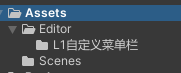
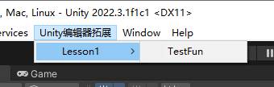
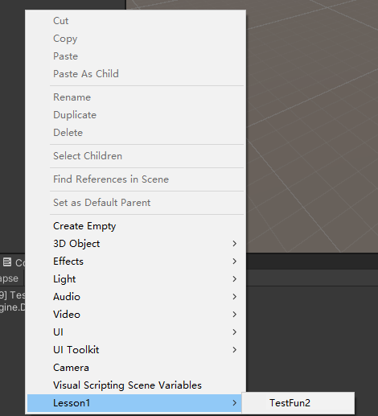
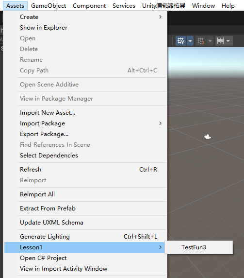
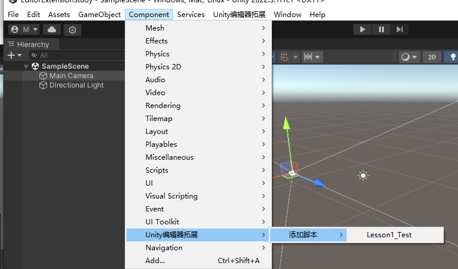
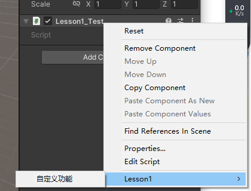
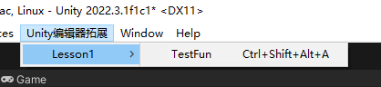

## 一、 特殊文件夹Editor
对于编辑器拓展相关的文件需要放置在名为Editor的文件夹中，如果被放置在其他地方，会导致打包时候不能够成功，避免打包时报错。


<!--more-->

## 二、 菜单栏中添加自定义页签（不可被打包，因为在edior文件夹下）
1. 命名空间：UnityEditor
2. 特性 MenuItem
3. 用法：在静态函数前加上 [MenuItem("页签/一级选项/二级选项/...")]
4. 作用： 当在菜单栏点击该页签，将执行对应的静态函数中的逻辑
5. 注意：
   - 不同在意继承对象，不继承MonoBehaviour也可以
   - 斜杠必须是/
   - 方法是私有函数的也可以，只要是静态，且加了特性
6. 示例
```cs
    [MenuItem("Unity编辑器拓展/Lesson1/TestFun")]
    private static void TestFun()
    {
        Debug.Log("TestFun");
    }
```
7. 效果


## 三、在Hierarchy窗口中添加自定义页签（不可被打包，因为在edior文件夹下）
1. 命名空间：UnityEditor
2. 特性 MenuItem
3. 用法：在静态函数前加上，并且页签命名放入GameObject路径 [MenuItem("GameObject/页签/一级选项/二级选项/...")]
4. 注意情况跟第二点中一致，外还有一个：    在菜单栏的GameObject中也会出现对应选项
5. 示例：
```cs
    [MenuItem("GameObject/Lesson1/TestFun2")]
    private static void TestFun2()
    {
        Debug.Log("TestFun2");
    }
```
6. 效果：


## 四、在Project窗口中添加自定义页签（不可被打包，因为在edior文件夹下）
1. 与前面一致，唯有路径不同
2. 用法：在静态函数前加上，并且页签命名放入Assets路径 [MenuItem("Assets/页签/一级选项/二级选项/....")]
3. 在菜单栏的Assets中也会出现对应选项
4. 示例：
```cs
    [MenuItem("Assets/Lesson1/TestFun3")]
    private static void TestFun3()
    {
        Debug.Log("TestFun3");
    }
```
5. 效果：


## 五、在菜单栏的Component菜单添加脚本（可被打包）
1. 命名空间：UnityEngine
2. 特性：AddComponentMenu

3. 用法：
在想要通过Component菜单添加的**脚本类前面**前加上
[AddComponentMenu("一级选项/二级选项/....")]

4. 注意：
   - 脚本需要继承MonoBehaviour对象
   - 斜杠必须是/
   - 最后一级选项的名字可以和脚本名（**该脚本不会放在Editor文件夹内**）不一样，但是建议一致
5. 示例
```cs
using System.Collections;
using System.Collections.Generic;
using UnityEngine;
[AddComponentMenu("Unity编辑器拓展/添加脚本/Lesson1_Test")]
public class Lesson1_Test : MonoBehaviour
{
    // Start is called before the first frame update
    void Start()
    {
        
    }

    // Update is called once per frame
    void Update()
    {
        
    }
}

```
6. 效果:



## 六、 在Inspector为脚本右键添加菜单（不可被打包）

1. 命名空间：UnityEditor
2. 特性 MenuItem
3. 用法：在静态函数前加上[MenuItem("CONTEXT/脚本名/页签/一级选项/二级选项/....")]
4. 注意：
   - 不用在意继承对象
   - 斜杠必须是
5. 示例
```cs
    [MenuItem("CONTEXT/Lesson1_Test/Lesson1/自定义功能")]
    private static void TestFun4()
    {
        Debug.Log("TestFun4");
    }
```
6. 效果:



## 七、加入快捷键
1. 单键
   - 路径后 + 空格 + 下划线 + 想要的按键

2. 组合键：
下划线替换为
- %表示ctrl
- #表示shift
- &表示alt

3. 其他支持的按键：
- LEFT、RIGHT：持类似#LEFT是左shift之类的按键
- UP、DOWN、F1..F12、HOME、END、PGUP、PGDN

4. 以菜单栏中添加自定义页签 为例
```cs
[MenuItem("Unity编辑器拓展/Lesson1/TestFun %#&A")] //表示快捷键为Ctrl+Shift+Alt+A
    private static void TestFun()
    {
        Debug.Log("TestFun");
    }

```
5. 效果


## 八、总结
1. 使用UnityEditor命名空间的脚本必须放在Editor文件夹下，避免打包报错
2. 添加自定义页签 需要用到特性 MenuItem
3. 添加代码添加页签 需要用到特性 AddComponentMenu