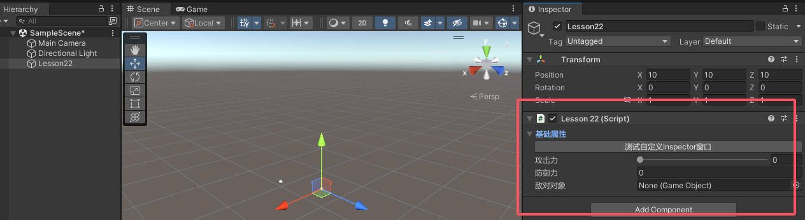

Inspector窗口拓展相关内容
<!--more-->

- [一、Inspector窗口拓展 基础知识](#一inspector窗口拓展-基础知识)
  - [1.1 Inspector窗口自定义显示指什么？](#11-inspector窗口自定义显示指什么)
  - [1.2 SerializedObject和SerializedProperty的作用](#12-serializedobject和serializedproperty的作用)
  - [1.3 自定义 脚本在Inspector窗口中显示的内容](#13-自定义-脚本在inspector窗口中显示的内容)
  - [1.4 获取脚本依附的对象](#14-获取脚本依附的对象)
  - [1.5 总结](#15-总结)
  - [1.6 代码示例](#16-代码示例)
- [二、数组、List属性 自定义显示](#二数组list属性-自定义显示)
  - [2.1 数组、List属性在Inspector窗口显示 基础方式](#21-数组list属性在inspector窗口显示-基础方式)
  - [2.2 数组、List属性在Inspector窗口显示 自定义方式](#22-数组list属性在inspector窗口显示-自定义方式)
  - [2.3 代码示例](#23-代码示例)
  - [2.4 效果](#24-效果)
- [三、自定义属性 自定义显示](#三自定义属性-自定义显示)
  - [3.1 自定义属性 在Inspector窗口显示 基础方式](#31-自定义属性-在inspector窗口显示-基础方式)
  - [3.2 自定义属性 在Inspector窗口显示 自定义方式](#32-自定义属性-在inspector窗口显示-自定义方式)
  - [3.3 代码示例](#33-代码示例)
  - [3.4 效果](#34-效果)
- [四、字典属性 自定义显示](#四字典属性-自定义显示)
  - [4.0 知识回顾 SerizlizeField特性](#40-知识回顾-serizlizefield特性)
  - [4.1 如何在Inspector窗口编辑字典成员](#41-如何在inspector窗口编辑字典成员)
  - [4.2 ISerializationCallbackReceiver接口](#42-iserializationcallbackreceiver接口)
  - [4.3 利用两个List在Inspector窗口中自定义Dictionary显示](#43-利用两个list在inspector窗口中自定义dictionary显示)
  - [4.4 总结](#44-总结)
  - [4.5 代码示例](#45-代码示例)
  - [4.6 效果](#46-效果)


# 一、Inspector窗口拓展 基础知识

## 1.1 Inspector窗口自定义显示指什么？
- 我可以完全自定义某一个脚本在Inspector窗口的相关显示
## 1.2 SerializedObject和SerializedProperty的作用
- SerializedObject 和 SerializedProperty
    - 主要用于在 Unity 编辑器中操作和修改序列化对象的属性。
    - 它们通常在自定义编辑器中使用，以创建更灵活、可定制的属性面板

- 我们只需要记住简单的规则
    - **SerializedObject 代表脚本对象** ⭐⭐⭐
    - **SerializedProperty 代表脚本对象中的属性** ⭐⭐⭐

SerializedObject: https://docs.unity.cn/cn/2022.1/ScriptReference/SerializedObject.html
SerializedProperty: https://docs.unity.cn/cn/2022.1/ScriptReference/SerializedProperty.html

## 1.3 自定义 脚本在Inspector窗口中显示的内容
关键步骤：
1. 单独为某一个脚本实现一个自定义脚本，并且脚本需要继承Editor。**一般该脚本命名为 自定义脚本名 + Editor**
2. 在该脚本前加上特性
    - 命名空间：UnityEditor
    - 特性名：CustomEditor(想要自定义脚本类名的Type)
3. 声明对应SerializedProperty序列化属性 对象
    - 主要通过它和自定义脚本中的成员进行关联
    - 可以利用继承Editor后的成员serializedObject中的FindProperty("成员变量名")方法关联对应成员;
        - 例如：
        ```cs
        SerializedProperty mySerializedProperty;
        mySerializedProperty = serializedObject.FindProperty("自定义脚本中的成员名");
        ```
        - 一般在OnEnable函数中初始化
4. 重写OnInspectorGUI函数
    - 该函数控制了Inspector窗口中显示的内容
    - 只需要在其中重写内容便可以自定义窗口
    - 注意：其中的逻辑需要包裹在这两句代码之间
    ```cs
        //  更新序列化对象的表示形式
        serializedObject.Update();
        //  之间应用属性修改
        serializedObject.ApplyModifiedProperties();
    ```

## 1.4 获取脚本依附的对象
   - 通过Editor中的target成员变量获取，**获取到的是依附在对象上的Lesson22组件对象并不是依附的GameObject**
## 1.5 总结
   - 为继承Editor的脚本添加[CustomEditor(typeof(想要自定义Inspector窗口的脚本))]特性
   - 在该脚本中按照一定的规则进行编写
   - 便可为Inspector窗口中的某个脚本自定义窗口布局
## 1.6 代码示例
1. Lesson22.cs（不能放在Editor文件夹下）
```cs
    //攻击力
    public int atk;
    //防御力
    public float def;
    //敌对目标对象依附的Gameobject
    public GameObject obj;
    void Start()
    {}

    void Update()
    {}
```

2. Lesson22Editor.cs(放在Editor文件夹下)
```cs
//通过这个特性，我们就可以为Lesson22脚本自定义Inspector窗口中的显示了
[CustomEditor(typeof(Lesson22))]
public class Lesson22Editor : Editor
{
    private SerializedProperty atk;
    private SerializedProperty def;
    private SerializedProperty obj;

    private bool foldOut;

    private void OnEnable()
    {
        atk = serializedObject.FindProperty("atk"); //关联Lesson22中的对应变量，serializedObject代表的就是Lesson22.cs
        def = serializedObject.FindProperty("def");
        obj = serializedObject.FindProperty("obj");
    }

    //  该函数控制了Inspector窗口中显示的内容
    //  只需要在其中重写内容便可以自定义窗口
    public override void OnInspectorGUI()
    {
        //base.OnInspectorGUI();
        serializedObject.Update(); //需要用Update()和ApplyModifiedProperties()进行包裹
        //自定义Inspector窗口的内容
        foldOut = EditorGUILayout.BeginFoldoutHeaderGroup(foldOut, "基础属性"); //折叠控件（头）
        if(foldOut)
        {
            if(GUILayout.Button("测试自定义Inspector窗口"))
            {
                Debug.Log(target.name);
            }
            EditorGUILayout.IntSlider(atk, 0, 100, "攻击力");
            def.floatValue = EditorGUILayout.FloatField("防御力", def.floatValue);
            EditorGUILayout.ObjectField(obj, new GUIContent("敌对对象"));
        }
        EditorGUILayout.EndFoldoutHeaderGroup(); //折叠控件（尾）
        serializedObject.ApplyModifiedProperties();
    }
}

```



# 二、数组、List属性 自定义显示

## 2.1 数组、List属性在Inspector窗口显示 基础方式
1. 主要知识点：
```cs
    EditorGUILayout.PropertyField(SerializedProperty对象, 标题);
        //该API会按照属性类型自己去处理控件绘制的逻辑
```

## 2.2 数组、List属性在Inspector窗口显示 自定义方式
如果我们不想要Unity默认的绘制方式去显示 数组、List相关内容
我们也可以完全自定义布局方式
1. 主要知识点：
    利用SerializedProperty中数组相关的API来完成自定义
    - (1) arraySize 获取数组或List容量
    - (2) InsertArrayElementAtIndex(索引) 为数组在指定索引插入默认元素（容量会变化）
    - (3).DeleteArrayElementAtIndex(索引) 为数组在指定索引删除元素（容量会变化）
    - (4).GetArrayElementAtIndex(索引) 获取数组中指定索引位置的 SerializedProperty 对象

## 2.3 代码示例

```cs
// lesson22.cs
    public string[] strs;
    public int[] ints;
    public GameObject[] gameObjects;

    public List<GameObject> listObjs;
    private int count;

// lesson22Editor.cs

    private SerializedProperty strs;
    private SerializedProperty ints;
    private SerializedProperty gameObjects;

    private SerializedProperty listObjs;

    private void OnEnable(){
         //默认得到的数组和List容量为空
        strs = serializedObject.FindProperty("strs"); 
        ints = serializedObject.FindProperty("ints"); 
        gameObjects = serializedObject.FindProperty("gameObjects"); 

        listObjs = serializedObject.FindProperty("listObjs");
        //初始化当前容量 否则 每次一开始都是0
        count = listObjs.arraySize;
    }

    public override void OnInspectorGUI()
    {
        serializedObject.Update(); //需要用Update()和ApplyModifiedProperties()进行包裹
        //容量设置
        count = EditorGUILayout.IntField("List容量", count);

        //是否要缩减 移除尾部的内容
        //从后往前去移除 避免移除不干净
        //当容量变少时 才会走这的逻辑
        for (int i = listObjs.arraySize - 1; i >= count; i--)
            listObjs.DeleteArrayElementAtIndex(i);

        //根据容量绘制需要设置的每一个索引位置的对象
        for (int i = 0; i < count; i++)
        {
            //去判断如果数组或者LIst容量不够 去通过插入的形式去扩容
            if (listObjs.arraySize <= i)
                listObjs.InsertArrayElementAtIndex(i);

            SerializedProperty indexPro = listObjs.GetArrayElementAtIndex(i);
            EditorGUILayout.ObjectField(indexPro, new GUIContent($"索引{i}"));
        }
        EditorGUILayout.Space(10);

        EditorGUILayout.PropertyField(strs, new GUIContent("字符串数组")); //不能放到折叠中（因为数组本身自带折叠
        EditorGUILayout.PropertyField(ints, new GUIContent("整形数组")); //不能放到折叠中（因为数组本身自带折叠
        EditorGUILayout.PropertyField(gameObjects, new GUIContent("游戏对象数组")); //不能放到折叠中（因为数组本身自带折叠
        //EditorGUILayout.PropertyField(listObjs, new GUIContent("游戏对象List"));
        serializedObject.ApplyModifiedProperties();
    }
```

## 2.4 效果


# 三、自定义属性 自定义显示

## 3.1 自定义属性 在Inspector窗口显示 基础方式
主要知识点：
```cs
    EditorGUILayout.PropertyField(SerializedProperty对象, 标题);
    //该API会按照属性类型自己去处理控件绘制的逻辑
```

## 3.2 自定义属性 在Inspector窗口显示 自定义方式
如果我们不想要Unity默认的绘制方式去显示 自定义数据结构类 相关内容
我们也可以完全自定义布局方式
1. 主要知识点：
```cs
    //下面两种方法访问自定义属性的子属性
    SerializedProperty.FindPropertyRelative(属性)
    serializedObject.FindProperty(属性.子属性)
```
## 3.3 代码示例
```cs
//lesson22.cs
[Serializable] //想在inspector窗口上显示则 必加该特性 
public class MyCustonPro
{
    public int i;
    public float f;
}
public class Lesson22 : MonoBehaviour
{
     public MyCustonPro myCustom;
}
// lesson22Editor.cs
    private void OnEnable()
    {
        serializedObject.Update(); //需要用Update()和ApplyModifiedProperties()进行包裹
        myCustom = serializedObject.FindProperty("myCustom");

        //下面两种获取方式
        //myCustomI = myCustom.FindPropertyRelative("i");
        //myCustomF = myCustom.FindPropertyRelative("f");
        myCustomI = serializedObject.FindProperty("myCustom.i");
        myCustomF = serializedObject.FindProperty("myCustom.f");
        serializedObject.ApplyModifiedProperties();
    }
```


## 3.4 效果


# 四、字典属性 自定义显示

## 4.0 知识回顾 SerizlizeField特性
让私有字段可以被序列化（能够在Unity的Inspector窗口被看到）

## 4.1 如何在Inspector窗口编辑字典成员
Unity默认是不支持Dictionary在Inspector窗口被显示的
我们只有**利用两个List（或数组）成员来间接设置Dictionary**

## 4.2 ISerializationCallbackReceiver接口
**该接口是Unity提供的用于序列化和反序列化时执行自定义逻辑的接口**
实现该接口的类能够在对象被序列化到磁盘或从磁盘反序列化时执行一些额外代码
1. **接口中函数：**
    - OnBeforeSerialize: 在对象被序列化之前调用
    - OnAfterDeserialize: 在对象从磁盘反序列化后调用

    由于我们需要用两个List存储Dictionary的具体值
    相当于字典中的真正内容是存储在两个List中的
    **所以我们需要在**
    **OnBeforeSerialize序列化之前：将Dictionary里的数据存入List中进行序列化**
    **OnAfterDeserialize反序列化之后：将List中反序列化出来的数据存储到Dictionary中**

## 4.3 利用两个List在Inspector窗口中自定义Dictionary显示
由于我们在Inspector窗口中显示的信息的数据来源是List
因此我们只需要利用List在Inspector窗口中自定义显示即可

## 4.4 总结
由于Unity中不支持在Inspector窗口直接使用Dictionary
因此我们可以利用两个List（或数组）来间接的表达Dictionary成员

## 4.5 代码示例
```cs
//lesson22.cs
public class Lesson22 : MonoBehaviour, ISerializationCallbackReceiver{
    public Dictionary<int, string> myDic = new Dictionary<int, string>() { { 1, "123" }, { 2, "234" } };

    [SerializeField]
    private List<int> keys = new List<int>();
    [SerializeField]
    private List<string> values = new List<string>();

    //反序列化之后自动调用
    public void OnAfterDeserialize()
    {
        myDic.Clear();
        for (int i = 0; i < keys.Count; i++)
        {
            if (!myDic.ContainsKey(keys[i]))
                myDic.Add(keys[i], values[i]);
            else
                Debug.LogWarning("字典Dictionary容器中不允许有相同的键");
        }
    }

    //序列化之前自动调用
    public void OnBeforeSerialize()
    {
        keys.Clear();
        values.Clear();
        foreach (var item in myDic)
        {
            keys.Add(item.Key);
            values.Add(item.Value);
        }
    }
    void Start()
    {
        foreach (var item in myDic)
        {
            print($"Dic:{item.Key} - {item.Value}");
        }
    }
}

// lesson2Editor.cs
    private SerializedProperty keys;
    private SerializedProperty values;

    private int dicCount;
    private void OnEnable()
    {
        
        dicCount = keys.arraySize;
    }
    public override void OnInspectorGUI()
    {
        serializedObject.Update(); //需要用Update()和ApplyModifiedProperties()进行包裹
         dicCount = EditorGUILayout.IntField("字典容量", dicCount);
        //容量变少时 把多的删了
        for (int i = keys.arraySize - 1; i >= dicCount; i--)
        {
            keys.DeleteArrayElementAtIndex(i);
            values.DeleteArrayElementAtIndex(i);
        }

        for (int i = 0; i < dicCount; i++)
        {
            //如果容量不够 扩容
            if (keys.arraySize <= i)
            {
                keys.InsertArrayElementAtIndex(i);
                values.InsertArrayElementAtIndex(i);
            }
            //去真正的自定义键值对的修改
            SerializedProperty indexKey = keys.GetArrayElementAtIndex(i);
            SerializedProperty indexValue = values.GetArrayElementAtIndex(i);
            EditorGUILayout.BeginHorizontal();
            indexKey.intValue = EditorGUILayout.IntField("字典的键", indexKey.intValue);
            indexValue.stringValue = EditorGUILayout.TextField("字典的值", indexValue.stringValue);
            EditorGUILayout.EndHorizontal();
        }

        serializedObject.ApplyModifiedProperties();
    }
```
## 4.6 效果

