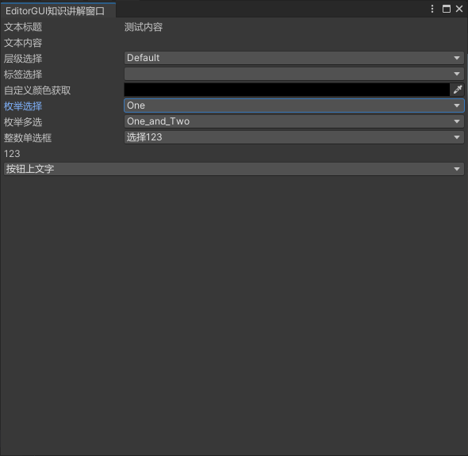
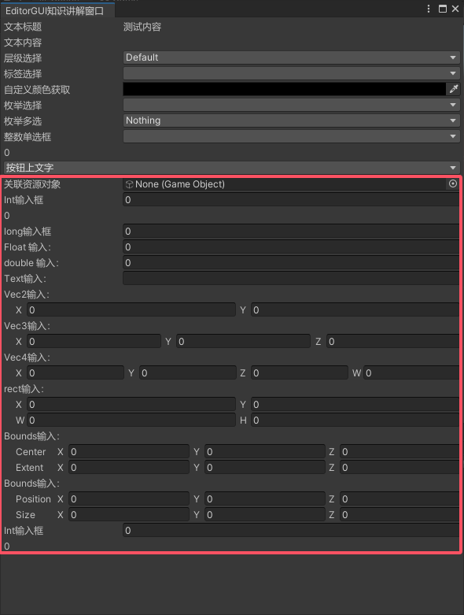
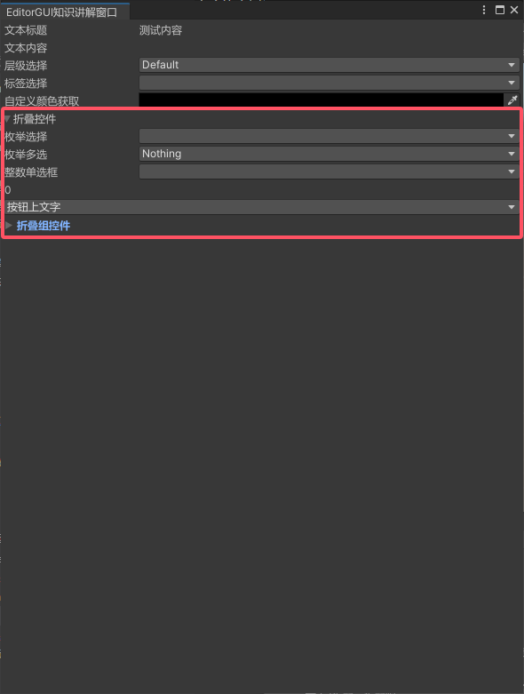
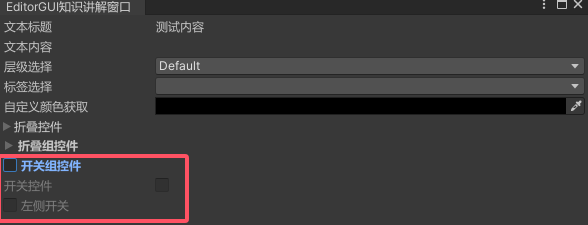
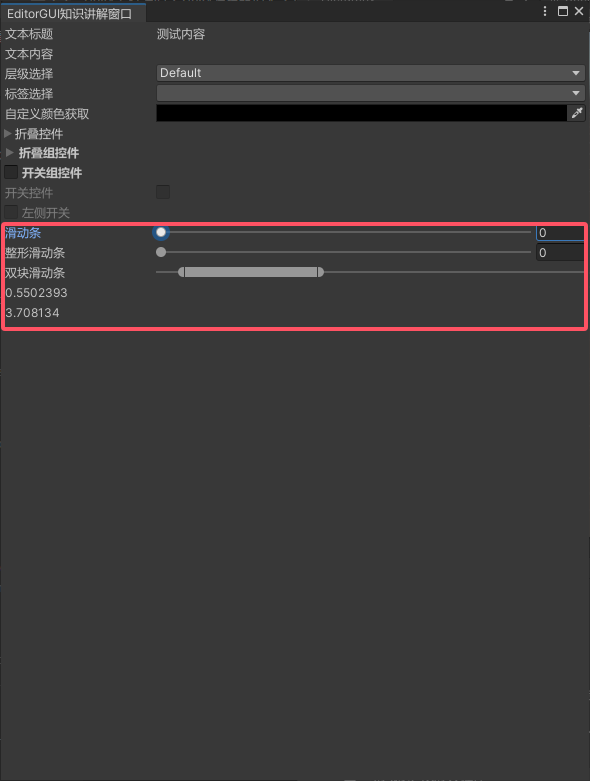

EditorGUI相关的内容

<!--more-->

# 一、EditorGUI是什么
## 1.1 知识回顾

1. GUILayout 是一个GUI自动布局的公共类
2. 它其中的方法和GUI基本一模一样，都是用来绘制、响应各种UI控件的
3. 只不过它在**GUI的基础上加入了自动布局功能**
4. 我们无需过多的去关心UI控件的位置和大小

5. guilayoutoption 布局选项
- 方法 ：GUILayout.Button("文本",[guilayoutoption])
- 使用示例：
```cs
GUILayout.Button("确定",guilayout.width(300),guilayout.height(200),...)
```
- 更多：
```cs
    //方法 ：GUILayout.Button("确定",[guilayoutoption])
    //
    //控件的固定宽高
    guilayout.width(300);
    guilayout.height(200);
    //允许控件的最小宽高
    guilayout.minwidth(50);
    guilayout.minheight(50);
    //允许控件的最大宽高
    guilayout.maxwidth(100);
    guilayout.maxheight(100);
    //允许或禁止水平拓展
    guilayout.expandwidth(true);//允许
    guilayout.expandheight(false);//禁止
    guilayout.expandheight(true);//允许
    guilayout.expandheight(false);//禁止
```

6. 创建一个GUI窗口
```cs
    [MenuItem("Unity编辑器拓展/Lesson3/EditorGUI窗口")]
    private static void OpenLesson3()
    {
        Lesson3 win = EditorWindow.GetWindow<Lesson3>("EditorGUI窗口");
        //win.titleContent = new GUIContent("EditorGUI窗口"); 
        win.Show();
    }
```

## 1.2 EditorGUI是什么？
1. EditorGUI 类似 GUI，是一个主要用于绘制编辑器拓展 UI 的工具类
   - 它提供了一些 GUI 中没有的API，主要是 编辑器功能中会用到的一些特殊控件
2. 而EditorGUILayout 类似于 GUILayout，是一个**带有自动布局功能的** EditorGUI 绘制工具类

3. 我们经常会将 EditorGUI 和 GUI 混合使用 来制作一些编辑器拓展功能
    - 但是由于更多时候我们会用到自动布局功能
    - 因此着重学习 EditorGUILayout 中的功能
4. EditorGUI和EditorGUILayout的区别仅仅是需要自己设置位置而已

5. 更多详细内容：https://docs.unity.cn/cn/2022.3/ScriptReference/EditorGUILayout.html


# 二、文本、层级和标签、颜色拾取控件
## 2.1 EditorGUILayout中的文本控件
1. 方法
```CS
    EditorGUILayout.LabelField("文本标题", "文本内容");
```
2. 示例
```CS
    int layer;
    string tag;
    Color color;
    //文本控件
    EditorGUILayout.LabelField("文本标题", "测试内容");
    EditorGUILayout.LabelField("文本内容");
```
## 2.2 EditorGUILayout中的层级、标签选择
1. 方法
```CS
//Layer
    int变量 = EditorGUILayout.LayerField("层级选择", int变量);
//Tag
    string变量 = EditorGUILayout.TagField("标签选择", string变量);
```
2. 示例
```cs
    //层级标签控件
    //layer = EditorGUILayout.LayerField(layer); //这样写就只会有个下拉框,没有说明文本
    layer = EditorGUILayout.LayerField("层级选择", layer);
    //tag = EditorGUILayout.TagField(tag); //这样写就只会有个下拉框,没有说明文本
    tag = EditorGUILayout.TagField("标签选择", tag);
```
## 2.3 EditorGUILayout中的颜色获取
1. 方法
```CS
    color变量 = EditorGUILayout.ColorField(new GUIContent("标题"),color变量, 是否显示拾色器, 是否显示透明度通道, 是否支持HDR);
```
2. 示例
```cs
    //颜色获取控件
    color = EditorGUILayout.ColorField(new GUIContent("自定义颜色获取"), color, true, false, false);
```

# 2.4 效果展示


# 三、枚举选择、整数选择、按下就触发的按钮

## 3.1 枚举选择控件
1. 枚举选择（方法）
```cs
枚举变量 = (枚举类型)EditorGUILayout.EnumPopup("枚举选择", 枚举变量);
```
2. 多选枚举（方法）
注意：**多选枚举进行的是或运算**，声明枚举时一定注意其中的赋值，并且一定要有多种情况的搭配值）,**即如果是多选枚举，需要给每个不同的枚举要赋值为2的次方**
```cs
枚举变量 = (枚举类型)EditorGUILayout.EnumFlagsField("枚举多选", 枚举变量);
```
3. 示例
```cs
public enum E_TestType
{
    One = 1,
    Two = 2,
    Three = 4,
    One_and_Two = 1 | 2,
}
E_TestType type;
E_TestType type2;

string[] strs = { "选择123", "选择234", "选择345" };
int[] ints = { 123, 234, 345 };
int num = 0;

 //枚举选择
type = (E_TestType)EditorGUILayout.EnumPopup("枚举选择", type);

type2 = (E_TestType)EditorGUILayout.EnumFlagsField("枚举多选", type2);
```
## 3.2 整数选择控件
1. 方法
```cs
int变量 = EditorGUILayout.IntPopup("整数单选框", int变量, 字符串数组, int数组);
```
2. 示例
```cs
//整数选择控件
// strs是每个值的描述
// ints是每个描述对应的值
//返回值num 是整数数组当中的某一个值，而不是索引

num = EditorGUILayout.IntPopup("整数单选框", num, strs, ints);

EditorGUILayout.LabelField(num.ToString());
```
## 3.3 按下就触发的按钮控件

1. 方法
```cs
EditorGUILayout.DropdownButton(new GUIContent("按钮上文字"), FocusType.Passive)
```
2. 参数的类型：
- FocusType枚举时告诉UI系统能够获得键盘焦点 当用户按Tab键时在控件之间进行切换
- Keyboard	该控件可接收键盘焦点。
- Passive 该控件不能接收键盘焦点。

3. 示例
```cs
//按下就响应的按钮
if (EditorGUILayout.DropdownButton(new GUIContent("按钮上文字"), FocusType.Passive))
    Debug.Log("按下就响应");
```
## 3.4 效果



# 四、对象关联、各类型输入 控件
## 4.1 对象关联控件
1. 方法
```cs
    对象变量 = EditorGUILayout.ObjectField(对象变量, typeof(对象类型), 是否允许关联场景上对象资源) as 对象类型;
```
2. 示例
```cs
    GameObject obj;
    //对象关联
    obj = EditorGUILayout.ObjectField("关联资源对象", obj, typeof(GameObject), false) as GameObject;
```
## 4.2 各类型输入控件
1. 方法
```cs
    int变量 = EditorGUILayout.IntField("Int输入框", int变量);
    long变量 = EditorGUILayout.LongField("long输入框", long变量);
    float变量 = EditorGUILayout.FloatField("Float 输入：", float变量);
    double变量 = EditorGUILayout.DoubleField("double 输入：", double变量);

    string变量 = EditorGUILayout.TextField("Text输入：", string变量);
    vector2变量 = EditorGUILayout.Vector2Field("Vec2输入： ", vector2变量);
    vector3变量 = EditorGUILayout.Vector3Field("Vec3输入： ", vector3变量);
    vector4变量 = EditorGUILayout.Vector4Field("Vec4输入： ", vector4变量);
    rect变量 = EditorGUILayout.RectField("rect输入： ", rect变量);
    bounds变量 = EditorGUILayout.BoundsField("Bounds输入： ", bounds变量);
    boundsInt变量 = EditorGUILayout.BoundsIntField("Bounds输入： ", boundsInt变量);
```
2. 注意：EditorGUILayout中还有一些Delayed开头的输入控件
他们和普通输入控件**最主要的区别是：在用户按 Enter 键或将焦点从字段移开之前，返回值不会更改**
3. 示例
```cs
    //各类型输入
    i = EditorGUILayout.IntField("Int输入框", i);
    EditorGUILayout.LabelField(i.ToString());
    l = EditorGUILayout.LongField("long输入框", l);
    f = EditorGUILayout.FloatField("Float 输入：", f);
    d = EditorGUILayout.DoubleField("double 输入：", d);

    str = EditorGUILayout.TextField("Text输入：", str);
    vec2 = EditorGUILayout.Vector2Field("Vec2输入： ", vec2);
    vec3 = EditorGUILayout.Vector3Field("Vec3输入： ", vec3);
    vec4 = EditorGUILayout.Vector4Field("Vec4输入： ", vec4);

    rect = EditorGUILayout.RectField("rect输入： ", rect); //矩形变量
    bounds = EditorGUILayout.BoundsField("Bounds输入： ", bounds); //范围变量
    boundsInt = EditorGUILayout.BoundsIntField("Bounds输入： ", boundsInt);//范围变量（整型）

    //注意：EditorGUILayout中还有一些Delayed开头的输入控件
    //     他们和普通输入控件最主要的区别是：在用户按 Enter 键或将焦点从字段移开之前，返回值不会更改。个人这边测试下来感觉DelayedIntField就是 不会实时更改i2，而是enter或者焦点移开后更改
    i2 = EditorGUILayout.DelayedIntField("Int输入框", i2);
    EditorGUILayout.LabelField(i2.ToString());
```

## 4.3 效果展示


# 五、 折叠、折叠组控件

## 5.1 折叠控件
1. 方法
```cs
    bool变量 = EditorGUILayout.Foldout(bool变量, "标题名");
    //通过bool变量配合 if(bool变量){
    //  折叠的内容进行使用
    // }
```
2. 示例
```cs
    bool isHide;
    isHide = EditorGUILayout.Foldout(isHide, "折叠控件", false);

    if (isHide)
    {
        //枚举选择
        type = (E_TestType)EditorGUILayout.EnumPopup("枚举选择", type);

        type2 = (E_TestType)EditorGUILayout.EnumFlagsField("枚举多选", type2);

        //整数选择控件
        // strs是每个值的描述
        // ints是每个描述对应的值
        //返回值num 是整数数组当中的某一个值，而不是索引
        num = EditorGUILayout.IntPopup("整数单选框", num, strs, ints);
        EditorGUILayout.LabelField(num.ToString());

        //按下就响应的按钮
        if (EditorGUILayout.DropdownButton(new GUIContent("按钮上文字"), FocusType.Passive))
            Debug.Log("按下就响应");
    }
```

## 5.2 折叠组控件
配合其他控件使用，避免控件展示过多、或者分类控件
1. 方法
两行代码需要成对存在
```cs
    bool变量 = EditorGUILayout.BeginFoldoutHeaderGroup(bool变量, "标题名",整行是否能点击折叠交互);
    //通过bool变量配合 if(bool变量){
    //  折叠的内容进行使用
    // }
    EditorGUILayout.EndFoldoutHeaderGroup(); 
```
2. 示例
```cs
    bool isHideGroup;
    isHideGroup = EditorGUILayout.BeginFoldoutHeaderGroup(isHideGroup, "折叠组控件");

    if (isHideGroup)
    {
        //对象关联 ----对象变量 = EditorGUILayout.ObjectField(对象变量, typeof(对象类型), 是否允许关联场景上对象资源) as 对象类型;
        obj = EditorGUILayout.ObjectField("关联资源对象", obj, typeof(GameObject), false) as GameObject;
        //各类型输入
        i = EditorGUILayout.IntField("Int输入框", i);
        EditorGUILayout.LabelField(i.ToString());
        l = EditorGUILayout.LongField("long输入框", l);
        f = EditorGUILayout.FloatField("Float 输入：", f);
        d = EditorGUILayout.DoubleField("double 输入：", d);

        str = EditorGUILayout.TextField("Text输入：", str);
        vec2 = EditorGUILayout.Vector2Field("Vec2输入： ", vec2);
        vec3 = EditorGUILayout.Vector3Field("Vec3输入： ", vec3);
        vec4 = EditorGUILayout.Vector4Field("Vec4输入： ", vec4);

        rect = EditorGUILayout.RectField("rect输入： ", rect);//矩形变量
        bounds = EditorGUILayout.BoundsField("Bounds输入： ", bounds);//范围变量
        boundsInt = EditorGUILayout.BoundsIntField("Bounds输入： ", boundsInt);//范围变量（整型）

        //注意：EditorGUILayout中还有一些Delayed开头的输入控件
        //     他们和普通输入控件最主要的区别是：在用户按 Enter 键或将焦点从字段移开之前，返回值不会更改
        i2 = EditorGUILayout.DelayedIntField("Int输入框", i2);
        EditorGUILayout.LabelField(i2.ToString());
    }

    EditorGUILayout.EndFoldoutHeaderGroup();
```

## 5.3 折叠和折叠组的区别
折叠组的文本会加粗高亮，并且默认点击整行也会交互展开，主要是表现上的区别。具体看下面效果图

## 5.4 效果


# 六、开关、开关组控件


## 6.1 开关控件

1. 方法
```cs
bool变量 = EditorGUILayout.Toggle("普通开关", bool变量);

bool变量 = EditorGUILayout.ToggleLeft("开关在左侧", bool变量);
```
2. 示例
下面与开关组一起写了
## 6.2 开关组控件
1. 方法
```cs
bool变量 = EditorGUILayout.BeginToggleGroup("开关组", bool变量);
//其他控件绘制(包裹起来)
EditorGUILayout.EndToggleGroup();
```
2. 示例
```cs
    //开关组控件
    isTogGroup = EditorGUILayout.BeginToggleGroup("开关组控件", isTogGroup);
    //开关控件
    isTog = EditorGUILayout.Toggle("开关控件", isTog);
    isTogLeft = EditorGUILayout.ToggleLeft("左侧开关", isTogLeft);
    EditorGUILayout.EndToggleGroup();
```

## 6.3 效果


# 七、 滑动条、双块滑动条控件
## 7.1 知识点一 滑动条控件
1. 方法
```cs
    float变量 = EditorGUILayout.Slider("滑动条", float变量, 最小值, 最大值);
    int变量 = EditorGUILayout.IntSlider("整数值滑动条", int变量, 最小值, 最大值);
```
2. 示例
```cs
    //滑动条
    fSlider = EditorGUILayout.Slider("滑动条", fSlider, 0, 10);
    iSlider = EditorGUILayout.IntSlider("整形滑动条", iSlider, 0, 10);
```
## 7.2 知识点二 双块滑动条控件
1. 方法
```cs
    EditorGUILayout.MinMaxSlider("双块滑动条", ref 左侧值, ref 右侧值, 最小值, 最大值);
```
2. 示例
```cs
    //双块滑动条
    EditorGUILayout.MinMaxSlider("双块滑动条", ref leftV, ref rightV, 0, 10);
    EditorGUILayout.LabelField(leftV.ToString());
    EditorGUILayout.LabelField(rightV.ToString());
```

## 7.3 效果
