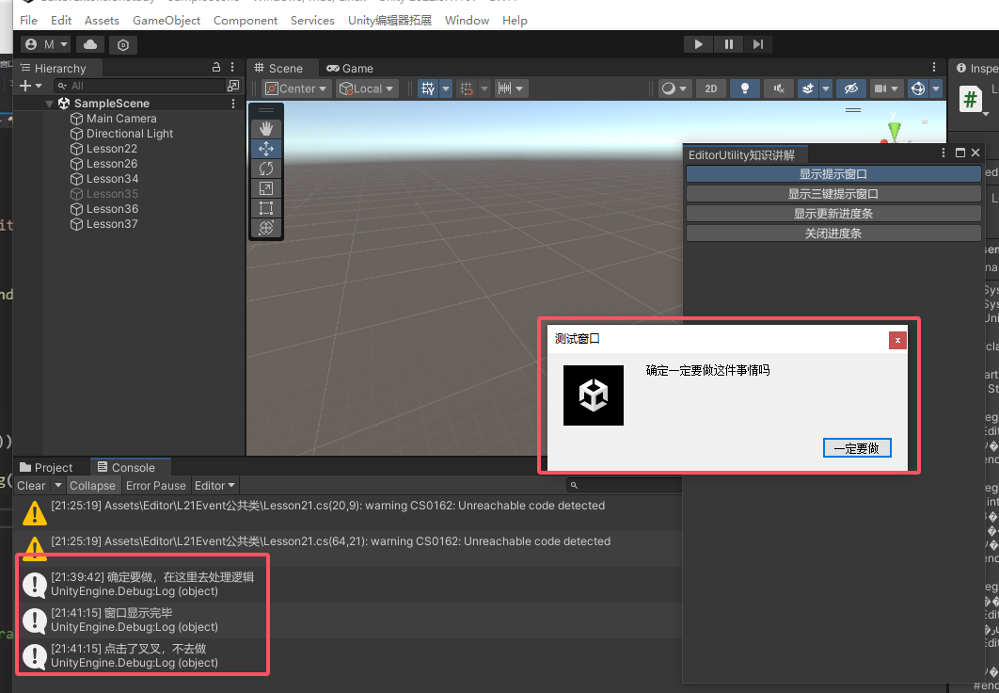
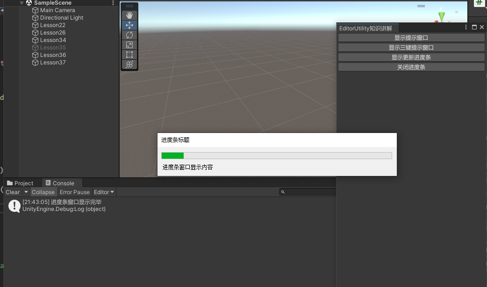

Unity编辑器拓展（九）-EditorUtility公共类 学习笔记

<!--more-->
# 一、EditorUtility是什么
## 1.0 之前知识
1. 自定义菜单栏拓展
2. 自定义窗口拓展
3. EditorGUI、EditorGUIUtility相关
4. Selection公共类
5. Event公共类
6. Inspector窗口拓展
7. Scene窗口拓展（Handles公共类、HandleUtility公共类、Gizmos公共类）
## 1.1 知识点一 EditorUtility公共类是用来做什么的？
- 它是 Unity 编辑器中的一个实用工具类
- 提供了一系列用于编辑器脚本和自定义编辑器的实用功能

## 1.2 #region 知识点二 在哪里使用EditorUtility公共类中的相关内容
- 在编辑器相关处都可以使用EditorUtility公共类中的相关内容
- 它主要提供的是一些辅助功能，可以在编辑器拓展开发的任意地方使用
- 但一定注意，**它属于编辑器功能，无法被打包出去**，只能在Unity编辑器中使用

## 1.3 #region 知识点三 准备工作
- EditorUtility可以在任何编辑器功能开发时使用
- 但是为了之后的知识点理解更方便
- 下文通过一个自定义窗口来进行举例（代码对应Lesson38.cs-继承了EditorWindow）
```cs
public class Lesson38 : EditorWindow
{
    [MenuItem("Unity编辑器拓展/Lesson38/EditorUtility知识讲解")]
    private static void OpenLesson38Win()
    {
        Lesson38 win = EditorWindow.GetWindow<Lesson38>("EditorUtility知识讲解");
        win.Show();
    }
}
```

# 二、 EditorUtility类中的 编辑器默认窗口相关
## 2.1 知识点一 显示提示窗口
- 注意：窗口显示会阻塞逻辑
```cs
EditorUtility.DisplayDialog("标题", "显示信息", "确定键名");
```

## 2.2 知识点二 显示三键提示面板
- 注意：窗口显示会阻塞逻辑
- 返回值 0-按钮1按下 1-按钮3按下 2-按钮2按下
```cs
int EditorUtility.DisplayDialogComplex("标题", "显示信息", "按钮1名字", "按钮3名字", "按钮2名字");
```
#endregion

## 2.3 知识点三 进度条相关
- 显示进度条
EditorUtility.DisplayProgressBar("进度条", "显示信息", 进制值0~1);
- 关闭进度条
EditorUtility.ClearProgressBar();

- 注意：进度条窗口不会卡逻辑，但是需要配合关闭进度条使用

## 2.4 代码示例
```cs
    private float value;
    private void OnGUI()
    {
        #region Lesson39 编辑器默认窗口相关
        if (GUILayout.Button("显示提示窗口"))
        {
            if (EditorUtility.DisplayDialog("测试窗口", "确定一定要做这件事情吗", "一定要做"))
            {
                Debug.Log("确定要做，在这里去处理逻辑");
            }
            else
            {
                Debug.Log("点击了叉叉，不去做");
            }

            Debug.Log("窗口显示完毕");
        }

        if (GUILayout.Button("显示三键提示窗口"))
        {
            int result = EditorUtility.DisplayDialogComplex("三键提示", "显示信息", "选项1", "关闭", "选项2");
            switch (result)
            {
                case 0:
                    Debug.Log("选项1按下了");
                    break;
                case 1:
                    Debug.Log("关闭键按下了");
                    break;
                case 2:
                    Debug.Log("选项2按下了");
                    break;
                default:
                    break;
            }

            Debug.Log("三键窗口显示完毕");
        }

        if (GUILayout.Button("显示更新进度条"))
        {
            value += 0.1f;
            EditorUtility.DisplayProgressBar("进度条标题", "进度条窗口显示内容", value);
            Debug.Log("进度条窗口显示完毕");
        }

        if (GUILayout.Button("关闭进度条"))
        {
            value = 0;
            EditorUtility.ClearProgressBar();
        }

        #endregion
```

## 2.5 效果
1. 显示提示窗口

2. 显示三键提示窗口

3. 显示更新进度条
