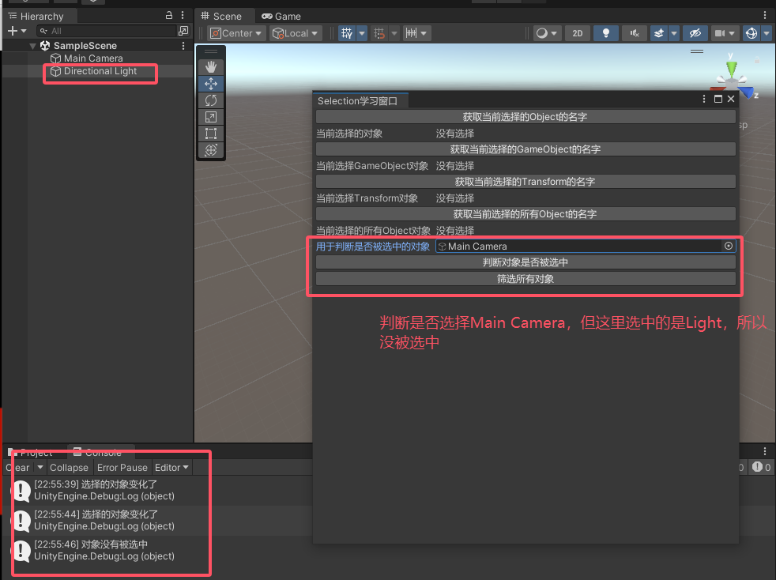
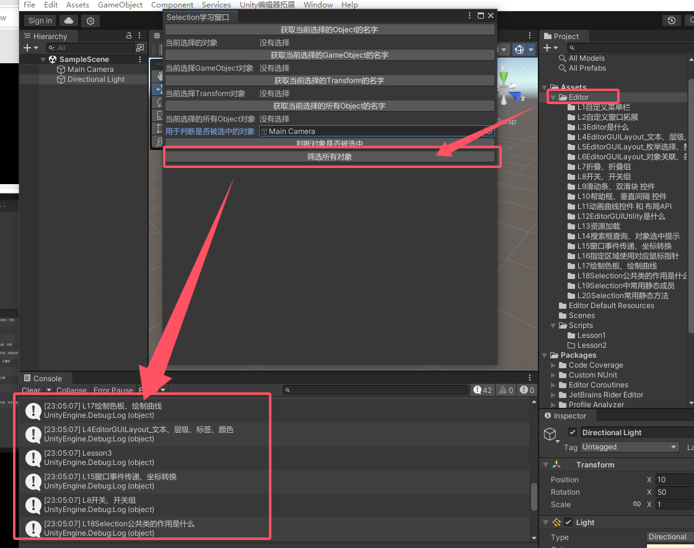

Selection公共类
<!--more-->
- [一、Selection公共类的作用是什么](#一selection公共类的作用是什么)
  - [1.1 Selection公共类的作用是什么](#11-selection公共类的作用是什么)
- [二、Selection中常用静态成员](#二selection中常用静态成员)
  - [2.1 获取当前选择的Object](#21-获取当前选择的object)
  - [2.2 获取当前选择的GameObject](#22-获取当前选择的gameobject)
  - [2.3 获取当前选择的Transform](#23-获取当前选择的transform)
  - [2.4 获取当前选择的所有Object](#24-获取当前选择的所有object)
  - [2.5 获取当前选择的所有GameObject](#25-获取当前选择的所有gameobject)
  - [2.6 获取当前选择的所有Transform](#26-获取当前选择的所有transform)
  - [2.7 前面6中情况使用](#27-前面6中情况使用)
- [三、Selection常用静态方法](#三selection常用静态方法)
  - [3.1 判断某个对象是否被选中](#31-判断某个对象是否被选中)
  - [3.2 筛选对象](#32-筛选对象)
  - [3.3 当选中变化时会调用的委托](#33-当选中变化时会调用的委托)
  - [3.4 效果](#34-效果)
- [四、总结](#四总结)


# 一、Selection公共类的作用是什么
## 1.1 Selection公共类的作用是什么
- 主要用来获取当前在Unity编辑器中选择的对象
- 只能用于编辑器开发中


# 二、Selection中常用静态成员
## 2.1 获取当前选择的Object
1. 作用：
- 获取当前在面板上选择的游戏物体Object，未选择则返回Null
- 选择多个则返回最后一个选择的游戏物体
2. 方法
```cs
    Selection.activeObject
```
## 2.2 获取当前选择的GameObject
1. 作用：
- 获取当前在面板上选择的游戏物体GameObject，未选择则返回Null
- 选择多个则返回最后一个选择的游戏物体
2. 方法
```cs
    Selection.activeGameObject
```
## 2.3 获取当前选择的Transform
1. 作用
- 获取当前在面板上选择的游戏物体的Transform，未选择则返回Null
- 选择多个则返回最后一个选择的游戏物体
- **只能获取到场景中（Hierarchy）的对象的Transform**
2. 方法
```cs
    Selection.activeTransform
```
## 2.4 获取当前选择的所有Object
1. 作用：
- 获取当前在面板上选择的物体**数组**，未选择则返回Null
2. 方法
```cs
    Selection.objects 
```
## 2.5 获取当前选择的所有GameObject
1. 作用：
- 获取当前在面板上选择的**游戏物体或Project中预设体 GameObject数组**
- 未选择则返回Null
2. 方法
```cs
    Selection.gameObjects
    //可以遍历获取所有信息
```
## 2.6 获取当前选择的所有Transform
1. 作用
- 获取当前在面板上选择的游戏物体Transform数组，未选择则返回Null
2. 方法
```cs
    Selection.transforms
    //可以遍历获取所有信息
```

## 2.7 前面6中情况使用
1. 示例
```cs
    private StringBuilder str = new StringBuilder("没有选择");
    private StringBuilder str2 = new StringBuilder("没有选择");
    private StringBuilder str3 = new StringBuilder("没有选择");
    private StringBuilder str4 = new StringBuilder("没有选择");
    //1.当前选择的Object
    if(GUILayout.Button("获取当前选择的Object的名字"))
    {
        if(Selection.activeObject != null)
        {
            str.Clear();
            str.Append(Selection.activeObject.name);

            if (Selection.activeObject is GameObject)
                Debug.Log("它是游戏对象");
            else if(Selection.activeObject is Texture)
                Debug.Log("它是一张纹理");
            else if (Selection.activeObject is TextAsset)
                Debug.Log("它是一个文本");
            else
                Debug.Log("它是其他类型的资源");
        }
        else
        {
            str.Clear();
            str.Append("没有选择");
        }
    }
    EditorGUILayout.LabelField("当前选择的对象", str.ToString());
    //2.当前选择的GameObject
    if (GUILayout.Button("获取当前选择的GameObject的名字"))
    {
        if (Selection.activeGameObject != null)
        {
            str2.Clear();
            str2.Append(Selection.activeGameObject.name);
        }
        else
        {
            str2.Clear();
            str2.Append("没有选择");
        }
    }
    EditorGUILayout.LabelField("当前选择GameObject对象", str2.ToString());
    //3.当前选择的Transform
    if (GUILayout.Button("获取当前选择的Transform的名字"))
    {
        if (Selection.activeTransform != null)
        {
            str3.Clear();
            str3.Append(Selection.activeTransform.name);
            Selection.activeTransform.position = new Vector3(10, 10, 10); //改变对象的位置
        }
        else
        {
            str3.Clear();
            str3.Append("没有选择");
        }
    }
    EditorGUILayout.LabelField("当前选择Transform对象", str3.ToString());
    //4.当前选择的所有Object
    if (GUILayout.Button("获取当前选择的所有Object的名字"))
    {
        if (Selection.count != 0)
        {
            str4.Clear();
            for (int i = 0; i < Selection.objects.Length; i++)
            {
                str4.Append(Selection.objects[i].name + "||");
            }
        }
        else
        {
            str4.Clear();
            str4.Append("没有选择");
        }
    }
    EditorGUILayout.LabelField("当前选择的所有Object对象", str4.ToString());
    //5.当前选择的所有GameObject
    //Selection.gameObjects
    //6.当前选择的所有Transform
    //Selection.transforms
```
2. 效果
- 选择代码对象
.png)
- 多选场景对象
.png)

# 三、Selection常用静态方法
## 3.1 判断某个对象是否被选中
1. 方法
选择多个对象时，只要在里面也能判断为被选中
```cs
    Contains //判断某个对象是否被选中(选择多个对象时，只要在里面也能判断为被选中)
```
1. 示例
```cs
    private Object obj;
    //判断某个对象是否被选中
    obj = EditorGUILayout.ObjectField("用于判断是否被选中的对象", obj, typeof(GameObject), true);

    if (GUILayout.Button("判断对象是否被选中"))
    {
        if (Selection.Contains(obj))
            Debug.Log("对象有被选中");
        else
            Debug.Log("对象没有被选中");
    }
```   

## 3.2 筛选对象
1. 作用：从当前选择对象中，筛选出想要的内容
2. 方法
```cs
    Selection.GetFiltered(类型, 筛选模式)
    Selection.GetFiltered<类型>(筛选模式)

    //  筛选模式：SelectionMode
    //  Unfiltered: 不过滤
    //  TopLevel: 只获取最上层对象，子对象不获取
    //  Deep: 父对象、子对象都获取
    //  ExcludePrefab: 排除预设体
    //  Editable: 只选择可编辑的对象
    //  OnlyUserModifiable: 仅用户可修改的内容
    //  Assets: 只返回资源文件夹下的内容
    //  DeepAssets: 如果存在子文件夹，其中的内容也获取
    //  如果要混用 位或 | 即可
```
3. 示例
```cs
    //筛选对象
    if (GUILayout.Button("筛选所有对象"))
    {
        Object[] objs = Selection.GetFiltered(typeof(Object), SelectionMode.Assets | SelectionMode.DeepAssets);
        for (int i = 0; i < objs.Length; i++)
        {
            Debug.Log(objs[i].name);
        }
    }
```

## 3.3 当选中变化时会调用的委托
1. 方法
```cs
    Selection.selectionChanged += 函数;//选择的物体变化时调用
```
2. 示例
```cs
    private void OnEnable()
    {
        Selection.selectionChanged += SelectionChanged;
    }

    private void OnDestroy()
    {
        Selection.selectionChanged -= SelectionChanged;
    }
    private void SelectionChanged()
    {
        Debug.Log("选择的对象变化了");
    }
```
## 3.4 效果
- 判断某个对象是否被选中及当选中变化时会调用的委托

- 筛选对象（筛选了Editor下的内容及其子文件夹内容）


# 四、总结
- Selection公共类主要是帮助我们获取到选择的对象的
- 我们可以利用它对选中对象进行一些处理

Selection公共类 更多API：https://docs.unity.cn/cn/2022.1/ScriptReference/Selection.html