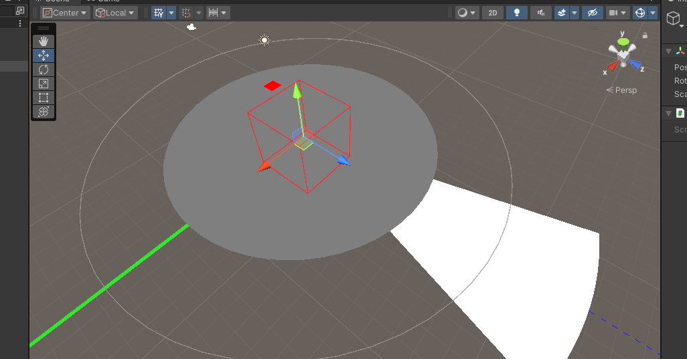
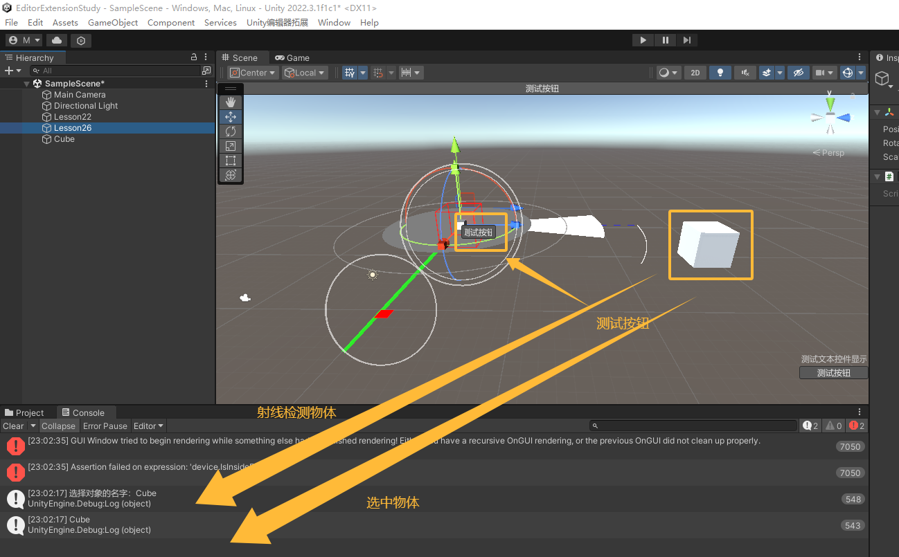
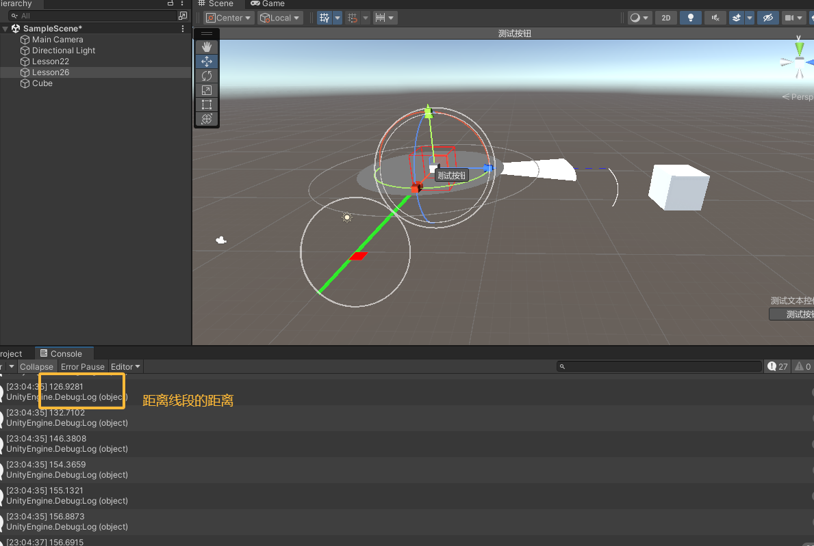

Unity编辑器拓展（七）-Scene窗口拓展 学习笔记

<!--more-->

# 一、 Handles类是什么及响应函数
## 1.1 知识点一 Handles公共类的作用
Handles类提供了很多API
- 让我们可以在Scene窗口中绘制我们的自定义内容
- 它和GUI、EditorGUI类似，只不过它专门提供给Scene窗口使用

- 想要在Scene窗口中显示自定义内容，我们**需要在对应的响应函数中进行处理**


## 1.2 知识点二 Scene窗口更新响应函数
关键点：
前两个步骤 和自定义Inspector窗口显示内容 一致
1. 单独为某一个脚本实现一个自定义脚本，并且脚本需要继承Editor
    - 一般该脚本命名为 自定义脚本名 + Editor
2. 在该脚本前加上特性
    - 命名空间：UnityEditor
    - 特性名：CustomEditor(想要自定义脚本类名的Type)

3. 在该脚本中实现void OnSceneGUI()方法
    - **该方法会在我们选中挂载自定义脚本的对象时自动更新**
    - **注意：只有选中时才会执行，没有选中不执行**

## 1.3 知识点三 自定义窗口中监听Scene窗口更新响应函数
可以在自定义窗口显示时
- 监听更新事件
```cs
    SceneView.duringSceneGui += 事件函数
```
- 窗口隐藏或销毁时移除事件
```cs  
    SceneView.duringSceneGui -= 事件函数
```
## 1.4 总结
Scene窗口拓展功能
主要是提供给自定义脚本和自定义窗口的
我们采用对应的规则进行处理
便可以在之后的章节中利用场景更新响应函数来自定义一些Scene窗口的显示内容

## 1.5 代码示例
1. scene窗口更新响应函数
```cs
//lesson26.cs
public class Lesson26 : MonoBehaviour
{
}
//lesson26Editor
[CustomEditor(typeof(Lesson26))]
public class Lesson26Editor : Editor
{
    private void OnSceneGUI() //选中挂载了Lesson26的对象时会调用该函数
    {
        Debug.Log("Scene窗口拓展相关逻辑");
    }
}
```
2. 自定义窗口监听scene窗口更新响应函数
```cs
public class Lesson26Window : EditorWindow
{
    [MenuItem("Unity编辑器拓展/Lesson26/打开Scene拓展窗口")]
    private static void OpenLesson26()
    {
        Lesson26Window win = EditorWindow.GetWindow<Lesson26Window>();
        win.Show();
    }

    private void OnEnable()
    {
        SceneView.duringSceneGui += SceneUpdate; //Scene视图每次调用 OnGUI 方法时会触发一次duringSceneGui
    }

    private void OnDestroy()
    {
        SceneView.duringSceneGui -= SceneUpdate;
    }

    private void SceneUpdate(SceneView view)
    {
        Debug.Log("自定义窗口拓展Scene相关内容");
    }
}
```

## 1.6 效果
包含函数和自定义窗口监听scene更新


# 二、Handles类中的 文本、线段、虚线控件
知识点回顾 Editor中的target成员
1. 我们可以利用继承Editor基类中的target成员获取到拓展的组件对象

## 2.1 Handles中的颜色控制
调用Handles中的绘制API之前 设置颜色即可
```cs
Handles.color = new Color(0, 1, 1, 0.3f);
```

## 2.2 Handles中的文本控件
```cs
Handles.Label(显示位置, 文本内容);
```
## 2.3 Handles中的线段控件
```cs
Handles.DrawLine(起点, 终点, 粗细);
```
## 2.4 Handles中的虚线控件
```cs
Handles.DrawDottedLine(起点, 终点, 粗细);
```

## 2.5 代码
```cs
[CustomEditor(typeof(Lesson26))]
public class Lesson26Editor : Editor
{
    private Lesson26 obj;

    private void OnEnable()
    {
        obj = target as Lesson26;//获取脚本挂载的obj
    }

    private void OnSceneGUI()
    {
        Debug.Log("Scene窗口拓展相关逻辑");

        //颜色
        Handles.color = new Color(0, 1, 0, 1f);
        //文本
        Handles.Label(obj.transform.position, "测试文本显示");
        //线段
        Handles.DrawLine(obj.transform.position, obj.transform.position + obj.transform.right * 5, 5);
        //虚线
        Handles.color = new Color(0, 0, 1, 1f);
        Handles.DrawDottedLine(obj.transform.position, obj.transform.position + obj.transform.forward * 5, 5);
    }
}
```

## 2.6 效果
文字、红色线段，蓝色虚线


# 三、Handles类中的 弧线、圆、立方体、几何体

## 3.1 知识点一 Handles中的弧线(圆弧)
1. 绘制线框弧线
Handles.DrawWireArc(圆心, 法线, 绘制朝向(起始方向), 角度, 半径); 
2. 绘制填充弧线
Handles.DrawSolidArc(圆心, 法线, 绘制朝向(起始方向), 角度, 半径); 

## 3.2 知识点二 Handles中的圆

1. 绘制填充圆
Handles.DrawSolidDisc(圆心, 法线, 半径); 

2. 绘制线框圆
Handles.DrawWireDisc(圆心, 法线, 半径); 

## 3.3 知识点三 Handles中的立方体线框
Handles.DrawWireCube(中心点, xyz大小);

## 3.4 知识点四 Handles中的几何体
Handles.DrawAAConvexPolygon(几何体各顶点);

## 3.5 代码
弧线、圆、立方体，几何体
```cs
[CustomEditor(typeof(Lesson26))]
public class Lesson26Editor : Editor
{
    private Lesson26 obj;

    private void OnEnable()
    {
        obj = target as Lesson26;//获取脚本挂载的obj
    }

    private void OnSceneGUI()
    {
        Debug.Log("Scene窗口拓展相关逻辑");

        //弧线（圆弧）
        Handles.color = Color.white;
        Handles.DrawWireArc(obj.transform.position, Vector3.up, obj.transform.forward, 30, 5);
        Handles.DrawSolidArc(obj.transform.position, obj.transform.up, Quaternion.Euler(0, -15, 0) * obj.transform.forward, 30, 4);
        //圆
        Handles.color = Color.gray;
        Handles.DrawSolidDisc(obj.transform.position, obj.transform.up, 2);
        Handles.DrawWireDisc(obj.transform.position, obj.transform.up, 3);
        //立方体
        Handles.color = Color.red;
        Handles.DrawWireCube(obj.transform.position, Vector3.one);
        //几何体
        //(0,0,0)
        //(1,0,0)
        //(1,0,1)
        //(0,0,z)
        Handles.DrawAAConvexPolygon(Vector3.zero, Vector3.right, Vector3.right + Vector3.forward, Vector3.forward);
    }
}
```
## 3.6 效果


# 四、Handles类中的 移动、旋转、缩放

## 4.1  知识点一 Handles中的移动轴
```cs
Vector3 Handles.DoPositionHandle(位置, 角度);
Vector3 Handles.PositionHandle(位置, 角度);
```

## 4.2 知识点二 Handles中的旋转轴
```cs
Quaternion Handles.DoRotationHandle(角度, 位置);
Quaternion Handles.RotationHandle(角度, 位置);
```
## 4.3 Handles中的缩放轴
```cs
Vector3 Handles.DoScaleHandle(缩放, 位置, 角度, HandleUtility.GetHandleSize(位置));
Vector3 Handles.ScaleHandle(缩放, 位置, 角度, HandleUtility.GetHandleSize(位置));
```
1. HandleUtility.GetHandleSize方法的作用是
- 获取给定位置的操纵器控制柄的世界空间大小
- 使用当前相机计算合适的大小
- 它决定了控制柄的缩放大小

## 4.4 代码
```cs
[CustomEditor(typeof(Lesson26))]
public class Lesson26Editor : Editor
{
    private Lesson26 obj;

    private void OnEnable()
    {
        obj = target as Lesson26;//获取脚本挂载的obj
    }

    private void OnSceneGUI()
    {
        Debug.Log("Scene窗口拓展相关逻辑");

        //移动
        obj.transform.position = Handles.DoPositionHandle(obj.transform.position, obj.transform.rotation);
        //obj.transform.position = Handles.PositionHandle(obj.transform.position, obj.transform.rotation);
        //旋转
        //obj.transform.rotation = Handles.DoRotationHandle(obj.transform.rotation, obj.transform.position) ;
        obj.transform.rotation = Handles.RotationHandle(obj.transform.rotation, obj.transform.position);
        //缩放
        obj.transform.localScale = Handles.DoScaleHandle(obj.transform.localScale, obj.transform.position, obj.transform.rotation,
                                                         HandleUtility.GetHandleSize(obj.transform.position));

        //obj.transform.localScale = Handles.ScaleHandle(obj.transform.localScale, obj.transform.position, obj.transform.rotation,
        //                                                 HandleUtility.GetHandleSize(Vector3.zero));
    }
}
```

## 4.5 效果
缩放、旋转、位置轴


# 五、Handles类中的 自由移动、自由旋转

## 知识回顾
HandleUtility.GetHandleSize
- 用于获取在 Scene 窗口中的一个单位距离所对应的屏幕空间大小
- 这个方法主要用于根据物体的距离来动态调整控制手柄的大小
- 使其在不同距离下能够在视图中显示合适的大小
- 一般我们把对象位置传递进去，他会自动得到一个句柄大小

## 5.1 知识点一 Handles中的自由移动（当前摄像机横截面）
- 一个不受约束的移动控制柄
- 这个把手可以在所有方向上自由移动
```cs
Vector3 Handles.FreeMoveHandle(位置, 句柄大小, 移动步进值(按住ctrl键时会按该单位移动), 渲染控制手柄的回调函数);
```
1. 句柄大小一般配合HandleUtility.GetHandleSize函数使用

2. 渲染控制手柄的常用回调函数
```cs
Handles.RectangleHandleCap:一个矩形形状的控制手柄，通常用于表示一个平面的控制面
Handles.CircleHandleCap:一个圆形的控制手柄，通常用于表示一个球体的控制面
Handles.ArrowHandleCap:一个箭头形状的控制手柄，通常用于表示方向
```
## 5.2 知识点二 Handles中的自由旋转
```cs
Quaternion Handles.FreeRotateHandle(角度, 位置, 句柄大小);
```

## 5.3 代码
        //自由移动（当前摄像机横截面）
        obj.transform.position = Handles.FreeMoveHandle(obj.transform.position, HandleUtility.GetHandleSize(obj.transform.position),
                                                        Vector3.one * 5, Handles.CircleHandleCap);

        //自由旋转
        obj.transform.rotation = Handles.FreeRotateHandle(obj.transform.rotation, Vector3.zero, HandleUtility.GetHandleSize(Vector3.zero));
## 5.4 效果


# 六、Handles类中的 显示GUI
## 6.1 Scene中显示GUI
```cs
Handles.BeginGUI();
GUI相关代码
Handles.EndGUI();
```

## 6.2 知识点二 获取Scene窗口大小
```CS
    获取当前Scene窗口信息
    SceneView.currentDrawingSceneView
    它继承自EditorWindow，因此通过position就能得到它的大小
```

## 6.3 知识点三 Handles更多内容(⭐⭐⭐)
https://docs.unity3d.com/ScriptReference/Handles.html

## 6.4 代码
```cs
 #region Lesson31 显示GUI
        Handles.BeginGUI();
        if (GUILayout.Button("测试按钮"))
        {
            Debug.Log("Scene中的按钮响应");
        }

        float w = SceneView.currentDrawingSceneView.position.width;
        float h = SceneView.currentDrawingSceneView.position.height;

        GUILayout.BeginArea(new Rect(w - 100, h - 100, 100, 100));
        GUILayout.Label("测试文本控件显示");
        if (GUILayout.Button("测试按钮"))
        {
            Debug.Log("Scene中的按钮响应");
        }
        GUILayout.EndArea();

        Handles.EndGUI();
        #endregion
```
## 6.5 效果


# 七、前几个的代码汇总
```cs
[CustomEditor(typeof(Lesson26))]
public class Lesson26Editor : Editor
{
    private Lesson26 obj;

    private void OnEnable()
    {
        obj = target as Lesson26;//获取脚本挂载的obj
    }

    private void OnSceneGUI()
    {
        Debug.Log("Scene窗口拓展相关逻辑");

        #region Lesson27 文本、线段、虚线
        //颜色
        Handles.color = new Color(0, 1, 0, 1f);
        //文本
        Handles.Label(obj.transform.position, "测试文本显示");
        //线段
        Handles.DrawLine(obj.transform.position, obj.transform.position + obj.transform.right * 5, 5);
        //虚线
        Handles.color = new Color(0, 0, 1, 1f);
        Handles.DrawDottedLine(obj.transform.position, obj.transform.position + obj.transform.forward * 5, 5);
        #endregion

        #region Lesson28 弧线、圆、立方体，几何体
        //弧线（圆弧）
        Handles.color = Color.white;
        Handles.DrawWireArc(obj.transform.position, Vector3.up, obj.transform.forward, 30, 5);
        Handles.DrawSolidArc(obj.transform.position, obj.transform.up, Quaternion.Euler(0, -15, 0) * obj.transform.forward, 30, 4);
        //圆
        Handles.color = Color.gray;
        Handles.DrawSolidDisc(obj.transform.position, obj.transform.up, 2);
        Handles.DrawWireDisc(obj.transform.position, obj.transform.up, 3);
        //立方体
        Handles.color = Color.red;
        Handles.DrawWireCube(obj.transform.position, Vector3.one);
        //几何体
        //(0,0,0)
        //(1,0,0)
        //(1,0,1)
        //(0,0,z)
        Handles.DrawAAConvexPolygon(Vector3.zero, Vector3.right, Vector3.right + Vector3.forward, Vector3.forward);
        #endregion

        #region Lesson29 移动、旋转、缩放
        //移动
        obj.transform.position = Handles.DoPositionHandle(obj.transform.position, obj.transform.rotation);
        //obj.transform.position = Handles.PositionHandle(obj.transform.position, obj.transform.rotation);
        //旋转
        //obj.transform.rotation = Handles.DoRotationHandle(obj.transform.rotation, obj.transform.position) ;
        obj.transform.rotation = Handles.RotationHandle(obj.transform.rotation, obj.transform.position);
        //缩放
        obj.transform.localScale = Handles.DoScaleHandle(obj.transform.localScale, obj.transform.position, obj.transform.rotation,
                                                         HandleUtility.GetHandleSize(obj.transform.position));

        //obj.transform.localScale = Handles.ScaleHandle(obj.transform.localScale, obj.transform.position, obj.transform.rotation,
        //                                                 HandleUtility.GetHandleSize(Vector3.zero));
        #endregion

        #region Lesson30 自由移动，自由旋转
        //自由移动
        obj.transform.position = Handles.FreeMoveHandle(obj.transform.position, HandleUtility.GetHandleSize(obj.transform.position),
                                                        Vector3.one * 5, Handles.RectangleHandleCap);

        //自由旋转
        obj.transform.rotation = Handles.FreeRotateHandle(obj.transform.rotation, Vector3.zero, HandleUtility.GetHandleSize(Vector3.zero));
        #endregion

        #region Lesson31 显示GUI
        Handles.BeginGUI();
        if (GUILayout.Button("测试按钮"))
        {
            Debug.Log("Scene中的按钮响应");
        }

        float w = SceneView.currentDrawingSceneView.position.width;
        float h = SceneView.currentDrawingSceneView.position.height;

        GUILayout.BeginArea(new Rect(w - 100, h - 100, 100, 100));
        GUILayout.Label("测试文本控件显示");
        if (GUILayout.Button("测试按钮"))
        {
            Debug.Log("Scene中的按钮响应");
        }
        GUILayout.EndArea();

        Handles.EndGUI();
        #endregion
    }
}

```

# 八、HandleUtility公共类

## 8.1 #region 知识回顾 获取窗口上鼠标位置
Event.current.mousePosition

## 8.2 知识点一 HandleUtility公共类的主要作用
- HandleUtility是 Unity 中的一个工具类
- 用于处理场景中的编辑器句柄（Handles）以及其他一些与编辑器交互相关的功能
- 它提供了一系列静态方法，用于处理编辑器中的鼠标交互、坐标转换以及其他与Handles相关的功能

## 8.3 知识点二 HandleUtility类中的常用API
1. GetHandleSize(Vector3 position)
- 我们之前已经使用过的API
- 获取在场景中给定位置的句柄的合适尺寸
- 该方法通常用于根据场景中对象的距离来调整句柄的大小，以便在不同的缩放级别下保持合适的显示大小

2. WorldToGUIPoint(Vector3 worldPosition)
- 将世界坐标转换为 GUI 坐标
- 这个方法通常用于将场景中的某个点的位置转换为屏幕上的像素坐标
- 以便在 GUI 中绘制相关的信息

3. GUIPointToWorldRay(Vector2 position)
- 将屏幕上的像素坐标转换为射线
- 这个方法通常用于从屏幕坐标中获取一条射线，用于检测场景中的物体或进行射线投射

4. DistanceToLine(Vector3 lineStart, Vector3 lineEnd)
- 计算场景中一条线段与鼠标光标的最短距离
- 可以用来制作悬停变色等功能

5. PickGameObject(Vector2 position, bool isSelecting)
在编辑器中进行对象的拾取
这个方法通常用于根据鼠标光标位置获取场景中的对象，以实现对象的选择或交互操作

## 8.4 知识点三 更多内容
https://docs.unity3d.com/ScriptReference/HandleUtility.html

## 8.5 代码
```cs
[CustomEditor(typeof(Lesson26))]
public class Lesson26Editor : Editor
{
    private Lesson26 obj;

    private void OnEnable()
    {
        obj = target as Lesson26;//获取脚本挂载的obj
    }

    private void OnSceneGUI()
    {
        //1.GetHandleSize(Vector3 position)
        //  之前学习过 所以不需要举例
        //2.WorldToGUIPoint(Vector3 worldPosition)
        Vector2 pos = HandleUtility.WorldToGUIPoint(obj.transform.position);
        Handles.BeginGUI();
        GUI.Button(new Rect(pos.x, pos.y, 50, 20), "测试按钮");
        Handles.EndGUI();

        //3.GUIPointToWorldRay(Vector2 position)
        Ray r = HandleUtility.GUIPointToWorldRay(Event.current.mousePosition);
        RaycastHit info;
        if (Physics.Raycast(r, out info))
            Debug.Log(info.collider.name);

        //4.DistanceToLine(Vector3 lineStart, Vector3 lineEnd)
        float dis = HandleUtility.DistanceToLine(Vector3.zero, Vector3.right);
        //Debug.Log(dis);

        //5.PickGameObject(Vector2 position, bool isSelecting)
        GameObject testObj = HandleUtility.PickGameObject(Event.current.mousePosition, true);
        if (testObj != null)
            Debug.Log("选择对象的名字：" + testObj.name);
    }
}
```

## 8.6 效果

距离线段距离


# 九、Gizmos类是什么及响应函数

## 9.1 知识点一 Gizmos类是用来做什么的？
- Gizmos和Handles一样
- 是用来让我们拓展Scene窗口的
- 而Gizmos相对Handles来说
- 它主要专注于绘制辅助线、图标、形状等
- 而Handles主要用来绘制编辑器控制手柄等

## 9.2 知识点二 Gizmos响应函数
- 在继承MonoBehaviour的脚本中实现以下函数
- 便可以在其中使用Gizmos来进行图形图像的绘制
1. OnDrawGizmos() 在每帧调用，绘制的内容随时可以在Scene窗口中看见
2. OnDrawGizmosSelected() 仅当脚本依附的GameObject被选中时才会每帧调用绘制相关内容
它们的执行类似生命周期函数，Unity会帮助我们自动执行

# 十、Gizmos类中的 颜色、立方体、视锥、跟随旋转

## 10.1 知识点一 Gizmos修改颜色
Gizmos.color = Color.green;

## 10.2 知识点二 Gizmos绘制立方体
Gizmos.DrawCube(中心点, 大小);
Gizmos.DrawWireCube(中心点, 大小);

## 10.3 知识点三 Gizmos绘制视锥
Gizmos.DrawFrustum(绘制中心, FOV(Field of View,视野)角度, 远裁切平面, 近裁切平面, 屏幕长宽比); 

## 10.4 知识点四 如何改变绘制内容的角度
- 修改Gizmos绘制前的矩阵
Gizmos.matrix
Gizmos.matrix = Matrix4x4.TRS(位置, 角度, 缩放);
- 还原矩阵
Gizmos.matrix = Matrix4x4.identity

## 10.5 代码
挂载在一个节点上，不放在Editor文件夹下
```cs
    private void OnDrawGizmosSelected()
    {
        //将绘制矩阵还原(设置成默认，避免跟着移动、旋转、缩放)
        Gizmos.matrix = Matrix4x4.identity;
        Gizmos.color = Color.green;
        Gizmos.DrawCube(Vector3.zero, Vector3.one);
        Gizmos.color = Color.red;
        Gizmos.DrawWireCube(this.transform.position, new Vector3(2, 1, 3));//随节点移动
        Gizmos.color = Color.yellow;
        Gizmos.DrawFrustum(this.transform.position, 30, 50, 0.5f, 1.7f);
        //将绘制矩阵该为某个对象的 这样就可以跟着 移动 旋转 缩放了
        Gizmos.matrix = Matrix4x4.TRS(this.transform.position, this.transform.rotation, Vector3.one);
        //Gizmos.matrix = this.transform.localToWorldMatrix; //移动 旋转 缩放完全跟随节点
        Gizmos.color = Color.white;
        Gizmos.DrawWireCube(Vector3.zero, new Vector3(2, 1, 4));
    }
```

## 10.6 效果


# 十一、Gizmos类中的 贴图、图标

## 11.1 知识点一 Gizmos绘制贴图
只会在二维平面上绘制
Gizmos.DrawGUITexture(new Rect(x, y, w, h), 图片信息); 


## 12.1 知识点二 Gizmos绘制图标
图标需要放置在固定文件夹中Assets/Gizmos/中

Gizmos.DrawIcon(Vector3.up, "图标名");

## 12.2 代码
```cs
    public Texture pic;
    private void OnDrawGizmos()
    {
        if(pic != null)
           Gizmos.DrawGUITexture(new Rect(this.transform.position.x, this.transform.position.y, 160, 90), pic);

        Gizmos.DrawIcon(this.transform.position, "MyIcon");
    }
```
## 12.3 效果


# 十二、Gizmos类中的 线段、网格、射线

## 12.1 知识点一 Gizmos绘制线段
    Gizmos.DrawLine(起点, 终点);


## 12.2 知识点二 Gizmos绘制网格
    Gizmos.DrawMesh(mesh, 位置, 角度);


## 12.3 知识点三 Gizmos绘制射线
    Gizmos.DrawRay(起点, 方向); 

## 12.4 代码
```cs
    public Mesh mesh;
    private void OnDrawGizmosSelected()
    {
        Gizmos.color = Color.red;
        Gizmos.DrawLine(this.transform.position, this.transform.position + Vector3.one);
        Gizmos.color = Color.blue;
        if(mesh != null)
            Gizmos.DrawMesh(mesh, this.transform.position, this.transform.rotation);

        Gizmos.DrawRay(this.transform.position, this.transform.forward);
    }
```
## 12.5 效果


# 十三、

## 13.1  知识点一 Gizmos绘制球体
Gizmos.DrawSphere(中心点, 半径);
Gizmos.DrawWireSphere(中心点, 半径); //球体网格

## 13.2 知识点二 Gizmos绘制网格线
Gizmos.DrawWireMesh(mesh, 位置, 角度);


## 13.3 更多Gizmos相关
https://docs.unity3d.com/ScriptReference/Gizmos.html


## 13.4 代码
```cs
    public Mesh mesh;
    private void OnDrawGizmosSelected()
    {
        Gizmos.color = Color.red;
        Gizmos.DrawSphere(this.transform.position, 2);
        Gizmos.color = Color.white;
        Gizmos.DrawWireSphere(this.transform.position, 3);//球体网格

        Gizmos.color = Color.yellow;
        if(mesh != null)
            Gizmos.DrawWireMesh(mesh, this.transform.position, this.transform.rotation);
    }
```

## 13.5 效果
