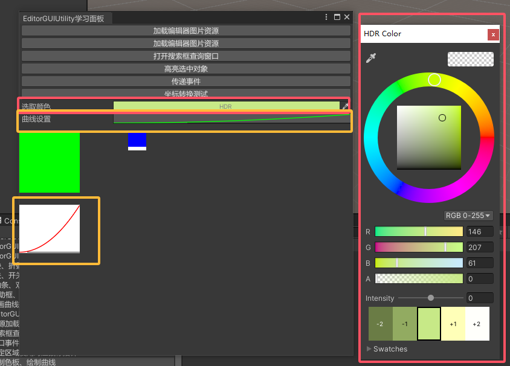

EditorGUIUtility公共类相关内容
 
<!--more-->
- [一、EditorGUIUtility公共类的作用是什么](#一editorguiutility公共类的作用是什么)
- [二、资源加载](#二资源加载)
  - [2.1 Editor Default Resources文件夹](#21-editor-default-resources文件夹)
  - [2.2 加载资源（如果资源不存在返回null）](#22-加载资源如果资源不存在返回null)
  - [2.3 加载资源（如果资源不存在会直接报错）](#23-加载资源如果资源不存在会直接报错)
  - [2.3 效果](#23-效果)
- [三、搜索框查询、对象选中提示](#三搜索框查询对象选中提示)
  - [3.1 搜索框查询](#31-搜索框查询)
  - [3.2 对象选中提示](#32-对象选中提示)
  - [3.3 效果](#33-效果)
- [四、窗口事件传递、坐标转换](#四窗口事件传递坐标转换)
  - [4.1 region 知识点一 窗口事件传递](#41-region-知识点一-窗口事件传递)
  - [4.2 坐标转换](#42-坐标转换)
  - [4.3 效果](#43-效果)
- [五、指定区域使用对应鼠标指针](#五指定区域使用对应鼠标指针)
  - [5.1 方法](#51-方法)
  - [5.2 示例](#52-示例)
  - [5.3 效果](#53-效果)
- [六、绘制色板、绘制曲线](#六绘制色板绘制曲线)
  - [6.1 绘制色板](#61-绘制色板)
  - [6.2 绘制曲线](#62-绘制曲线)
  - [6.3 效果](#63-效果)
- [七、更多API](#七更多api)


# 一、EditorGUIUtility公共类的作用是什么
- Utility是实用的意思，EditorGUIUtility 是 EditorGUI 中的一个实用工具类
- 提供了一些 EditorGUI 相关的其他辅助API
- 本文只学习其中的相对常用的内容
官方文档：https://docs.unity3d.com/ScriptReference/EditorGUIUtility.html

# 二、资源加载
## 2.1 Editor Default Resources文件夹
- **Editor Default Resources** 也是Unity当中的一个特殊文件夹，**它的主要作用是放置提供给 EditorGUIUtility 加载的资源**
- 想要使用EditorGUIUtility公共类来加载资源
- **我们需要将资源放置在 Editor Default Resources 文件夹中**
  
## 2.2 加载资源（如果资源不存在返回null）
1. 方法
**注意事项：**
- 只能加载Assets/Editor Default Resources/文件夹下的资源
- 加载资源时，**需要填写资源后缀名**
```cs
//对应API：
EditorGUIUtility.Load
```
2. 示例
```cs
    //加载资源（如果资源不存在返回null)
    if (GUILayout.Button("加载编辑器图片资源"))
        img = EditorGUIUtility.Load("EditorTeach.png") as Texture;
    if (img != null)
        GUI.DrawTexture(new Rect(0, 50, 160, 90), img); //显示图片
```

## 2.3 加载资源（如果资源不存在会直接报错）
1. 方法

**注意事项：**
- 只能加载Assets/Editor Default Resources/文件夹下的资源
- 加载资源时，需要填写资源后缀名

```cs
//对应API：
EditorGUIUtility.LoadRequired
```

2. 示例
```cs
    //加载资源（如果资源不存在会直接报错）
    if (GUILayout.Button("加载编辑器图片资源"))
        img2 = EditorGUIUtility.LoadRequired("EditorTeach.png") as Texture;
    if (img2 != null)
        GUI.DrawTexture(new Rect(0, 150, 160, 90), img2); //显示图片
```

## 2.3 效果


# 三、搜索框查询、对象选中提示
## 3.1 搜索框查询
1. 主要作用：
    弹出一个搜索窗口，用于选择自己想要的资源，只能打开窗口，无法监听选择的对象信息，需要配合第3点中的EditorGUIUtility.GetObjectPickerObject()进行使用
2. 主要API：
```cs
    EditorGUIUtility.ShowObjectPicker<资源类型>(默认被选中的对象, 是否允许查找场景对象, "查找对象名称过滤", 0);
```
   - 参数1. 默认被选中的对象的引用
   - 参数2. 是否允许查找场景对象
   - 参数3. 查找对象名称过滤（比如这里的normal是指文件名称中有normal的会被搜索到）
   - 参数4. controlID, 默认写0

3. 获取选择对象，主要API：
```cs
EditorGUIUtility.GetObjectPickerObject()
```
- 弹出的搜索窗口会通过发送事件的形式，通知开启它的窗口对象信息的变化
- 通过Event公共类可以获取其它窗口发送给自己的事件。（即Event公共类会给当前打开的窗口发送事件信息）
- Event.current 获取当前事件
    - commandName 获取事件命令的名字
      - ObjectSelectorUpdated 对象选择发生变化时发送
      - ObjectSelectorClosed 对象选择窗口关闭时发送
```cs
    if(Event.current.commandName == "ObjectSelectorUpdated")
    {
    //当选择发生更新时通知进入

    }
    else if (Event.current.commandName == "ObjectSelectorClosed")
    {
    //当选择窗口关闭时通知进入
    }
```
1. 示例
```cs
    private Texture img3;
    //搜索框查询
    if (GUILayout.Button("打开搜索框查询窗口"))
    {
        EditorGUIUtility.ShowObjectPicker<Texture>(null, false, "Editor", 0);//传参分别表示，默认选中的是null对象，不允许查找场景物体，文件名称中有Editor的会被搜索到的Texture资源
    }

    if (Event.current.commandName == "ObjectSelectorUpdated")
    {
        img3 = EditorGUIUtility.GetObjectPickerObject() as Texture;
        if (img3 != null)
            Debug.Log(img3.name);
    }
    else if (Event.current.commandName == "ObjectSelectorClosed")
    {
        img3 = EditorGUIUtility.GetObjectPickerObject() as Texture;
        if (img3 != null)
            Debug.Log("窗口关闭 - " + img3.name);
    }
```
## 3.2 对象选中提示
1. 方法
```cs
    EditorGUIUtility.PingObject(想要提示选中的对象);
```

1. 示例
```cs
    //对象选中提示提示
    if (GUILayout.Button("高亮选中对象"))
    {
        if (img3 != null)
            EditorGUIUtility.PingObject(img3);
    }
```

## 3.3 效果
1. 搜索框查询

2. 对象选中提示


# 四、窗口事件传递、坐标转换
## 4.1 region 知识点一 窗口事件传递
1. 方法
在传递事件时,会自动将接受事件的窗口打开,不管对象是否有监听处理对应的内容
```cs
    Event e = EditorGUIUtility.CommandEvent("事件名");
    //获取到另一个窗口后，让该窗口调用SendEvent(e) 
    //在另一个窗口中可以通过
    Event.current.type == EventType.ExecuteCommand 判断
    Event.current.commandName == "事件名" 判断
```
2. 示例
```cs
    //窗口事件传递
    if (GUILayout.Button("传递事件"))
    {
        //声明事件
        Event e = EditorGUIUtility.CommandEvent("测试事件");
        Lesson3 win = EditorWindow.GetWindow<Lesson3>();
        win.SendEvent(e);
    }
//````````````````````````````````````````````````````````````````
    //另一个窗口代码的OnGUI中（这里指Lesson3.cs的OnGUI中）
    if (Event.current.type == EventType.ExecuteCommand)
    {
        if (Event.current.commandName == "测试事件")
        {
            Debug.Log("收到测试事件");
        }
    }
```

## 4.2 坐标转换
- 屏幕坐标系：原点为屏幕左上角
- GUI坐标系：原点为当前窗口左上角
1. 方法
- GUIToScreenPoint:将点从GUI位置转换为屏幕空间
- GUIToScreenRect:将rect从GUI位置转换为屏幕空间

- ScreenToGUIPoint:将点从屏幕空间转换为GUI位置
- ScreenToGUIRect:将rect从屏幕空间转换为GUI位置

2. 示例
```cs
    //坐标转换
    if (GUILayout.Button("坐标转换测试"))
    {
        Vector2 v = new Vector2(10, 10);//GUI坐标
        GUI.BeginGroup(new Rect(10, 10, 100, 100));
        //转换函数 如果包裹在布局相关函数中 那么位置会加上布局的偏移 再进行转换
        Vector2 screenPos = EditorGUIUtility.GUIToScreenPoint(v);
        GUI.EndGroup();
        Debug.Log("GUI:" + v + "Screen:" + screenPos);
    }
```

## 4.3 效果


# 五、指定区域使用对应鼠标指针
## 5.1 方法
```cs
    AddCursorRect(Rect position, MouseCursor mouse);
    //  MouseCursor鼠标光标类型枚举
    //  Arrow	            普通指针箭头
    //  Text                文本文本光标
    //  ResizeVertical      调整大小垂直调整大小箭头
    //  ResizeHorizontal    调整大小水平调整大小箭头
    //  Link                带有链接徽章的链接箭头
    //  SlideArrow          滑动箭头带有小箭头的箭头，用于指示在数字字段处滑动
    //  ResizeUpRight       调整大小向上向右调整窗口边缘的大小
    //  ResizeUpLeft        窗口边缘为左
    //  MoveArrow           带有移动符号的箭头旁边用于场景视图
    //  RotateArrow         旁边有用于场景视图的旋转符号
    //  ScaleArrow          旁边有用于场景视图的缩放符号
    //  ArrowPlus           旁边带有加号的箭头
    //  ArrowMinus          旁边带有减号的箭头
    //  Pan                 用拖动的手拖动光标进行平移
    //  Orbit               用眼睛观察轨道的光标
    //  Zoom                使用放大镜进行缩放的光标
    //  FPS                 带眼睛的光标和用于FPS导航的样式化箭头键
    //  CustomCursor        当前用户定义的光标
    //  SplitResizeUpDown   向上-向下调整窗口拆分器的大小箭头
    //  SplitResizeLeftRight窗口拆分器的左-右调整大小箭头
```
## 5.2 示例
```cs
    EditorGUI.DrawRect(new Rect(0, 150, 100, 100), Color.green);//绘制一块绿色矩形
    EditorGUIUtility.AddCursorRect(new Rect(0, 150, 100, 100), MouseCursor.Text);
```

## 5.3 效果


# 六、绘制色板、绘制曲线
## 6.1 绘制色板
1. 方法
在指定区域绘制一个色板矩形,主要配合 EditorGUILayout.ColorField 颜色输入控件使用
```cs
    EditorGUIUtility.DrawColorSwatch(Rect 绘制色板的矩形, Color 颜色);
```
2. 示例
```cs
    private Color color;
    //绘制色板
    color = EditorGUILayout.ColorField(new GUIContent("选取颜色"), color, true, true, true);
    EditorGUIUtility.DrawColorSwatch(new Rect(180, 180, 30, 30), Color.blue);//绘制蓝色色板
```
## 6.2 绘制曲线
1. 方法
在指定区域绘制曲线,主要配合EditorGUILayout.CurveField 曲线输入控件使用
```cs
    EditorGUIUtility.DrawCurveSwatch(Rect 绘制曲线的范围,
                                       AnimationCurve 曲线,
                                       SerializedProperty 要绘制为SerializedProperty的曲线,
                                       Color 绘制曲线的颜色,
                                       Color 绘制背景的颜色);
```

2. 示例
```cs
//绘制曲线
    private AnimationCurve curve = new AnimationCurve();
    curve = EditorGUILayout.CurveField("曲线设置", curve);
    EditorGUIUtility.DrawCurveSwatch(new Rect(0, 300, 100, 80), curve, null, Color.red, Color.white);
```

## 6.3 效果


# 七、更多API
官方文档：https://docs.unity3d.com/ScriptReference/EditorGUIUtility.html
