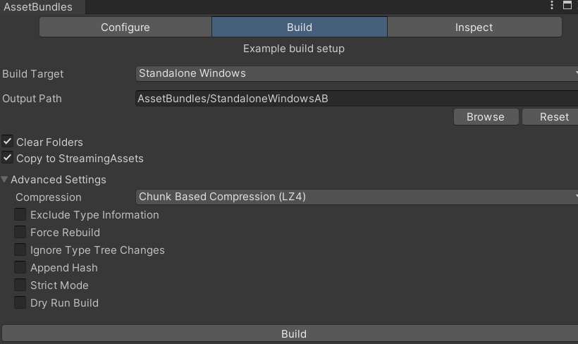

热更新解决方案学习-AssetBundle-AB包
<!--more-->

# 一、AB包的定义
- 特定于平台的资产压缩包，类似压缩文件
- 资产包括：模型、贴图、预制体、音效、材质球等
# 二、AB包的作用
- 相对于Resources下的资源，AB包更好管理资源
  - Resources打包时定死、制度、无法修改。只能通过Load加载
  - 存储位置、压缩方式（打包哪些、压多少）自定义，后期可以动态更新。可以从网络或本地加载。


- 减少包体大小
  - 压缩资源
  - 减少初始包大小。（先安装一个小安装包，在进入游戏时再下载安装）
- 热更新使用
  - 资源热更新（美术类）
  - 脚本热更新（更新lua脚本）-unity3d中的C#代码是没法打包成AB包的，只能打包物体关联了哪些代码脚本的信息（一堆数据）
  - 热更新的基本规则


# 三、生成AB包资源文件
- Unity编辑器开发，通过U3D提供的API自定义打包工具（一般公司已经做好了）。
- 官方提供好的打包工具：Asset Bundle Browser（主要学习）
- AssetBundleBrowser参数相关
- 点击中文件夹中的物体，在Inspector面板最下方有个AssetBundle的第一个空格进行命名

- 在window-AssetBundle Browser内可以看到刚刚命名的一些内容。（资源关联到包名）
- 另一方面，可以发现cube（预制体）上有很多组件（碰撞体、网格等）看起来都是脚本，其实会利用反射机制，使得预制体记录的只是一些数据。所以打包到ab时不是打包的脚本（代码）本身，而是预制体关联了哪些代码


- 最终打包-Build：目标平台-输出路径-（是否清空文件夹，包过大时会影响打包速度，因为每次都要打包全部）-（是否把打包到输出路径的AB复制一份到StreamingAssets，**该文件夹内的文件在PC上是可读可写的，在移动端是可读的）**
- 压缩方式：不压缩包很大解压快；LZMA: 压缩包最小，使用某一个资源时需要解压整个包，速度满；LZ4: 大小次之，需要什么资源解压什么资源，速度适中）


- AB包生成的文件
  - AB包文件-资源文件
    - manifest文件
- AB包文件信息
  - 当加载时，提供了关键信息：资源信息、依赖关系、版本信息等
- 关键AB包（和目录名一样的包）
  - 主包
  - AB包依赖关系
- 实例
  - StandaloneWindowsAB指的是打包出去的主包
  - 不带后缀名的（ui、cude）指的是资源文件
  - 后缀manifest文件是表示的对应的资源文件的配置信息


- Inspect页面 （检查页面）
  - 可以把打包好的AB包添加进来，查看相关的信息


# 四、AB包的使用
1、加载AB包，由于在打包时复制到了StreamingAssets中，通过AB加载其中的AB包

2、异步加载AB包

3、卸载AB包

```Csharp
  AssetBundle.UnloadAllAssetBundles(true);//卸载所有AB包以及其场景上已经加载的资源
  AssetBundle.UnloadAllAssetBundles(false);//只卸载所有AB包，其场景上已经加载的资源不受影响（常用）
  ab.Unload(true);//卸载单个ab包及其场景上已经加载的资源（同步）-ab包自己卸载自己
  ab.Unload(false);//只卸载单个ab包，其场景上已经加载的资源不受影响（同步）
  ab.UnloadAsync(true);//卸载单个ab包及其场景上已经加载的资源（异步）
  ab.UnloadAsync(false);//只卸载单个ab包，其场景上已经加载的资源不受影响（异步)
```

# 五、AB包的依赖
- 给球添加材质后，并没有给材质添加到AB打包，但AB自动添加了材质
- **即在包中的资源如果使用了另一个资源，那么另一个资源会被默认打在同一个包中（脚本不算）**
- **如果另一个资源自己选择不打包在同一个包，当只加载自己的包,通过它创建对象,会出现资源丢失的情况，那么此时需要加载另一个资源所在的包（称依赖包），才能修复丢失。**


（1）当我们并**不知道依赖的包**是哪一个时，如何判断——依赖- 包的关键知识点： **利用主包 获取依赖信息**
- 加载主包
- 加载主包中的固定文件
- 从固定文件中得到依赖信息
- 得到依赖包的名字
- 依据依赖包名字加载依赖包

```csharp
//依赖包的关键知识点—利用主包 获取依赖信息
        //加载主包
        AssetBundle abMain = AssetBundle.LoadFromFile(Application.streamingAssetsPath +  "/" + "StandaloneWindowsAB");
        //加载主包中的固定文件
        AssetBundleManifest abMainfest =  abMain.LoadAsset<AssetBundleManifest>("AssetBundleManifest");
        //从固定文件中 得到依赖信息(得到uicube包的所有依赖信息）
        string[] strs = abMainfest.GetAllDependencies("uicube");
        //得到了 依赖包的名字
        for(int i = 0; i < strs.Length; i++)
        {
            Debug.Log(strs[i]);
            //依据依赖包名字加载依赖包
            AssetBundle.LoadFromFile(Application.streamingAssetsPath + "/" + strs[i]);
        }
```

# 六、AB包资源加载管理器

- 字典-保存已经加载的ab包
- 协程-异步加载ab包中的资源
- 单例模式-提供加载资源的接口
- AB包相关API-AssetBundle的一些接口
- 委托（lambda表达式）-异步加载完后返回响应的操作

# 其他
## UnityAction和System.Action的区别
1. 首先，unity内置的.AddListener只能注册UnityAction来添加非持久监听器
2. 如果希望在inspector面板访问委托，只能使用UnityAction，否则无法序列化。
3. 注意，有人说UnityAction参数最多四个，System.Action参数远远多于UnityAction。但那是.Net环境的System.Action，这在unity环境下是不对的，因为unity用的是Mone，所以System.Action参数也最多是四个。当然如果环境变了，或许会有所不同。